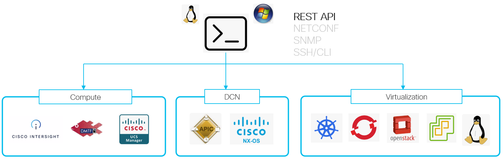

# iserver

iserver is command line tool for compute and networking data center infrastructure management

## Compute

- [Intersight](./doc/intersight/README.md)
- [Redfish](./doc/redfish/README.md)
- IMC
- UCSM

## Data Center Networking
- ACI
- Nexus

## Virtualization
- [OpenShift](./doc/ocp/Operations.md)
- Kubernetes
- OpenStack
- vCenter

## HowTo Run

- download Windows or Linux [binary](https://github.com/datacenter/iserver/releases/latest) somewhere in your path e.g. /usr/local/bin
- or clone the repository and run from sources using Python3 with [requirements](./requirements-freeze.txt)

Dependencies
- [Intersight](./doc/intersight/README.md) features require [isctl](https://github.com/cgascoig/isctl)
- no requiremets or dependencies for non-Intersight related features