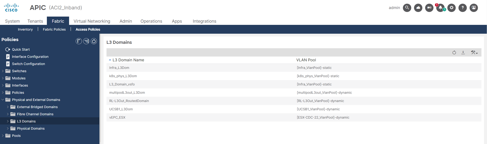
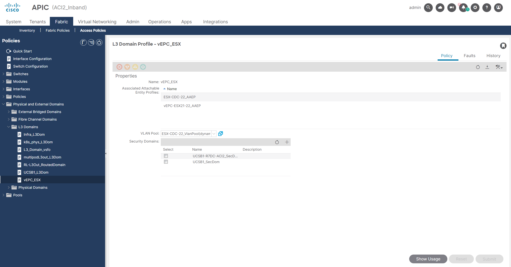
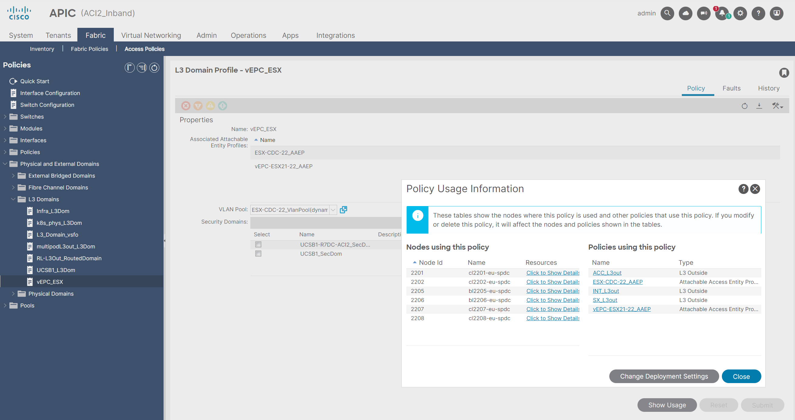
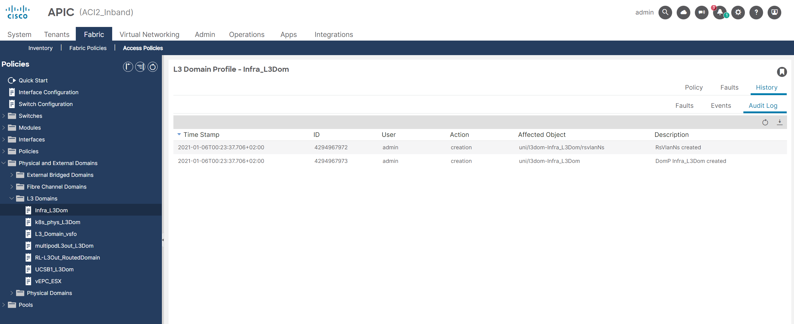
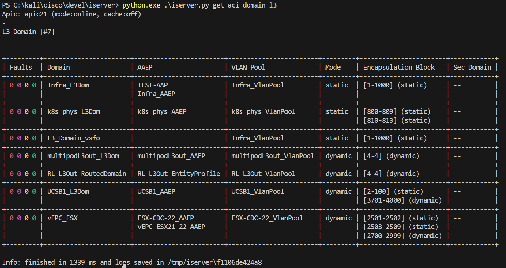
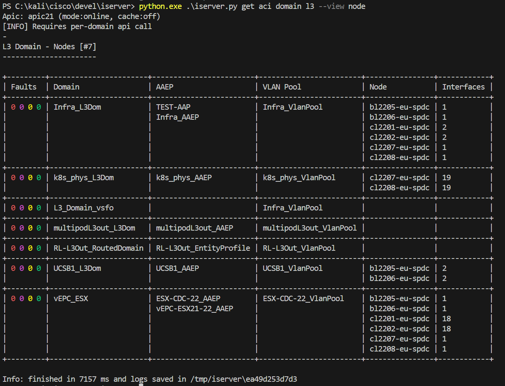
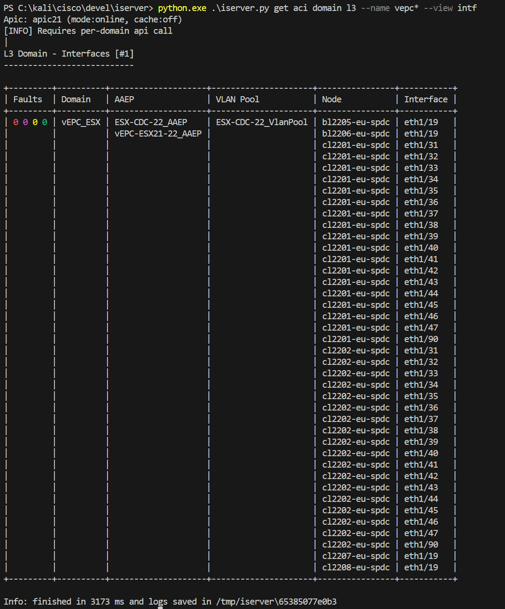
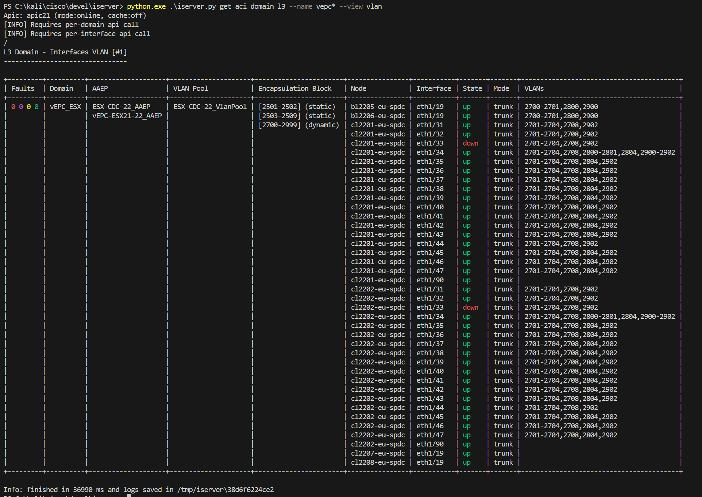
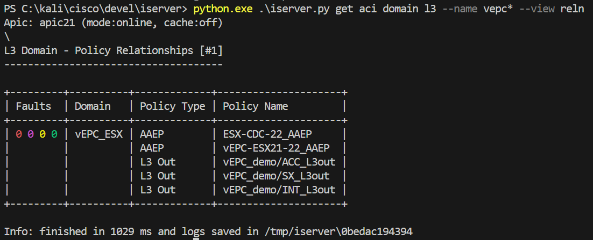
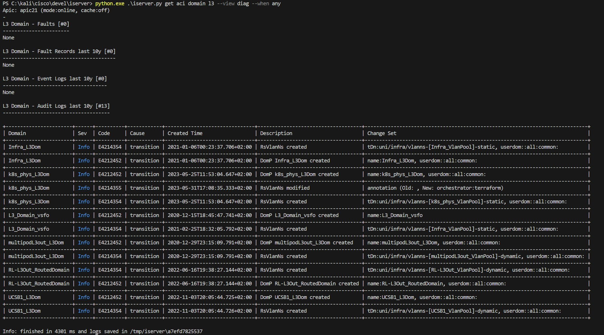

# L3 Domain

## APIC UI

### List

### Selected

### Usage

### Diagnostics

## CLI

### State View

### Node View

### Intf View

### Vlan View

### Reln View

### Diag View

[[Back]](./DomainL3.md)
