# VMM Domain

## APIC UI

### List

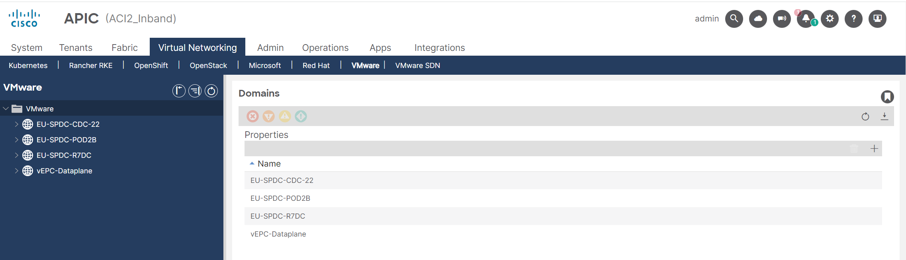

### Selected

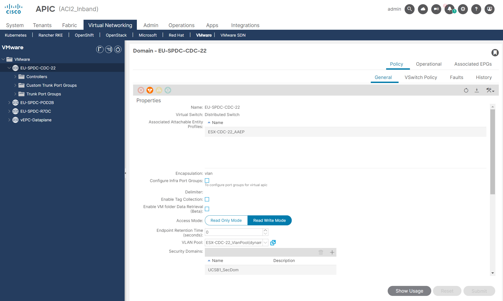

### Usage

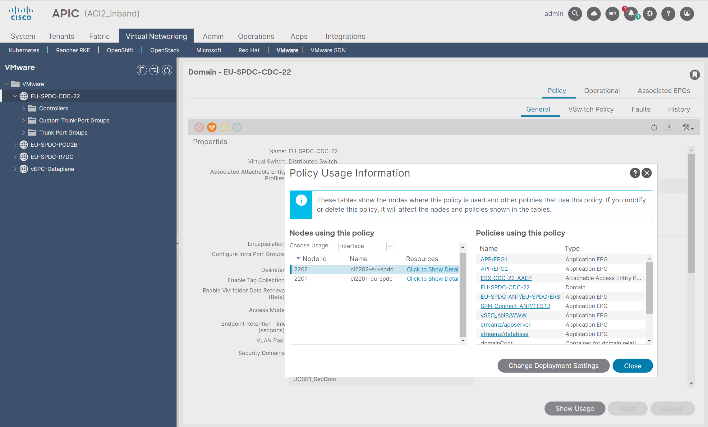

### Operational

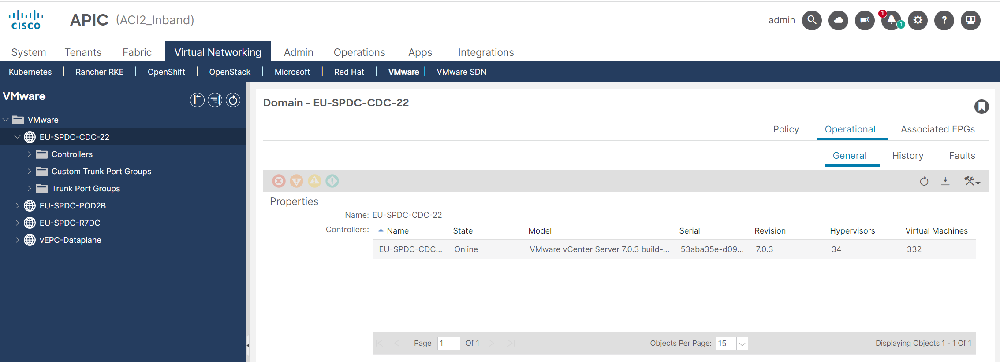

### EPG

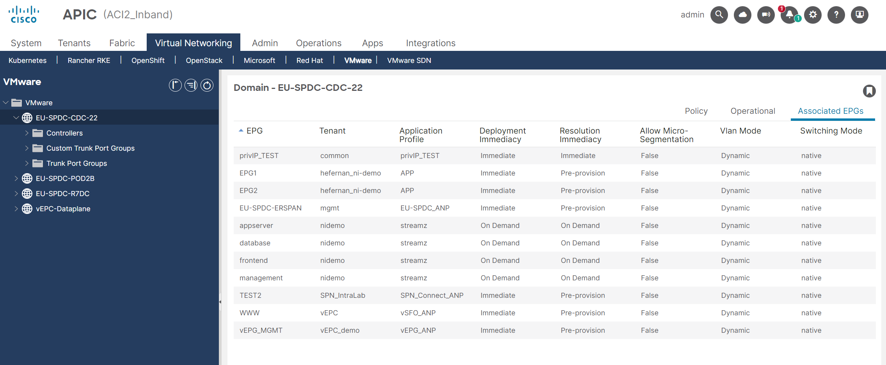

### Diagnostics

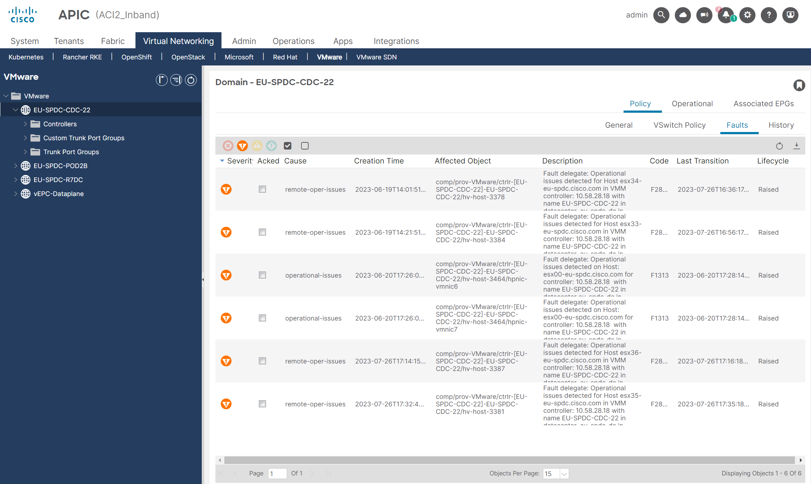

## CLI

### State View

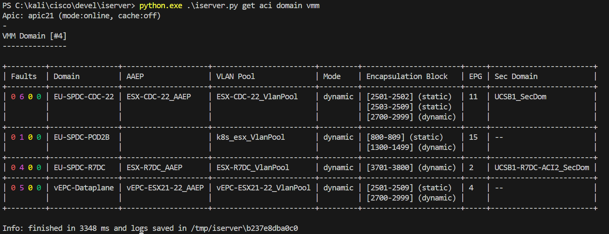

### Prop View

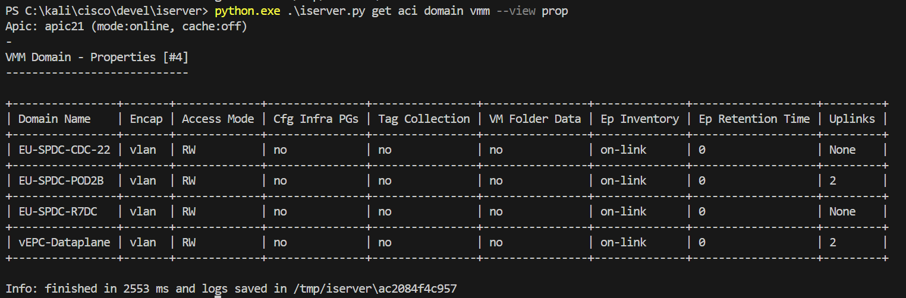

### Vc View

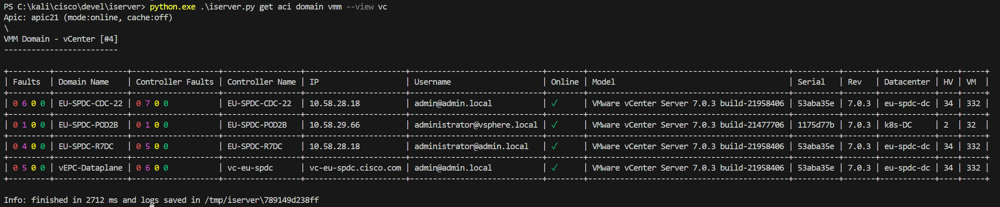

### EPG View

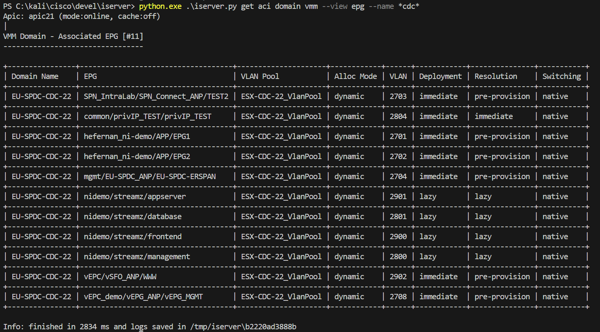

### Node View

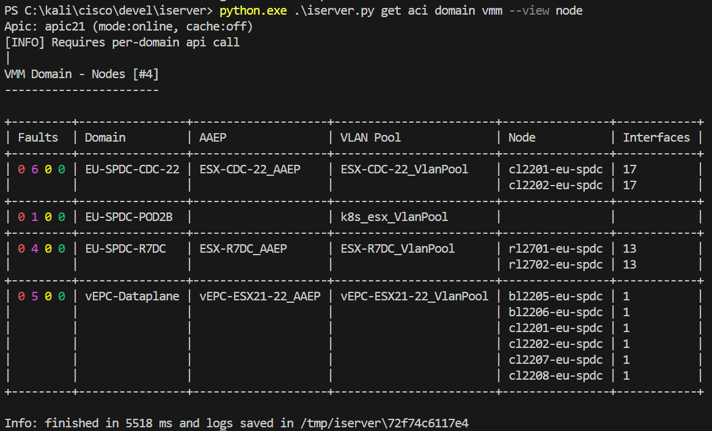

### Intf View

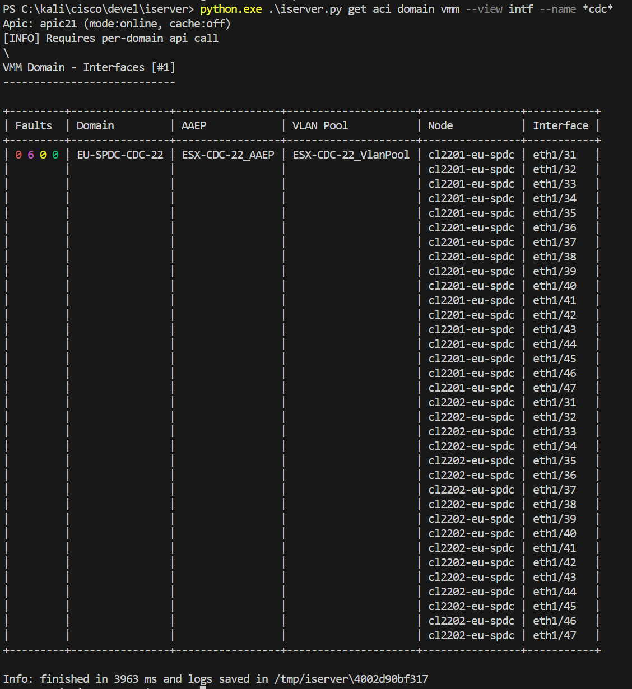

### Vlan View

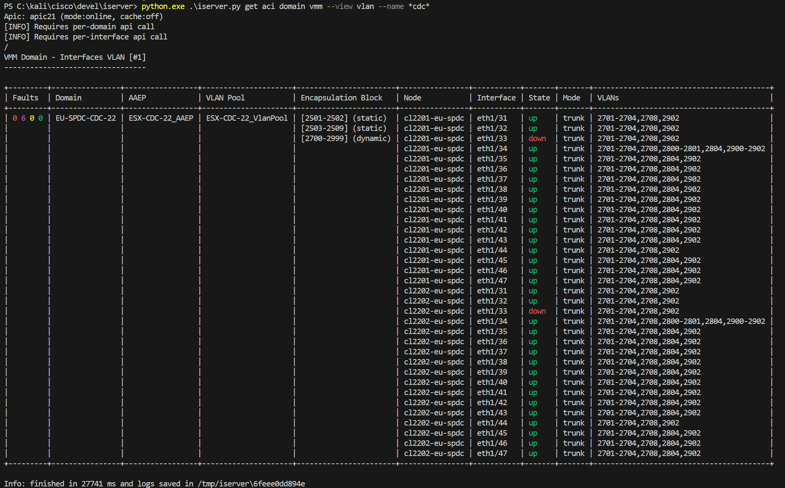

### Diag View

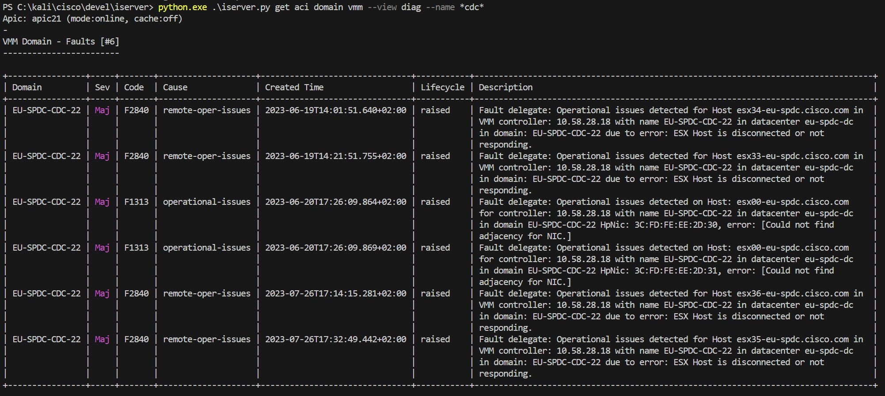

[[Back]](./DomainVmm.md)
