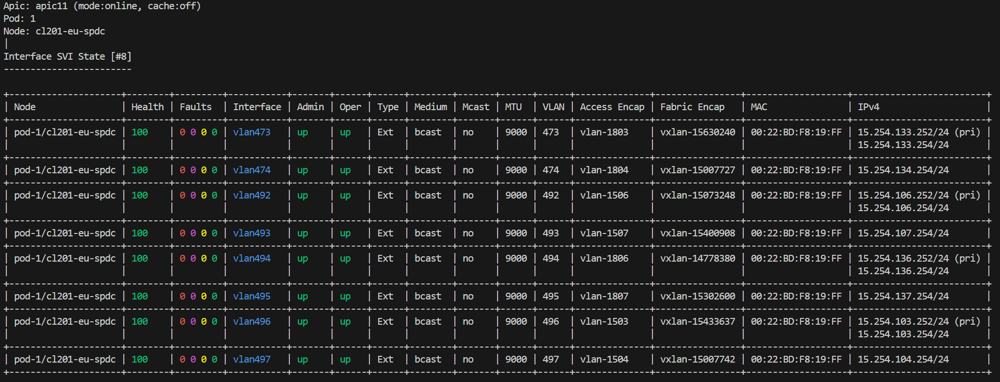

# Node Interface

## SVI

Example:



Node selection options:
  - [single node](./InterfaceSviNode.md)
  - [selected nodes](./InterfaceSviNodes.md)
  - [all nodes](./InterfaceSviNodesAll.md)
  - [multi APIC](./InterfaceSviNodesApics.md)

Filter options:
  - [Interface Name](./InterfaceSviFilterName.md)
  - [Interface Type](./InterfaceSviFilterType.md)
  - [Oper State](./InterfaceSviFilterState.md)
  - [VLAN](./InterfaceSviFilterVlan.md)
  - [Access Encapsulation](./InterfaceSviFilterAccess.md)
  - [Fabric Encapsulation](./InterfaceSviFilterFabric.md)
  - [MAC Address](./InterfaceSviFilterMac.md)
  - [IP address](./InterfaceSviFilterIp.md)
  - [IP subnet](./InterfaceSviFilterSubnet.md)
  - [Fault or Event Severity](./InterfaceSviFilterSeverity.md)
  - [Fault or Event Time Window](./InterfaceSviFilterWhen.md)

View options:
  - [state](./InterfaceSviViewState.md)
  - [stats](./InterfaceSviViewStats.md)
  - [event](./InterfaceSviViewEvent.md)
  - [fault](./InterfaceSviViewFault.md)
  - [diag](./InterfaceSviViewDiag.md)
  - [all](./InterfaceSviViewAll.md)
  - [verbose](./InterfaceSviViewVerbose.md)

Output options:
  - [default](./InterfaceSviOutputDefault.md)
  - [json](./InterfaceSviOutputJson.md)

Command options

```
# iserver get aci intf svi --help

Usage: iserver.py get aci intf svi [OPTIONS]

  Get aci node svi interface

Options:
  --apic TEXT                     APIC name
  --ip TEXT                       APIC IP
  --port INTEGER                  APIC Port  [default: 443]
  --username TEXT                 APIC Username
  --password TEXT                 APIC Password
  --pod TEXT                      Pod ID
  --node TEXT                     Node name patterns
  --role [any|leaf|spine]         [default: any]
  --name TEXT                     Interface name
  --admin [any|up|down]           [default: any]
  --oper [any|up|down]            [default: any]
  --type [any|int|ext]            [default: any]
  --mac TEXT                      MAC Address filter
  --vlan TEXT                     VLAN filter
  --fabric TEXT                   Fabric encap filter
  --access TEXT                   Access encap filter
  --address TEXT                  IP Address filter
  --subnet TEXT                   IP Subnet filter
  --fault                         Filter with faults
  --severity [any|critical|major|minor|warning]
                                  Filter faults by severity  [default: any]
  --when TEXT                     Filter faults by timestamp  [default: 7d]
  -v, --view [state|stats|event|fault|diag|all|verbose]
  -o, --output [default|json]     [default: default]
  --no-cache                      Disable cache
  --devel                         Developer output
  --help                          Show this message and exit.

Info: finished in 64 ms and logs saved in /tmp/iserver\b56fd20f2984
```

[[Back]](./Interface.md)