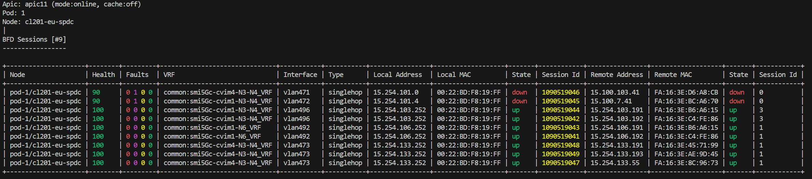

# Node Protocol

## BFD

Example:



Node selection options:
  - [single node](./ProtocolBfdNode.md)
  - [selected nodes](./ProtocolBfdNodes.md)
  - [all nodes](./ProtocolBfdNodesAll.md)

Filter options:
  - [Session ID](./ProtocolBfdFilterSession.md)
  - [Session state](./ProtocolBfdFilterState.md)
  - [Source Interface](./ProtocolBfdFilterInterface.md)
  - [VRF](./ProtocolBfdFilterVrf.md)
  - [IP Address](./ProtocolBfdFilterIp.md)
  - [IP Subnet](./ProtocolBfdFilterSubnet.md)
  - [Fault or Event Severity](./ProtocolBfdFilterSeverity.md)
  - [Fault or Event Time Window](./ProtocolBfdFilterTime.md)

View options:
  - [session](./ProtocolBfdViewSession.md)
  - [stats](./ProtocolBfdViewStats.md)
  - [summary](./ProtocolBfdViewSummary.md)
  - [event](./ProtocolBfdViewEvent.md)
  - [fault](./ProtocolBfdViewFault.md)
  - [diag](./ProtocolBfdViewDiag.md)
  - [all](./ProtocolBfdViewAll.md)
  - [verbose](./ProtocolBfdViewVerbose.md)

Output options:
  - [default](./ProtocolBfdOutputDefault.md)
  - [json](./ProtocolBfdOutputJson.md)

Command options

```
# iserver get aci proto bfd --help

Usage: iserver.py get aci proto bfd [OPTIONS]

  Get aci node protocol bfd

Options:
  --apic TEXT                     APIC name
  --ip TEXT                       APIC IP
  --port INTEGER                  APIC Port  [default: 443]
  --username TEXT                 APIC Username
  --password TEXT                 APIC Password
  --pod TEXT                      Pod ID
  --node TEXT                     Node name patterns
  --role [any|leaf|spine]         [default: any]
  --id TEXT                       Filter by session id
  --intf TEXT                     Filter by interface id
  --state [any|up|down]           Filter by session state  [default: any]
  --vrf TEXT                      Filter by VRF name
  --address TEXT                  Filter by IP address
  --subnet TEXT                   Filter by IP subnet
  --severity [any|critical|major|minor|warning]
                                  Filter faults by severity  [default: any]
  --when TEXT                     Filter faults by timestamp  [default: 7d]
  -v, --view [session|stats|summary|event|fault|diag|all|verbose]
                                  [default: session]
  -o, --output [default|json]     [default: default]
  --no-cache                      Disable cache
  --devel                         Developer output
  --help                          Show this message and exit.

Info: finished in 69 ms and logs saved in /tmp/iserver\6fd32c8dd2ef
```

[[Back]](./Protocol.md)