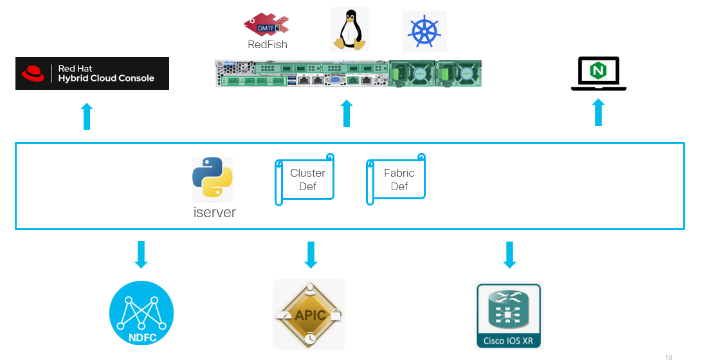

# OpenShift - Bare Metal Cluster Life Cycle Management

## Problem statement

OpenShift assisted installer is great deployment option provided by RedHat. At the same time
- trust that network configuration matches the OpenShift cluster configuration (bonding, IP address, VLAN, etc)
- does not support Cilium CNI from UI level
- manual configuration of the servers boot from generated ISO
- UI click-through inputs and interaction i.e. no full automation
- several post installation steps may be required

Note: while UI supports OVNKubernetes CNI only, assisted installer [REST API](./bm/api.md) supports other CNIs

## Key Features

- network fabric configuration and/or state checks
- zero-touch OpenShift installation on bare metal servers
- OpenShift cluster post-installation tasks

YouTube [playlist](https://www.youtube.com/playlist?list=PLcdvTuD4ZpKZEFXzRUYvZ24Dv2_X2Atsi)

## Requirements

Get the data from RedHat Console
- [pull secret](https://console.redhat.com/openshift/install/pull-secret)
- [access token](https://console.redhat.com/openshift/token)

One-time configuration
- goto [home-dir]/.itool directory that is created the first time you run iserver tool
- create 'openshift' directory
- create 'token' one-liner file with access token
- create 'pull_secret.txt' one-liner file with pull secret

IP reachability
- Internet to download ISO from OpenShift Console
- server imc w/Redfish
- web server for ISO upload
- server imc <=> web server for virtual media mount
- machine host network for Linux SSH and Kubernetes API

## Definintion of intent

Rules:
- input data must be organized in files within single directory passed as parameter to iserver
- cluster.json mandatory file
- cluster.json may contain all information
- intent defitions can be in dedicated files as per table below

Type | Name | Fixed filename | Section Required | Note
--- | --- | --- | --- | ---
File | [cluster.json](./bm/input_data_cluster.md) | True | True | Cluster definition file
File | [server.json](./bm/input_data_server.md) | True | True | cluster.server section
File | [proxy.json](./bm/input_data_proxy.md) | True | False | augments cluster with http proxy settings
File | [ssh.pub](./bm/input_data_ssh_pub.md) | True | True | cluster.ssh_public_key property
File | [web.json](./bm/input_data_web.md) | True | True | cluster.web_server section
File | [redfish.json](./bm/input_data_redfish.md) | True | True | augments cluster.server.redfish section with username and password
File | [tasks.json](./bm/input_data_tasks.md) | True | False | cluster.tasks section
File | [htpasswd](./bm/input_data_htpasswd.md) | False | False | htpasswd-formatted file referred in cluster.tasks.identity provider configuration
File | [fabric.json](./bm/input_data_fabric.md) | True | False | cluster.fabric section
File | [nmstate.yaml](./bm/input_data_nmstate.md) | False | True | nmstate-formatted file for interface configuration of the servers referred by cluster.server.nmstate value with variables
Directory | ssh | True | False | with any-name.pub files for extra SSH pubkey configuration enabled with cluster.tasks.ssh section
Directory | manifests | True | False | [Custom CNI manifests](./bm/input_data_cni.md) with optional variables defined in cluster.json

[Example configuration](../../../../tree/master/samples/ocp/cluster/bm)

## Create

- execute 'iserver create ocp cluster bm --dir [directory-name]'
- option --fabric check (default) to trigger fabric check workflow
- option --fabric patch to trigger fabric configuration workflow
- option --mode create (default) to trigger cluster installation workflow
- option --mode check to trigger cluster intent definition check-only workflow

## Delete

- execute 'iserver delete ocp cluster bm --dir [directory-name]'
- option --fabric to trigger fabric unconfiguration workflow

## Modules

- [Verification](./bm/verification.md)
- [Fabric configuration](./bm/input_data_fabric.md)
- [Cluster installation](./bm/cluster.md)
- [Post-installation tasks](./bm/input_data_tasks.md)

[[Back]](../../README.md)