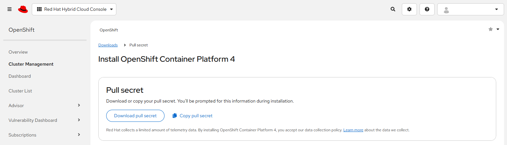
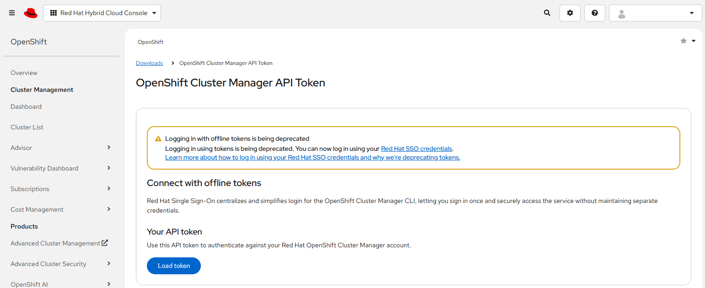

# OpenShift Console API

[[Back]](./Operations.md) [[Next]](./BareMetalCluster.md)

OpenShift cluster installation use OpenShift Console API access. One-time configuration is **required** to properly authenticate.

## Requirement

Valid accout at [RedHat Openshift console](https://console.redhat.com)

## Step 1: Pull secret

Downloaded [pull secret](https://console.redhat.com/openshift/install/pull-secret)



## Step 2: Token

Access OpenShift Cluster Manager API Token [page](https://console.redhat.com/openshift/token), click 'Load Token' button and save API token to local file



## Step 3: Configure iserver with pull secret and token

```
# iserver set ocp console --token C:\tmp\token.txt --secret C:\tmp\pull-secret.txt

OpenShift Workflow - OpenShift Console REST API - Configure access
==================================================================

Openshift settings directory will be created: C:\Users\user\.itool\openshift
Token saved: C:\Users\user\.itool\openshift\token
Pull secret saved: C:\Users\user\.itool\openshift\pull_secret.txt
OpenShift console connection successful
```

## Step 4: (Re)Check

```
# iserver get openshift login
Authentication successful
```

[[Back]](./Operations.md) [[Next]](./BareMetalCluster.md)