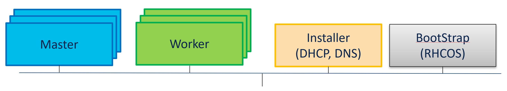

# OpenShift Container Platform (OCP)

Uses mix of Openshift and Kubernetes API calls to provide the configuration and operational state of OCP cluster, cloud native and virtual machines workloads via CLI.

## Cluster Life Cycle Management

### vCenter

Requirements:
- single vCenter
- all virtual machines in single folder and connected to single network

Usage:
- [define cluster](DefineVcenterCluster.md)
- [create cluster](./CreateVcenterCluster.md)
- [delete cluster](./DeleteVcenterCluster.md)
- [get cluster settings and state](./GetCluster.md)

## OpenShift Virtualization (tbd)

- [define virtual machine](./VmDefine.md)
- [create virtual machine](./VmCreate.md)
- [delete virtual machine](./VmDelete.md)
- [get state of virtual machines](./VmState.md)

[[Back]](../../README.md)