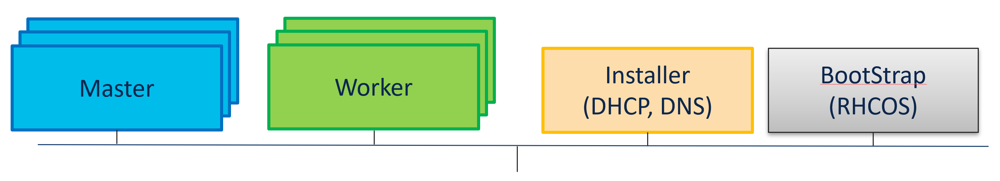

# OpenShift Container Platform (OCP)

## vCenter - Cluster Life Cycle Management

Requirements:
- single vCenter
- all virtual machines in single folder and connected to single network

Usage:
- [define cluster](./vcenter/DefineVcenterCluster.md)
- [create cluster](./vcenter/CreateVcenterCluster.md)
- [delete cluster](./vcenter/DeleteVcenterCluster.md)
- [get cluster settings and state](./vcenter/GetVcenterCluster.md)

[[Back]](./Operations.md)