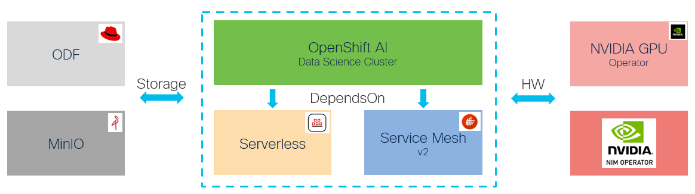

# Data Science (AI) Operator

OpenShift AI as per [documentation](https://www.redhat.com/en/products/ai/openshift-ai).

## Life Cycle Management Commands

Command | Intent | Details
--- | --- | ---
iserver get ocp ai | check the data science (ai) operator state | [Link](./get.md)
iserver set ocp ai --mode operator | install data science (ai) operator | [Link](./create_operator.md)
iserver set ocp ai --mode cluster | add data science cluster | [Link](./create_cluster.md)
iserver set ocp ai --mode all | install operator and add data science cluster | [Link](./create_all.md)
iserver set ocp task | in task way | [AI-only](./create_task.md), [with-dependencies](./create_task_all.md)
iserver delete ocp ai --mode operator | uninstall data science (ai) operator | [Link](./delete_operator.md)
iserver delete ocp ai --mode cluster | delete data science cluster | [Link](./delete_cluster.md)
iserver delete ocp ai --mode all | delete data science cluster and uninstall operator | [Link](./delete_all.md)
iserver delete ocp task | in task way | [AI-only](./delete_task.md), [with-dependencies](./delete_task_all.md)

[[Back]](../Operations.md)