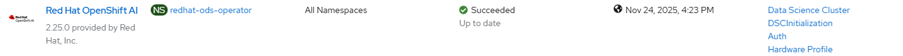
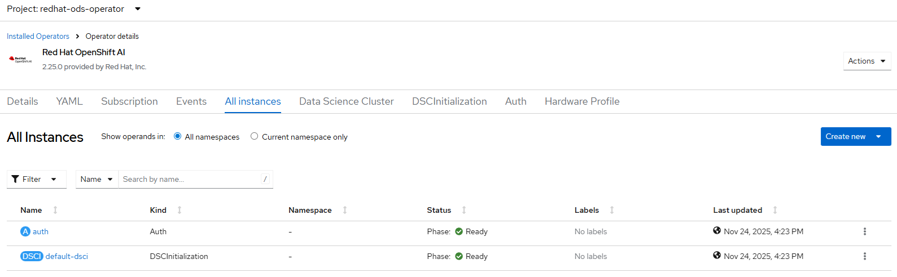
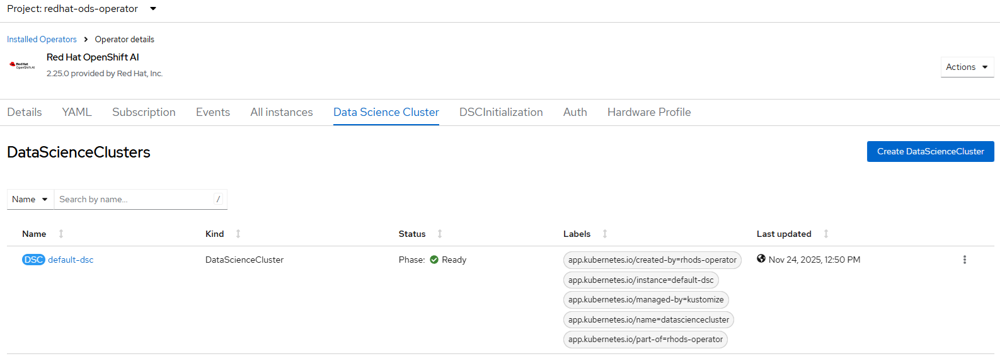
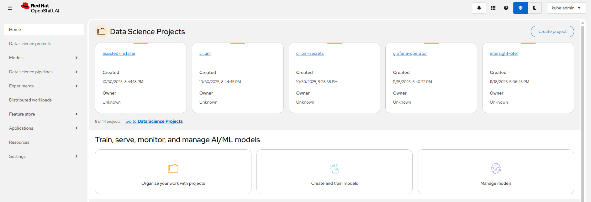

# Data Science (AI) Operator - Create Operator and Data Science Cluster

## Workflow

[create operator](./create_operator.md)
- create redhat-ods-operator namespace
- create operator group
- create subscription with user controlled channel or defaultChannelName
- wait for operator resources
- wait for auth ready
- wait for data science cluster initialization ready

[create cluster](./create_cluster.md)
- create data science cluster either based on default configuration or user provided definition
- default configuration patched with all-managed components
- wait for data science cluster resources ready

## Requirements

None

## Expected outcome

### Operator installed



### Operator resources ready



### Data Science Cluster ready



### Dashboard reachable



## Configurable options

```
# iserver set ocp ai --mode all
  --cluster TEXT     Cluster Name
  --channel TEXT     Operator channel  [default: __default__]
  --filename TEXT    DataScienceCluster CRD
  --no-confirm       Confirmation mode
```

## Example

```
# iserver set ocp ai --cluster bm1 --mode all --no-confirm


OpenShift Workflow - Data Science (AI) - Create Operator
========================================================

OpenShift Cluster: bm1

Create Namespace
----------------
- name: redhat-ods-operator

~~~
apiVersion: v1
kind: Namespace
metadata:
  name: redhat-ods-operator

~~~

Namespace created

Wait for namespace [timeout:60]...

Create Operator Group
---------------------
Operator group: redhat-ods-operator/ods-operator-group

~~~
apiVersion: operators.coreos.com/v1
kind: OperatorGroup
metadata:
  name: ods-operator-group
  namespace: redhat-ods-operator
spec:
  upgradeStrategy: Default

~~~

Operator group created

Wait for operator group [timeout:60]...

Create Subscription
-------------------
Subscription: redhat-ods-operator/rhods-operator
Source: openshift-marketplace/redhat-operators/rhods-operator
Install plan approval: Automatic
Getting subscription and packege manifest information...
Resolving channel name...
Channel: stable
- CSV [rhods-operator.2.25.0]
- CSV Display name [Red Hat OpenShift AI]
- CVS Version [2.25.0]
- CSV Provider [{'name': 'Red Hat, Inc.'}]
- CSV Maturity [stable]

~~~
apiVersion: operators.coreos.com/v1alpha1
kind: Subscription
metadata:
  name: rhods-operator
  namespace: redhat-ods-operator
spec:
  channel: stable
  installPlanApproval: Automatic
  name: rhods-operator
  source: redhat-operators
  sourceNamespace: openshift-marketplace

~~~

Subscription created

Wait for subscription install plan started [timeout:360]...
Install plan: install-7f96n
Wait for subscription install plan ready [timeout:600]...
Install plan succeeded
Wait for deployments ready (optional: True, allow zero replicas: False)...
- redhat-ods-operator/rhods-operator
Wait for data science cluster initialization...
default-dsci
Wait for data science cluster initialization [default-dsci] ready...
Wait for auth...
auth
Wait for auth [auth] ready...

Completed tasks
- Namespace created
- Operator Group created
- Data Science (AI) Operator installed
- Data Science Cluster Initialization ready
- Auth ready

OpenShift Workflow - Data Science (AI) - Create Data Science Cluster
====================================================================

OpenShift Cluster: bm1

Create Data Science Cluster
---------------------------
- name: default-dsc

~~~
apiVersion: datasciencecluster.opendatahub.io/v1
kind: DataScienceCluster
metadata:
  labels:
    app.kubernetes.io/created-by: rhods-operator
    app.kubernetes.io/instance: default-dsc
    app.kubernetes.io/managed-by: kustomize
    app.kubernetes.io/name: datasciencecluster
    app.kubernetes.io/part-of: rhods-operator
  name: default-dsc
spec:
  components:
    codeflare:
      managementState: Managed
    dashboard:
      managementState: Managed
    datasciencepipelines:
      managementState: Managed
    feastoperator:
      managementState: Managed
    kserve:
      managementState: Managed
      nim:
        managementState: Managed
      serving:
        ingressGateway:
          certificate:
            type: OpenshiftDefaultIngress
        managementState: Managed
        name: knative-serving
    kueue:
      managementState: Managed
    llamastackoperator:
      managementState: Managed
    modelmeshserving:
      managementState: Managed
    modelregistry:
      managementState: Managed
      registriesNamespace: rhoai-model-registries
    ray:
      managementState: Managed
    trainingoperator:
      managementState: Managed
    trustyai:
      managementState: Managed
    workbenches:
      managementState: Managed

~~~

DataScienceCluster created

Wait for data science cluster crd [timeout:60]...
Wait for data science cluster ready...
Waiting for: Code Flare, Dashboard, Data Science Pipeline, Feast Operator, Kserver, Kqueue, Llama Stack Operator, Model Mesh Serving, Model Registry, Ray, Training Operator, TrustyAI, Workbench
Waiting for: Code Flare, Dashboard, Data Science Pipeline, Feast Operator, Kserver, Kqueue, Model Mesh Serving, Model Registry, Ray, Training Operator, TrustyAI, Workbench
Waiting for: Dashboard, Data Science Pipeline, Feast Operator, Kserver, Kqueue, Model Mesh Serving, Ray, Training Operator, Workbench
Waiting for: Dashboard, Feast Operator, Kserver, Kqueue, Model Mesh Serving, Ray, Training Operator, Workbench
Waiting for: Dashboard, Feast Operator, Kserver, Model Mesh Serving, Ray, Training Operator
Waiting for: Dashboard, Kserver, Model Mesh Serving
Waiting for: Dashboard, Kserver
Waiting for: Dashboard
Waiting for: 
Waiting for ready state...
Wait for data science cluster resources...

Completed tasks
- Data Science Cluster created
```

[[Back]](./README.md)