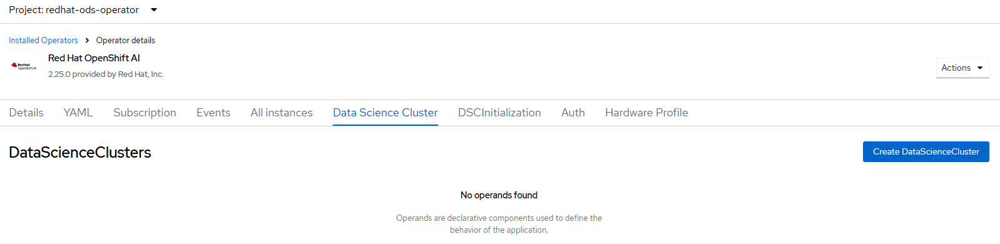

# Data Science (AI) Operator - Delete Cluster

## Workflow

- delete data science cluster either selected by --dsc or all clusters
- wait for no data science cluster resources

## Requirements

Data science operator [created](./create_operator.md)

## Expected Outcome



## Configurable options

```
# iserver delete ocp ai --mode cluster 
  --cluster TEXT                 Cluster Name
  --dsc TEXT                     Data Science Cluster
```

## Example

```
# iserver delete ocp ai --cluster bm1 --mode cluster --dsc default-dsc

OpenShift Workflow - Data Science (AI) - Delete Data Science Cluster
====================================================================

OpenShift Cluster: bm1

Delete Data Science Cluster
---------------------------
- name: default-dsc
- wait for no data science cluster instance

Completed tasks
- Selected data science cluster deleted
```

[[Back]](./README.md)