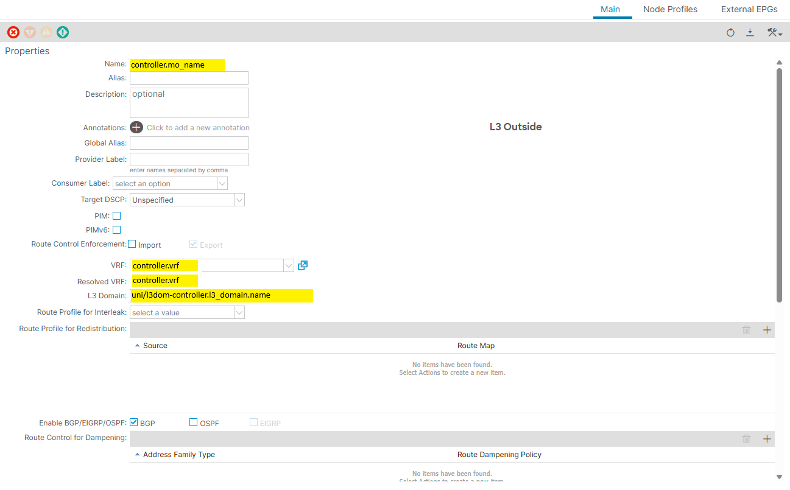
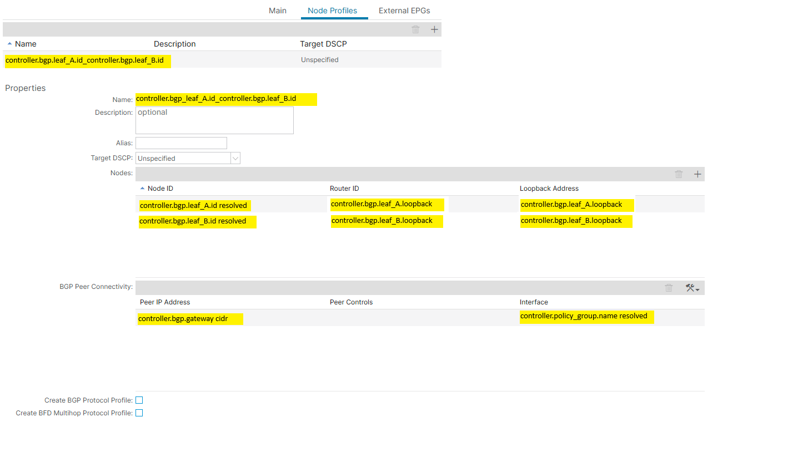
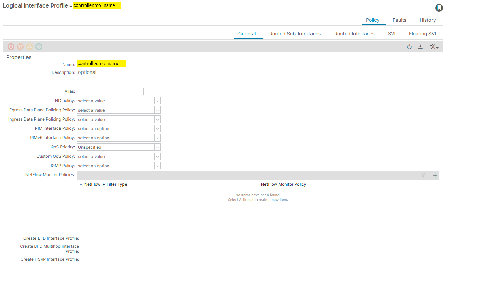
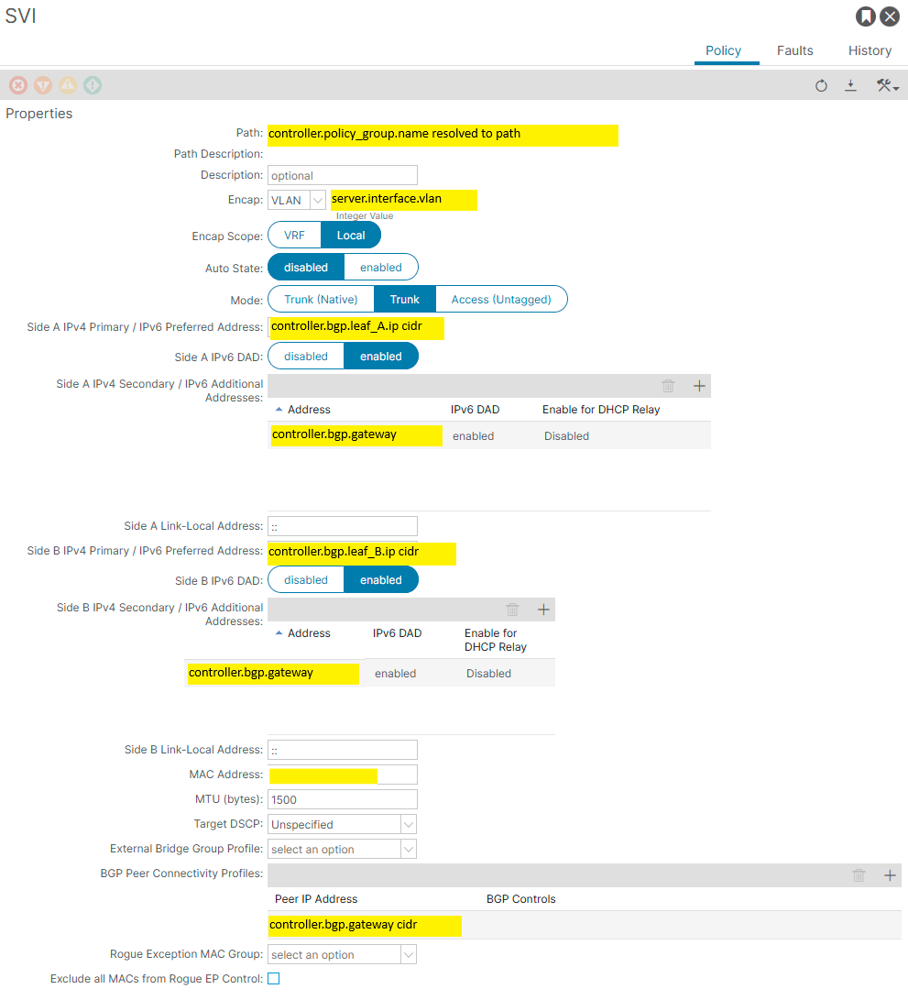
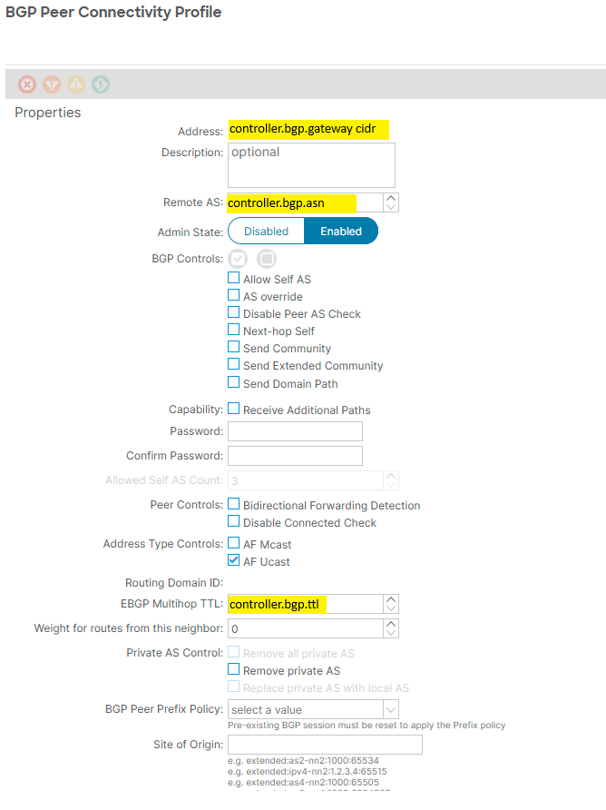
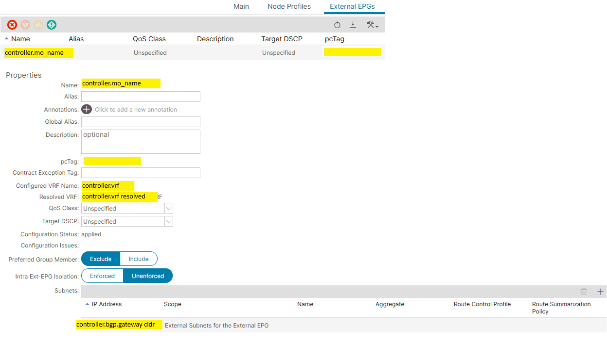

# ACI Fabric - Data model

## BGP

Property | Type | Default | Values
--- | --- | --- | ---
managed | bool | true | true/false
enabled | bool | true | true/false
shared | bool | false | true/false
name | string | tenant-mo_name-domain | any
type | string | svi | svi
gateway | string | generated | server.interface.gateway
ttl | int | 5 | <1,128>
asn | int | --- | <1, 65535>
l3out.name | string | generated | controller.mo_name
lnp.name | string | generated | [leaf_A.id]_[leaf_B.id]
lnp.lip | string | generated | controller.mo_name
leaf_A.id | string | --- | Valid node id
leaf_A.ip | string | --- | Valid ip within gateway subnet
leaf_A.loopback | string | --- | Valid ip
leaf_B.id | string | --- | Valid node id
leaf_B.ip | string | --- | Valid ip within gateway subnet
leaf_B.loopback | string | --- | Valid ip
epg.name | string | generated | controller.mo_name
epg.subnet | list of dict | generated | based on gateway cidr
epg.subnet.ip | string | generated | gateway cidr
epg.subnet.scope | list of strings | import-security

Example:

```
"bgp": {
    "enabled": true,
    "managed": true,
    "shared": false,
    "name": "bm31",
    "asn": 64666,
    "gateway": "10.4.4.15/28",
    "ttl": 5,
    "leaf_A": {
        "id": "100",
        "ip": "10.4.4.13",
        "loopback": "100.100.100.100"
    },
    "leaf_B": {
        "id": "200",
        "ip": "10.4.4.14",
        "loopback": "200.200.200.200"
    }
}
```

Notes:
- managed mode 'true' for object that can be created, updated and deleted
- managed mode 'false' for object that is read-only
- shared mode 'false' for object fully mananged by single workflow
- shared mode 'true' for object shared between workflows or non-workflows
- delete workflow expects that managed object can be deleted with no references once configurations are deleted. otherwise error is raised unless object is marked as shared.











