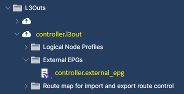

# ACI Fabric - Data model

## External EPG

Required only in case of controller.bgp.enabled:true.

BGP create workflow adds machine network to external EPG of controller.l3out.

In case there is only one external EPG, then it controller.external_epg value is automatically populated.

Otherwise, it must be user-defined.

