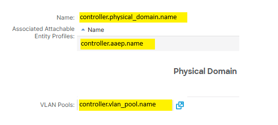

# ACI Fabric - Data model

## Physical Domain

Property | Type | Default | Values
--- | --- | --- | ---
managed | bool | true | true/false
enabled | bool | true | true/false
shared | bool | false | true/false
name | string | tenant-mo_name-domain | any

Notes:
- managed mode 'true' for object that can be created, updated and deleted
- managed mode 'false' for object that is read-only
- shared mode 'false' for object fully mananged by single workflow
- shared mode 'true' for object shared between workflows or non-workflows
- delete workflow expects that managed object can be deleted with no references once configurations are deleted. otherwise error is raised unless object is marked as shared.

