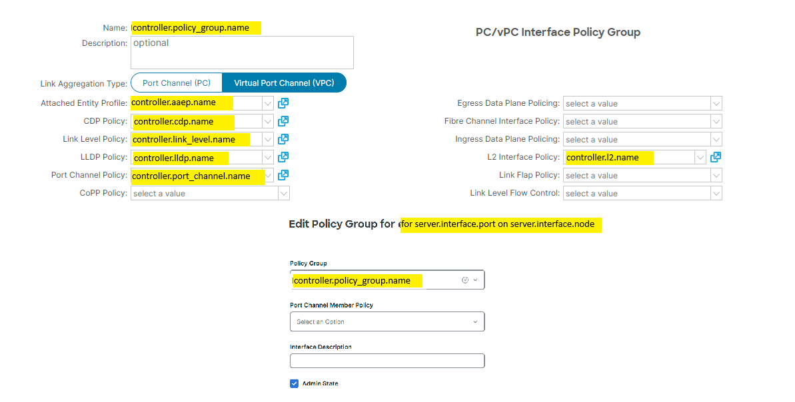

# ACI Fabric - Data model

## Interface Policy Group

Property | Type | Default | Values
--- | --- | --- | ---
managed | bool | true | true/false
enabled | bool | true | true/false
shared | bool | false | true/false
name | string | tenant-mo_name-domain[-index] | any
type | string | detected (*) | individual/pc/vpc
encap | string | detected (*) | vlan-[int]
immediacy | string | immediate | immediate

Interface policy group is done per-server
- if only one server, then name has no index value
- otherwise index value is index (order) of the server

Properties type and encap are generated/detected based on server interfaces
- if only one interface, then type is individual
- if two interfaces in single node, then type is pc
- if two interfaces in different nodes, then type is vpc
- vlan encapsulation is based on server.interface.vlan property

Name, type and encap properties can be user-defined.

Notes:
- managed mode 'true' for object that can be created, updated and deleted
- managed mode 'false' for object that is read-only
- shared mode 'false' for object fully mananged by single workflow
- shared mode 'true' for object shared between workflows or non-workflows
- delete workflow expects that managed object can be deleted with no references once configurations are deleted. otherwise error is raised unless object is marked as shared.

### VPC

