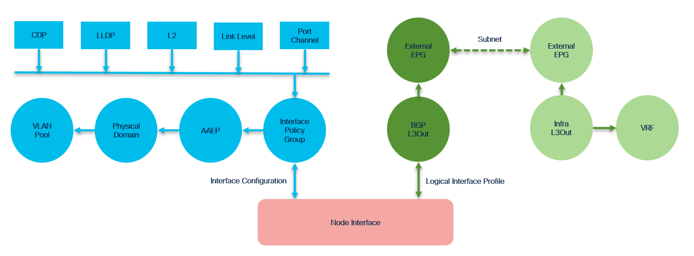

# ACI Fabric - Delete workflow

The delete workflow is launched with 'iserver delete ocp cluster bm --dir [directory-name] --fabric' command as long as fabric.json file is in defined directory.

## Overview

iserver can fully unconfigure ACI fabric for OpenShift bare metal cluster connectivity based on definitions (intent) in fabric.json file. Leaving the unmanaged ACI fabric configuration part i.e.
- Tenant
- VRF
- L3Out

Two deployment models are supported:
- epg/bd (for non-bgp case)


- l3out w/external-epg (for bgp case)



Objects deleted as per diagram above:
- objects deleted by name
    - object name generated based on controller.tenant, controller.domain and controller.mo_name user-provided values
    - object names can be explictly defined
- objects deleted if managed
    - object marked as unmanaged are not deleted
- objects deleted may have no existing relationships
    - if object configured with shared:true then delete is skipped
    - if object configured with default shared:false then delete workflow breaks with error

## Example EPG/BD

### Environment

- Single Node OpenShift (SNO) cluster with bonded interface over VLAN encapsulation.
- All ACI objects managed with generated name and default properties
- The expectation is that all objects besides tenant, vrf and l3out are deleted and interfaces unconfigured

### fabric.json

```
{
    "controller": [
        {
            "type": "aci",
            "apic": "myapic",
            "domain": "main",
            "mo_name": "bm2",
            "tenant": "k8s",
            "l3out": "MyL3out",
            "vrf": "MyVrf"
        }
    ],
    "server": [
        {
            "hostname": "bm2",
            "interface": [
                {
                    "domain": "main",
                    "ip": "10.4.4.1",
                    "gateway": "10.4.4.15/28",
                    "mac": "aa:aa:aa:aa:aa:aa",
                    "bond": true,
                    "trunk": true,
                    "vlan": 666,
                    "node": "100",
                    "port": "1/1/1"
                },
                {
                    "domain": "main",
                    "ip": "10.4.4.1",
                    "gateway": "10.4.4.15/28",
                    "mac": "bb:bb:bb:bb:bb:bb",
                    "bond": true,
                    "trunk": true,
                    "vlan": 666,
                    "node": "200",
                    "port": "1/1/1"
                }
            ]
        }
    ]
}
```

### Workflow

Steps
- input data validation and expansion
- tenant, vrf and l3out checks
- delete objects using generated names

Tasks
- delete epg static ports
- delete epg to phys domain association
- delete epg
- delete application profile
- delete bridge domain
- unconfigure access policy from interfaces
- delete vpc policy group
- delete interface policies: cdp, lldp, link level, l2 and port channel
- delete aaep
- delete physical domain
- delete vlan pool

Note: before delete operation checks run that object has no relationships

[Back](./input_data_fabric.md)