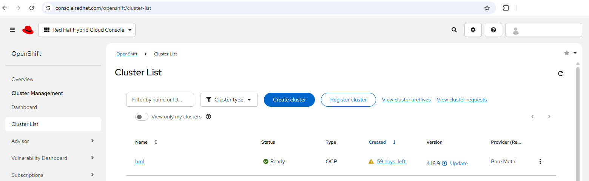

# cluster.json (base)

[[Back]](../BareMetalCluster.md) [[Next]](./input_data_server.md) [[aio]](./input_data_cluster_aio.md)

**mandatory** file

## Example

```json
{
    "name": "my-cluster",
    "base_dns_domain": "domain.com",
    "ntp": "ntp.domain.com",
    "api": "10.10.10.20",
    "ingress": "10.10.10.21",
    "openshift_version": "4.19.6",
    "cpu_architecture": "x86_64",
    "cluster_network_cidr": "10.128.0.0/14",
    "cluster_network_host_prefix": 23,
    "service_network_cidr": "172.30.0.0/16",
    "machine_network_gateway": "10.5.5.15/28",
    "network_type": "OVNKubernetes",
    "iso": "full",
    "dns_ip": "40.40.40.40",
    "dns_search": "domain.com"
}
```

## Mimimum

The smallest cluster.json file example for single-node-openshift

```json
{
    "name": "my-cluster",
    "base_dns_domain": "domain.com",
    "machine_network_gateway": "10.10.10.254/24",
    "ntp": "ntp.domain.com",
    "dns_ip": "40.40.40.40",
    "dns_search": "domain.com"
}
```

The smallest cluster.json file example for 3+ node cluster

```json
{
    "name": "my-cluster",
    "base_dns_domain": "domain.com",
    "machine_network_gateway": "10.10.10.254/24",
    "ntp": "ntp.domain.com",
    "dns_ip": "40.40.40.40",
    "dns_search": "domain.com",
    "api": "10.10.10.20",
    "ingress": "10.10.10.21"
}
```

## Configurable defaults

```json
{
    "openshift_version": "the-latest-production-version",
    "cpu_architecture": "x86_64",
    "cluster_network_cidr": "10.128.0.0/14",
    "cluster_network_host_prefix": 23,
    "service_network_cidr": "172.30.0.0/16",
    "network_type": "OVNKubernetes",
    "iso": "minimal"
}
```

## Selected attributes

### name

Cluster name will appear on the list of OpenShift clusters at console.redhat.com



It will be also used internally in iserver tool for day2ops

```
# iserver get ocp access --cluster my-cluster
```

### base_dns_domain

The full cluster address is [name].[base_dns_domain]

Example bind dns configuration

```
$ttl 3600
my-cluster.domain.com.      IN      SOA     dns.domain.com. (
                        2025071801
                        3600
                        600
                        1209600
                        3600 )
my-cluster.domain.com.          IN      NS      dns.domain.com.
api                             IN      A       10.10.10.20
*.apps                          IN      A       10.10.10.21
```

### ntp

NTP server configured on every cluster node

```
[cluster-node]$ cat /etc/chrony.conf 
...
server ntp.domain.com iburst
```

### dns ip and dns search domain

DNS settings configured on every cluster node

### Openshift version and cpu architecture

Openshift_version defaults to the latest production version 

```
# iserver get openshift ai version

+-------------------+---------------+-----------------------------------------+
| OpenShift Version | Support Level | CPU Architectures                       |
+-------------------+---------------+-----------------------------------------+
| 4.19.16           | production    | ['x86_64', 'ppc64le', 's390x', 'arm64'] |
+-------------------+---------------+-----------------------------------------+
```

Select any other production, maintenance, beta or end-of-life version as required

```
# iserver get openshift ai version --type production

+-------------------+---------------+-----------------------------------------+
| OpenShift Version | Support Level | CPU Architectures                       |
+-------------------+---------------+-----------------------------------------+
| 4.19.16           | production    | ['x86_64', 'ppc64le', 's390x', 'arm64'] |
+-------------------+---------------+-----------------------------------------+
| 4.19.16-multi     | production    | ['x86_64', 'arm64', 's390x', 'ppc64le'] |
+-------------------+---------------+-----------------------------------------+
| 4.19.15           | production    | ['x86_64', 'ppc64le', 'arm64', 's390x'] |
+-------------------+---------------+-----------------------------------------+
| 4.19.15-multi     | production    | ['x86_64', 'arm64', 's390x', 'ppc64le'] |
+-------------------+---------------+-----------------------------------------+

Support level filter (--type): latest (def), production, beta, maintenance, end-of-life
```

cpu_architecture value must be supported for the selected openshift version

### Network type

CNI network type can be OVNKubernetes (default) or Cilium with manifests provided in dedicated input directory.

Note: cilium automated [fixup](./cilium_fixup.md)

### ISO 

ISO can be minimal (default) or full.

The main difference is that the minimal ISO boots a smaller Red Hat Enterprise Linux CoreOS (RHCOS) image and downloads the rest of the operating system during the installation, while the full ISO is a much larger, self-contained live disk image with everything needed pre-installed. The full ISO is better for disconnected or slower networks because it is self-sufficient, whereas the minimal ISO is smaller to transfer but requires an internet connection for the initial setup. 

### Disk encryption

The default cluster settings do not enable disk encryption and cluster.json default attributes are

```json
    "disk_encryption": "none",
    "encryption_mode": "tpmv2"
```

Change disk_encryption parameter to one of the supported values to requst cluster installation with disk encryption:
- masters
- arbiters
- workers
- masters,arbiters
- masters,workers
- arbiters,workers
- masters,arbiters,workers
- all

These user settings are passed to cluster create API [request](https://api.openshift.com/api/assisted-install/v2/openapi) in disk-encryption properties.

### ISO and Kubeconfig download from RedHat

ISO is generated by RedHat assisted installer and then downloaded by iserver with ssl verification check and default timeout of 600 seconds. Kubeconfig download at the end of installation procedure has the same defaults.

These settings can be changed in iso property of cluster.json

```json
    "iso": {
        "mode": "full",
        "check_ssl": false,
        "timeout": 1800
    }
```

### ISO Manipulation

ISO generated by RedHat's assisted installer defines core user with ssh public key based authentication. It is possible to modify the ignition and define plaintext password for core user. This task can be done locally i.e., on the Linux host where iserver runs on; or remotely i.e., any Linux host accessible via ssh

Requirements
- Linux 
- openssl
- podman or docker
- passwordless sudo

This intent is defined in cluster.json by iso property modification. Exec property allowed values are podman, docker and detect (default).

#### Local ISO modification

```json
    "iso": {
        "mode": "full",
        "core": "password123",
        "ip": "localhost",
        "exec": "podman"
    }
```

#### Remote ISO modification

```json
    "iso": {
        "mode": "full",
        "core": "password123",
        "ip": "10.10.10.10",
        "username": "user",
        "password": "password",
        "exec": "docker"
    }
```

Note: use ssh-public-key property if needed

[[Back]](../BareMetalCluster.md) [[Next]](./input_data_server.md) [[aio]](./input_data_cluster_aio.md)