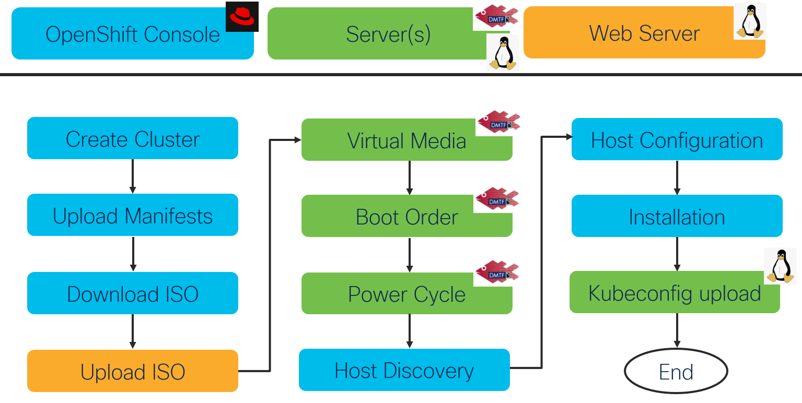

# web.json



Web server is crucially important in the installation workflow as shown in the diagram above
- RedHat's cloud generates an iso image from which the servers need to boot from
- iso is downloaded locally i.e. to the machine where iserver runs on
- iso is uploaded to web server
- bare metal servers are configured via redfish to mount iso as virtual media over http
- servers boot from iso
- no http proxy is expected between server IMC and web server.

The web server can run:
- locally i.e. on the same machine where iserver runs on, then the downloaded iso is copied to proper filesystem location
- remotely i.e. on any server reachable via the network, then the downloaded iso is copied over the network (scp) to proper filesystem location

Web server definition is used to instruct the workflow
- where is the web server (localhost vs remote)
- if local, where downloaded iso must be copied (image_upload_directory)
- if remote,
    - how to access and authenticate for secure copy (ip/username/password/ssh_public_key)
    - where downloaded iso must be copied (image_upload_directory)
- how to configure servers' virtual media via redfish (image_base_url)

Web server can be defined in cluster.json web_server section or in dedicated web.json file. The examples below show dedicated file content.

## Local web server

```
{
    "ip": "localhost",
    "image_base_url": "http://your-machine-ip:8080",
    "image_upload_directory": "/var/image"
}
```

Notes:
- ip:localhost triggers local web server workflow behavior
- image_upload_directory must be absolute path, this is where downloaded iso will be locally copied
- server virtual media will be configured with image_base_url/downloaded-iso-name url 

Example to start local webserver

```
sudo docker run -it --rm -d -p 8080:80 --name image -v /var/image:/usr/share/nginx/html nginx
```

## Remote web server with public key-based ssh authentication

```
{
    "ip": "ip-or-name-of-the-web-server",
    "username": "user",
    "password": null,
    "ssh_public_key": "ssh-ed25519 AAAA...",
    "image_base_url": "http://ip-or-name-of-the-web-server:8080",
    "image_upload_directory": "./image"
}
```

Notes:
- password attribute can be skipped
- image_upload_directory may be relative to home-dir of username or absolute path, this is where downloaded iso will be uploaded to via ssh/scp
- server virtual media will be configured with image_base_url/downloaded-iso-name url 

## Remote web server with password-based authentication

```
{
    "ip": "ip-or-name-of-the-web-server",
    "username": "user",
    "password": "password",
    "image_base_url": "http://ip-or-name-of-the-web-server:8080",
    "image_upload_directory": "./image"
}
```

Notes:
- image_upload_directory may be relative to home-dir of username or absolute path, this is where downloaded iso will be uploaded to via ssh/scp
- server virtual media will be configured with image_base_url/generated.iso

[Back](../BareMetalCluster.md)
