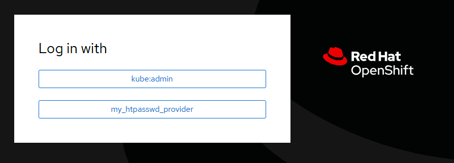
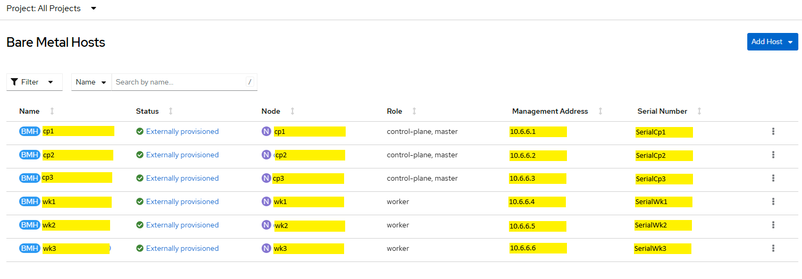
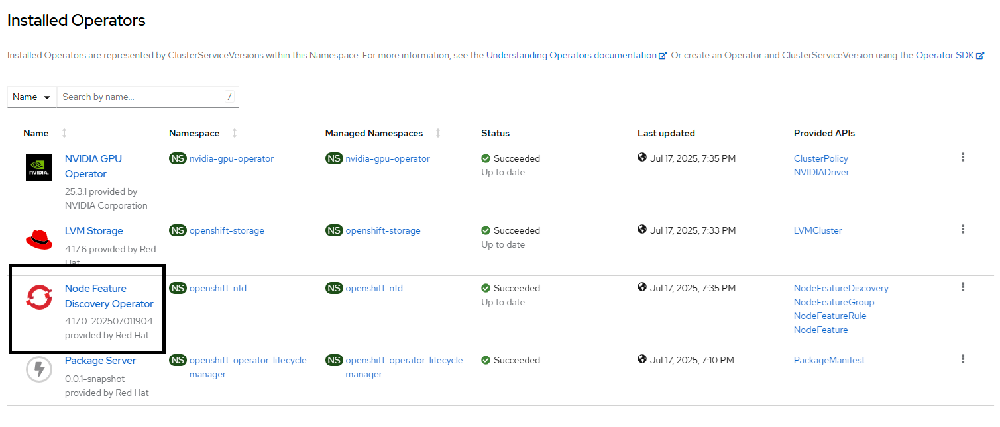
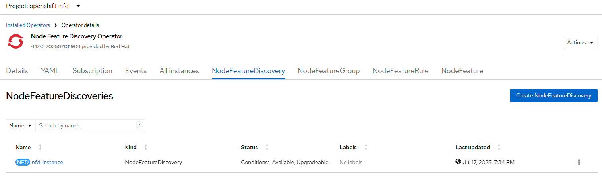
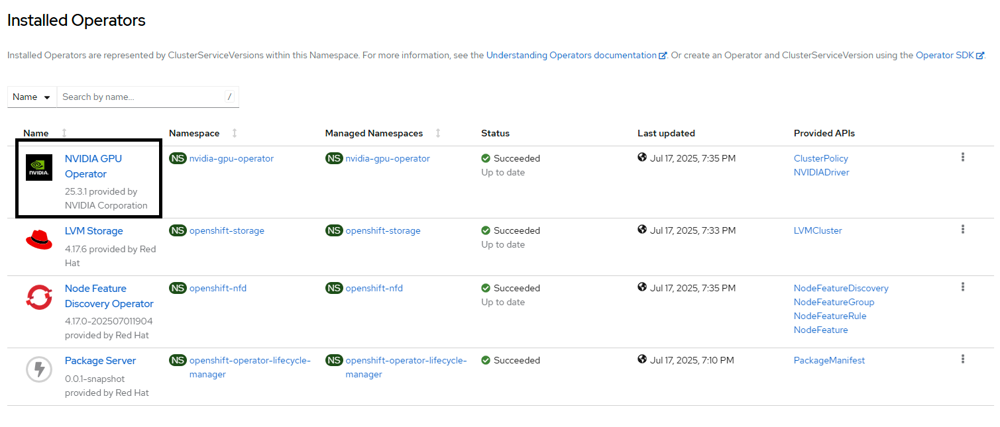
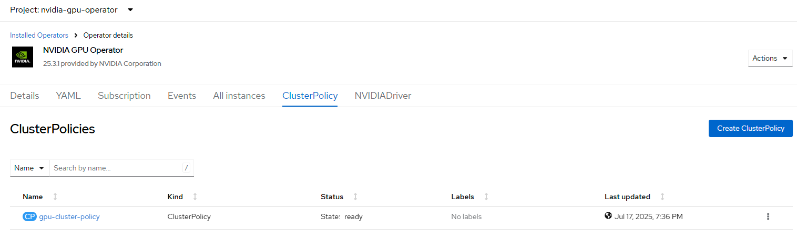
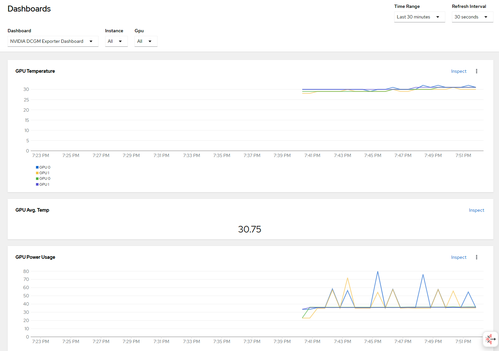
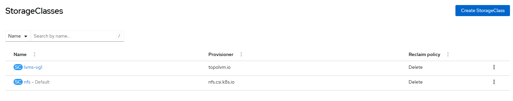

# OpenShift Cluster on UCSX with NVIDIA GPU

## Intent

Main automation goals
- deploy OpenShift Cluster on UCSX with NVIDIA GPU
- NFD operator
- GPU operator and GPU monitoring dashboard
- NFS CSI and nfs storage class being the default one
- HTPasswd Identity Provider with users and admins credentials from input file
- Configure bare metal server's redfish details for power management from OpenShift

## RunIt

- prepare input directory files with your intent
    - [cluster.json](./uc1_cluster.md) definining cluster and tasks intent
    - [single.yaml](./uc1_single.md) for single interface with vlan connection to fabric
    - [htpasswd](./uc1_htpasswd.md) for HTPasswd Identity Provider configuration
- **iserver create ocp cluster bm --dir [dir-name] --mode install**
- wait for the fabric-and-cluster installation to be completed

## Workflow

- verify input files
- check servers for Redfish access and operations
- cluster installation using RedHat Console API and Redfish API
    - define cluster with Cilium CNI
    - upload manifests
    - download generated ISO
    - boot server from ISO
    - wait for server calling-home to RedHat's cloud
    - initiate cluster
- post-installation tasks

## Result

OpenShift Cluster installed as requested
- OpenShift version 4.17.30
- OVNKubernetes CNI
- 6-node cluster following master/worker allocation
- .bashrc configured with proxy settings
- kubeconfig uploaded to cluster management node
- selected day2ops binaries uploaded to cluster node
- operators installed and configured
- NFS CSI configured incl. default storage class
- power management ready cluster

```
$ oc version
Client Version: 4.17.0-202504171308.p0.g0000b3e.assembly.stream-0000b3e
Kustomize Version: v5.0.4-0.20230601165947-6ce0bf390ce3
Server Version: 4.17.30
Kubernetes Version: v1.30.12
```

```
$ oc get node
NAME  STATUS   ROLES                  AGE   VERSION
cp1   Ready    control-plane,master   41m   v1.30.12
cp2   Ready    control-plane,master   24m   v1.30.12
cp3   Ready    control-plane,master   41m   v1.30.12
wk1   Ready    worker                 23m   v1.30.12
wk2   Ready    worker                 24m   v1.30.12
wk3   Ready    worker                 24m   v1.30.12
```

```
$ oc get network cluster -o yaml
apiVersion: config.openshift.io/v1
kind: Network
metadata:
  name: cluster
spec:
  clusterNetwork:
  - cidr: 10.128.0.0/14
    hostPrefix: 23
  externalIP:
    policy: {}
  networkDiagnostics:
    mode: ""
    sourcePlacement: {}
    targetPlacement: {}
  networkType: OVNKubernetes
  serviceNetwork:
  - 172.30.0.0/16
status:
  clusterNetwork:
  - cidr: 10.128.0.0/14
    hostPrefix: 23
  clusterNetworkMTU: 1400
  networkType: OVNKubernetes
  serviceNetwork:
  - 172.30.0.0/16
```

The single server selected with kube:true (cp1) is prepared for oc/kubectl with kubeconfig

```
$ ls .kube/
config

$ oc get node
[ready to be used]
```

On top of the following CLI tasks are defined

```
"cli": {
    "bashrc": true,
    "helm": true
}
```

preparing .bashrc with proxy settings from cluster.json file and installing helm binary on the kube:true selected server

## HTPasswd Identity Provider

HTPasswd Identity Provider is configured based on task definition

```
"identity": {
    "provider": "htpasswd",
    "filename": "htpasswd",
    "admin": [
        "__ALL__"
    ]
}
```

that will create users from htpasswd input file and make all of them admins



```
$ iserver get ocp htpasswd

OAuth HTPasswd [#1]
-------------------

+---------+----------------------+---------------+-----------+------------------+
| OAuth   | Name                 | Secret        | Is Secret | User             |
+---------+----------------------+---------------+-----------+------------------+
| cluster | my_htpasswd_provider | htpass-secret | True      | user1 (admin)    |
|         |                      |               |           | user2 (admin)    |
+---------+----------------------+---------------+-----------+------------------+
```

## Node annotations

All nodes are annotated with server hardware details based on cluster.json input file, showing single node as example

```
$ oc get node cp1 -o yaml
apiVersion: v1
kind: Node
metadata:
  annotations:
    server-imc: 10.5.5.1
    server-model: UCSX-210C-M7
    server-serial: SerialCp1
```

The workflow is triggerd with the following task

```
"server": {
    "node-annotation": true
}
```

## Power management

The server's BMC is automatically configured with redfish credentials allowing power management from OpenShift level

Minimum input task trigerring the workflow

```
"server": {
    "power-management": {}
}
```

Configurable options

```
"server": {
    "power-management": {
        "enabled": true|false(def),
        "wait-registered": true(def)|false,
        "check-ssl": true(def)|false
    }
}
```

Workflow
- create secret with redfish credentials
- patch BareMetalHost objects bmc specification with
  - bmc address
  - secret name
  - certificate verification (based on check-ssl)
- wait until server reaches 'externally provisioned' state (based on wait-registered)



```
$ oc get bmh -A
NAMESPACE               NAME  STATE                    CONSUMER         ONLINE   ERROR   AGE
openshift-machine-api   cp1   externally provisioned   master-0         true             53m
openshift-machine-api   cp2   externally provisioned   master-1         true             53m
openshift-machine-api   cp3   externally provisioned   master-2         true             53m
openshift-machine-api   wk1   externally provisioned   worker-0-649hz   true             53m
openshift-machine-api   wk2   externally provisioned   worker-0-7wnc4   true             53m
openshift-machine-api   wk3   externally provisioned   worker-0-gd79q   true             53m
```

```
$ oc get secret -n openshift-machine-api
NAME                         TYPE                DATA   AGE
cp1-bmc-secret               Opaque              2      15m
cp2-bmc-secret               Opaque              2      15m
cp3-bmc-secret               Opaque              2      15m
wk1-bmc-secret               Opaque              2      15m
wk2-bmc-secret               Opaque              2      15m
wk3-bmc-secret               Opaque              2      15m
```

## NFD

Node Feature Discovery operator installation and configuration.

```
"nfd": {}
```

Configurable options (showing defaults below)

```
"nfd": {
    "break-on-error": false,
    "check-fqdn": false,
    "namespace": "openshift-nfd",
    "name": "nfd",
    "channel": "stable",
    "instance": "nfd-instance"
}
```

Workflow
- install nfd operator
- create nfd instance based on the default configuration provided by operator
- wait until nfd deployments and deamon sets are ready
- wait until nodes are annotated by nfd

iserver output

```
Task nfd
--------
{
    "break-on-error": false,
    "check-fqdn": false,
    "namespace": "openshift-nfd",
    "name": "nfd",
    "channel": "stable",
    "instance": "nfd-instance",
    "confirmation": false,
    "cluster": "ocp-bm3"
}

kind: Subscription
apiVersion: operators.coreos.com/v1alpha1
metadata:
  name: nfd
  namespace: openshift-nfd
spec:
  channel: stable
  installPlanApproval: Automatic
  name: nfd
  source: redhat-operators
  sourceNamespace: openshift-marketplace
  startingCSV: nfd.4.17.0-202507011904

Namespace created: openshift-nfd
Operator group created for namespace: openshift-nfd
Subsciption create api successful
Wait for install plan...
Wait for install plan install-vlxmf finished...
Install plan succeeded
Create node feature discovery instance
NFD Operator installed and configured
Wait for deployments ready...
- openshift-nfd/nfd-controller-manager
- openshift-nfd/nfd-master
Wait for deamon sets ready...
- openshift-nfd/nfd-worker
Wait for annotations on all worker nodes
Node [wk1] annotations found
Node [wk2] annotations found
Node [wk3] annotations found

Completed tasks
- NFD Operator installed and configured
- NFD annotations found on the nodes
```





```
$ oc get nodefeaturediscoveries -A
NAMESPACE       NAME           AGE
openshift-nfd   nfd-instance   14m
```

```
$ oc get nodefeatures -A
NAMESPACE       NAME  AGE
openshift-nfd   wk1   14m
openshift-nfd   wk2   14m
openshift-nfd   wk3   14m
```

## GPU

NVIDIA GPU operator installation and configuration.

```
"gpu": {}
```

Configurable options (showing defaults below)

```
"gpu": {
    "break-on-error": false,
    "check-fqdn": false,
    "namespace": "openshift-marketplace",
    "name": "gpu-operator-certified",
    "channel": "stable"
}
```

Workflow
- install gpu operator
- create cluster policy based on the default policy provided by operator
- wait until gpu deployments are ready

iserver output

```
Task gpu
--------
{
    "break-on-error": false,
    "check-fqdn": false,
    "namespace": "openshift-marketplace",
    "name": "gpu-operator-certified",
    "channel": "stable"
}

kind: Subscription
apiVersion: operators.coreos.com/v1alpha1
metadata:
  name: gpu-operator-certified
  namespace: nvidia-gpu-operator
spec:
  channel: stable
  installPlanApproval: Automatic
  name: gpu-operator-certified
  source: certified-operators
  sourceNamespace: openshift-marketplace
  startingCSV: gpu-operator-certified.v25.3.1

Namespace created: nvidia-gpu-operator
Operator group created for namespace: nvidia-gpu-operator
Subsciption create api successful
Wait for install plan...
Wait for install plan install-5vh6v finished...
Install plan succeeded
GPU operator installed
Wait for deployments ready...
- nvidia-gpu-operator/gpu-operator
NVIDIA/GPU cluster policy needs to be created
Default cluster policy from channel [stable] created: gpu-cluster-policy

Completed tasks
- GPU Operator installed
```





```
$ oc get clusterpolicy
NAME                 STATUS   AGE
gpu-cluster-policy   ready    2025-07-17T17:36:02Z
```

## GPU Monitoring Dashboard

Following the [documentation](https://docs.nvidia.com/datacenter/cloud-native/openshift/latest/enable-gpu-monitoring-dashboard.html) for NVIDIA GPU Operator on Red Hat OpenShift Container Platform.

Minimum task definition

```
"gpu": {
    "monitoring": {}
}
```

Expanded with configurable defaults

```
"monitoring": {
      "enabled": true,
      "dashboard_url": "https://github.com/NVIDIA/dcgm-exporter/raw/main/grafana/dcgm-exporter-dashboard.json",
      "dashboard_namespace": "openshift-config-managed",
      "dashboard_name": "nvidia-dcgm-exporter-dashboard",
      "admin": true,
      "developer": false
}
```

Workflow
- download dashboard from dashboard_url
- create config map with dashboard content in specified namespace/name
- add admin or developer labels to config map for Console UI access control

```
$ oc get configmap -n openshift-config-managed nvidia-dcgm-exporter-dashboard
NAME                             DATA   AGE
nvidia-dcgm-exporter-dashboard   1      18m
```



## Storage Class

OpenShift cluster is installed with LVM operator for storage. The automation goal\
- install NFS CSI with helm
- configure nfs storage class
- make it default

Minimum task definition

```
"storage": {
    "nfs": {
        "server": "10.9.9.9",
        "share": "/export/nfs-share",
        "dir": "${pvc.metadata.namespace}-${pvc.metadata.name}",
        "default": true
    }
}
```

Expanded with configurable defaults

```
{
    "server": "10.9.9.9",
    "share": "/export/nfs-share",
    "dir": "${pvc.metadata.namespace}-${pvc.metadata.name}",
    "default": true,
    "enabled": true,
    "helm_repo": "https://raw.githubusercontent.com/kubernetes-csi/csi-driver-nfs/master/charts",
    "helm_namespace": "kube-system",
    "helm_name": "csi-driver-nfs",
    "helm_version": "4.6.0",
    "storage_class": "nfs"
}
```

Workflow
- add helm_repo
- install helm package based on helm_name and helm_version into helm_namespace
- wait for deployments and deamon sets to be ready
- configure storage class
- make it default

iserver output

```
Storage NFS (CSI)
-----------------
{
    "server": "10.9.9.9",
    "share": "/export/nfs-share",
    "dir": "${pvc.metadata.namespace}-${pvc.metadata.name}",
    "default": true,
    "enabled": true,
    "helm_repo": "https://raw.githubusercontent.com/kubernetes-csi/csi-driver-nfs/master/charts",
    "helm_namespace": "kube-system",
    "helm_name": "csi-driver-nfs",
    "helm_version": "4.6.0",
    "storage_class": "nfs"
}
- storage class will be created: nfs

- NFS helm chart will be installed
- nfs helm repo added
- nfs helm chart installed
Wait for deployments ready...
- kube-system/csi-nfs-controller
Wait for deamon sets ready...
- kube-system/csi-nfs-node
{
    "apiVersion": "storage.k8s.io/v1",
    "kind": "StorageClass",
    "metadata": {
        "name": "nfs",
        "annotations": {
            "storageclass.kubernetes.io/is-default-class": "true"
        }
    },
    "parameters": {
        "server": "10.9.9.9",
        "share": "/export/nfs-share",
        "subDir": "${pvc.metadata.namespace}-${pvc.metadata.name}"
    },
    "provisioner": "nfs.csi.k8s.io",
    "reclaimPolicy": "Delete",
    "volumeBindingMode": "WaitForFirstConsumer",
    "allowVolumeExpansion": true
}

- storage class created successfully
```



```
$ helm ls -A
NAME            NAMESPACE       REVISION        UPDATED                                 STATUS          CHART                   APP VERSION
csi-driver-nfs  kube-system     1               2025-07-17 17:36:14.50996487 +0000 UTC  deployed        csi-driver-nfs-v4.6.0   v4.6.0
```

```
$ oc get all -n kube-system
Warning: apps.openshift.io/v1 DeploymentConfig is deprecated in v4.14+, unavailable in v4.10000+
NAME                                      READY   STATUS    RESTARTS   AGE
pod/csi-nfs-controller-5566d78cdd-xd7tp   4/4     Running   0          23s
pod/csi-nfs-node-9ln8h                    3/3     Running   0          23s
pod/csi-nfs-node-d5jsb                    3/3     Running   0          23s
pod/csi-nfs-node-rp4tw                    3/3     Running   0          23s
pod/csi-nfs-node-s68hr                    3/3     Running   0          23s
pod/csi-nfs-node-w66rs                    3/3     Running   0          23s
pod/csi-nfs-node-x7tnf                    3/3     Running   0          23s

NAME              TYPE        CLUSTER-IP   EXTERNAL-IP   PORT(S)                        AGE
service/kubelet   ClusterIP   None         <none>        10250/TCP,10255/TCP,4194/TCP   22h

NAME                          DESIRED   CURRENT   READY   UP-TO-DATE   AVAILABLE   NODE SELECTOR            AGE
daemonset.apps/csi-nfs-node   6         6         6       6            6           kubernetes.io/os=linux   23s

NAME                                 READY   UP-TO-DATE   AVAILABLE   AGE
deployment.apps/csi-nfs-controller   1/1     1            1           23s

NAME                                            DESIRED   CURRENT   READY   AGE
replicaset.apps/csi-nfs-controller-5566d78cdd   1         1         1       23s
```

```
$ oc get sc nfs -o yaml
allowVolumeExpansion: true
apiVersion: storage.k8s.io/v1
kind: StorageClass
metadata:
  annotations:
    storageclass.kubernetes.io/is-default-class: "true"
  creationTimestamp: "2025-07-17T17:36:41Z"
  name: nfs
parameters:
  server: 10.9.9.9
  share: /export/nfs-share
  subDir: ${pvc.metadata.namespace}-${pvc.metadata.name}
provisioner: nfs.csi.k8s.io
reclaimPolicy: Delete
volumeBindingMode: WaitForFirstConsumer
```

```
$ oc get sc
NAME            PROVISIONER      RECLAIMPOLICY   VOLUMEBINDINGMODE      ALLOWVOLUMEEXPANSION   AGE
lvms-vg1        topolvm.io       Delete          WaitForFirstConsumer   true                   21m
nfs (default)   nfs.csi.k8s.io   Delete          WaitForFirstConsumer   true                   18m
```

[Back](../BareMetalCluster.md)