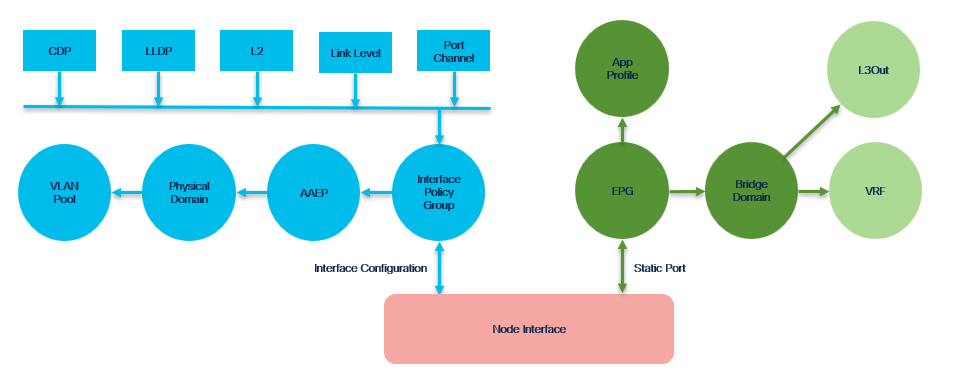

# OpenShift Cluster with Cilium CNI

## Fabric Configuration Overview

- OpenShift cluster node connects to ACI fabric via two physical interfaces that are configured in bonding mode with VLAN encapsulation.
- Several configuration constructs are required in the ACI domain to prepare for such connectivity.
- Refer to [ACI fabric configuration documentation](./fabric_aci_create.md) for further details.

## Input Data Example

Follows BD/EPG deployment mode



```
{
    "controller": [
        {
            "type": "aci",
            "apic": "my-apic",
            "domain": "main",
            "mo_name": "bm",
            "tenant": "k8s",
            "l3out": "MyL3out",
	        "vrf": "MyVrf"
        }
    ],
    "server": [
        {
            "hostname": "bm",
            "interface": [
                {
                    "domain": "main",
                    "ip": "10.6.6.1",
                    "gateway": "10.6.6.254/24",
                    "mac": "11:11:11:11:11:11",
                    "bond": true,
                    "trunk": true,
                    "vlan": 666,
                    "node": "100",
                    "port": "1/1/1"
                },
                {
                    "domain": "main",
                    "ip": "10.6.6.1",
                    "gateway": "10.6.6.254/24",
                    "mac": "22:22:22:22:22:22",
                    "bond": true,
                    "trunk": true,
                    "vlan": 666,
                    "node": "200",
                    "port": "1/1/1"
                }
            ]
        }
    ]
}
```

## Output Example

```
Apic [apic21] domain [main] configuration
------------------------------------------
Checks
- Tenant [k8s] found
- VRF [MyVrf] found in common tenant
- L3Out [MyL3out] found in common tenant

Validated and resolved fabric configuration intent
{
    "type": "aci",
    "apic": "apic21",
    "domain": "main",
    "mo_name": "bm",
    "tenant": "k8s",
    "l3out": "MyL3out",
    "vrf": "MyVrf",
    "check_mode": "full",
    "l3_domain": {
        "enabled": false
    },
    "bgp": {
        "enabled": false
    },
    "vlan_pool": {
        "managed": true,
        "enabled": true,
        "shared": false,
        "name": "k8s-bm-main",
        "vlan": "666",
        "mode": "static"
    },
    "physical_domain": {
        "managed": true,
        "enabled": true,
        "shared": false,
        "name": "k8s-bm-main"
    },
    "aaep": {
        "managed": true,
        "enabled": true,
        "shared": false,
        "name": "k8s-bm-main"
    },
    "policy_group": {
        "managed": true,
        "enabled": true,
        "shared": false,
        "name": "k8s-bm-main",
        "type": "vpc",
        "encap": "vlan-666",
        "immediacy": "immediate"
    },
    "ap": {
        "managed": true,
        "enabled": true,
        "shared": false,
        "name": "bm"
    },
    "epg": {
        "managed": true,
        "enabled": true,
        "shared": false,
        "name": "k8s/bm/main"
    },
    "bd": {
        "managed": true,
        "enabled": true,
        "shared": false,
        "name": "bm-main",
        "gateway": "10.6.6.254/24"
    },
    "cdp": {
        "managed": true,
        "enabled": true,
        "shared": false,
        "name": "k8s-bm-main",
        "cdp_enabled": true
    },
    "lldp": {
        "managed": true,
        "enabled": true,
        "shared": false,
        "name": "k8s-bm-main",
        "lldp_receive": true,
        "lldp_transmit": true
    },
    "link_level": {
        "managed": true,
        "enabled": true,
        "shared": false,
        "name": "k8s-bm-main",
        "auto": "on",
        "media": "auto",
        "debounce": 100,
        "delay": 0,
        "emi": false
    },
    "l2": {
        "managed": true,
        "enabled": true,
        "shared": false,
        "name": "k8s-bm-main",
        "qinq": "disabled",
        "relay": false,
        "vlan": "local"
    },
    "port_channel": {
        "managed": true,
        "enabled": true,
        "shared": false,
        "name": "k8s-bm-main",
        "mode": "on",
        "min": 1,
        "max": 16,
        "lb": "static",
        "suspend": true,
        "graceful": true,
        "fast": true,
        "symmetric": false,
        "hash": null
    },
    "l3out_tenant": "common"
}

Validated and resolved servers connectivity layout
[
    {
        "hostname": "bm",
        "interface": [
            {
                "domain": "main",
                "ip": "10.6.6.1",
                "gateway": "10.6.6.254/24",
                "mac": "11:11:11:11:11:11",
                "bond": true,
                "trunk": true,
                "vlan": "666",
                "node": "100",
                "port": "1/1/1",
                "mtu": "1500",
                "pod": "1"
            },
            {
                "domain": "main",
                "ip": "10.6.6.1",
                "gateway": "10.6.6.254/24",
                "mac": "22:22:22:22:22:22",
                "bond": true,
                "trunk": true,
                "vlan": "666",
                "node": "200",
                "port": "1/1/1",
                "mtu": "1500",
                "pod": "1"
            }
        ]
    }
]

VLAN Pool
        Enabled
        Pool [k8s-bm-main] with vlans [666]
        Managed mode [True]
        - VLAN pool will be created
        - VLAN pool created

Physical Domain
        Enabled
        Name [k8s-bm-main]
        Managed mode [True]
        - physical domain will be created
        - associated with vlan pool [k8s-bm-main]
        - phys domain created

L3 Domain
        Disabled

Attachable Access Entity Profile
        Enabled
        Name [k8s-bm-main]
        Managed mode [True]
        - profile will be created and associated with phys domain [k8s-bm-main]
        - profile created

Policy CDP
        Enabled
        Name [k8s-bm-main]
        Managed mode [True]
        - policy cdp will be created
        - cdp enabled [True]
        - policy cdp created

Policy LLDP
        Enabled
        Name [k8s-bm-main]
        Managed mode [True]
        - policy lldp will be created
        - lldp receive enabled [True]
        - lldp transmit enabled [True]
        - policy lldp created

Policy Link Level
        Enabled
        Name [k8s-bm-main]
        Managed mode [True]
        - policy link level will be created
        - auto [on]
        - media [auto]
        - debounce [100]
        - delay [0]
        - emi [False]
        - policy link level created

Policy L2
        Enabled
        Name [k8s-bm-main]
        Managed mode [True]
        - policy l2 will be created
        - qinq [disabled]
        - relay [False]
        - vlan [local]
        - policy l2 created

Policy Port Channel
        Enabled
        Name [k8s-bm-main]
        Managed mode [True]
        - policy port channel will be created
        - mode [on]
        - min [1]
        - max [16]
        - lb [static]
        - suspend [True]
        - graceful [True]
        - symmetric [False]
        - fast [True]
        - hash [None]
        - policy port channel created

Policy Group
        Enabled
        Name [k8s-bm-main]
        Managed mode [True]

Policy Group VPC
        Name [k8s-bm-main]
        - policy group will be created
        - Port channel interface policy [k8s-bm-main] found
        - CDP interface policy [k8s-bm-main] found
        - LLDP interface policy [k8s-bm-main] found
        - Link level interface policy [k8s-bm-main] found
        - Layer2 interface policy [k8s-bm-main] found
        - policy group created

Policy Group on access interface [bm]
        Policy [k8s-bm-main]
        - not configured on any interface
        Checking interface pod [1] node [100] interface [1/1/1]
        - no configuration
        - policy [k8s-bm-main] configured on interface
        Checking interface pod [1] node [200] interface [1/1/1]
        - no configuration
        - policy [k8s-bm-main] configured on interface

Bridge Domain
        Enabled
        Name [k8s/bm-main]
        Managed mode [True]
        - bridge domain will be created
        - bridge domain created

Application Profile
        Enabled
        Name [k8s/bm]
        Managed mode [True]
        - application profile will be created
        - application profile created

EPG
        Enabled
        Name [k8s/bm/main]
        Managed mode [True]
        - epg will be created
        - epg created with bd [bm-main] association
        - epg association with phys domain [k8s-bm-main] must be configured
        - epg associated with phys domain [k8s-bm-main]
        - epg static port with policy [k8s-bm-main] must be configured
        - static port added [topology/pod-1/protpaths-100-200/pathep-[k8s-bm-main]] [vlan-666] [immediate]
```

[Back](./uc2.md)