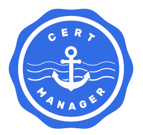

# Certificate Manager

cert-manager adds certificates and certificate issuers as resource types in Kubernetes clusters, and simplifies the process of obtaining, renewing and using those certificates. See more details [here](https://github.com/cert-manager/cert-manager)

## Life Cycle Management Commands

Command | Intent | Details
--- | --- | ---
iserver get ocp cert-manager | get cert manager state and resources | [Link](./get.md)
iserver set ocp cert-manager | install cert manager | [Link](./enable.md)
iserver set ocp task | in task way | [Link](./create_task.md)
iserver delete ocp cert-manager | uninstall cert manager | [Link](./disable.md)
iserver delete ocp task | in task way | [Link](./delete_task.md)

[[Back]](../Operations.md)