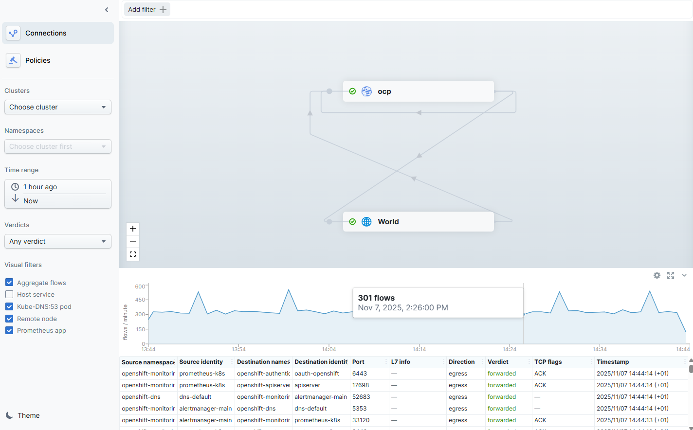

# Cilium Timescape - Create via Task

## Input

```
[
  {
    "cilium-timescape": {
      "feature": {}
    }
  }
]
```

Notes:
- [feature](./enable.md) trigger workflow execution with optional input parameters

## Requirements

None

## Configurable options

```
# iserver set ocp task 
  --cluster TEXT   Cluster Name
  --filename TEXT  Tasks filename
  --validate       Validate only
  --break          Break on error
  --no-confirm     Confirmation mode
```

## Expected outcome

- timescape enabled
- timescape ui route created



## Example

```
# iserver set ocp task --cluster bm1 --filename C:\tmp\task.json --no-confirm

OpenShift Workflow - Create Tasks
=================================

Validate Input
--------------
Completed


OpenShift Workflow - Cilium - Enable Timescape
==============================================

Workflow Parameters
-------------------
{
    "cluster": "bm1",
    "confirmation": false,
    "route": true,
    "check-verbose": true,
    "namespace": "cilium",
    "package": "clife",
    "operator-name": "cilium-operator",
    "agent-name": "cilium"
}


OpenShift Cluster
-----------------
- cluster: bm1 [domain:*****]
- api [*****]: ok
- dns resolution: ok


Operator
--------
- subscription          : cilium/clife
- package               : openshift-marketplace/certified-operators/clife
- channel               : 1.17
- install plan          : cilium/install-v6tpt
- install plan approved : ✓
- installed csv         : clife.v1.17.9-cee.1
- latest_csv            : ✓

~~~
enterprise:
  featureGate:
    approved:
    - HubbleTimescape
hubble:
  enabled: true
  export:
    timescape:
      tls:
        mtls:
          enabled: true
  relay:
    enabled: false
  timescape:
    enabled: true
    ingester:
      k8sImporter:
        enabled: true
    static:
      exporter:
        enabled: true
    useStreamAPI: true
  tls:
    enabled: true

~~~

Cilium config update
--------------------
CiliumConfig CRD patched
Take a nap to detect automatic deployment restart...
Automatic pods rollout detected

Wait for Cilium resources
-------------------------
- pod: cilium-5l5pb
- pod: cilium-envoy-bwzml
- pod: cilium-envoy-gm8k5
- pod: cilium-envoy-v9jgx
- pod: cilium-hpmlt
- pod: cilium-operator-85c8cf7cf6-2gx6x
- pod: cilium-operator-85c8cf7cf6-fm8k9
- pod: cilium-shnfm
- pod: clife-controller-manager-6c79869f6c-gcj6l
- pod: clustermesh-apiserver-5fbcd5b558-gws27
- pod: hubble-timescape-0
- deployment: cilium-operator
- deployment: clife-controller-manager
- deployment: clustermesh-apiserver
Wait for timescape pods...
Wait for timescape endpoints...

Create cilium timescape route
-----------------------------
- service namespace: cilium
- service name: hubble-timescape
- service found
- route namespace: cilium
- route name: hubble-timescape

~~~
apiVersion: route.openshift.io/v1
kind: Route
metadata:
  labels:
    app.kubernetes.io/component: hubble-timescape
    app.kubernetes.io/managed-by: Helm
    app.kubernetes.io/name: hubble-timescape
    app.kubernetes.io/part-of: cilium
    app.kubernetes.io/version: 1.18.0-dev
    isovalent.io/managed-by: clife
    k8s-app: hubble-timescape
  name: hubble-timescape
  namespace: cilium
spec:
  host: hubble-timescape-cilium.apps.bm1.ocp.domain.com
  port:
    targetPort: ui
  to:
    kind: Service
    name: hubble-timescape
    weight: 100
  wildcardPolicy: null

~~~

Route created

Wait for route ready...

Completed tasks
- Timescape feature enabled
- ui: http://hubble-timescape-cilium.apps.bm1.ocp.domain.com
```

[[Back]](./README.md)