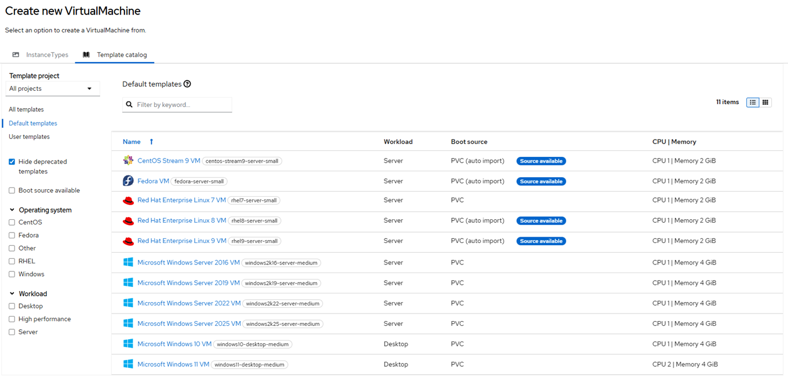

# CDI Data Import Cron

## Overview 

- DataImportCron polls disk images, checking for the latest versions, and imports the images as persistent volume claims (PVCs). 
- This process ensures that PVCs are updated to the latest version so that they can be used as reliable clone sources or golden images for virtual machines (VMs).
- For golden images, latest refers to the latest operating system of the distribution. 
- For other disk images, latest refers to the latest hash of the image that is available.

## Life Cycle Management Commands

Command | Intent | Details
--- | --- | ---
iserver get ocp cnv -v import | check data import cron state and pvc resources | [Link](./get.md)
iserver set ocp cnv --mode import | enable cdi data import cron | [Link](./enable.md)
iserver delete ocp cnv --mode import | disable cdi data import cron | [Link](./disable.md)
iserver delete ocp cnv --mode import --wipe | disable cdi data import cron and wipe all dv/pvc | [Link](./wipe.md)

[[Back]](../Operations.md)