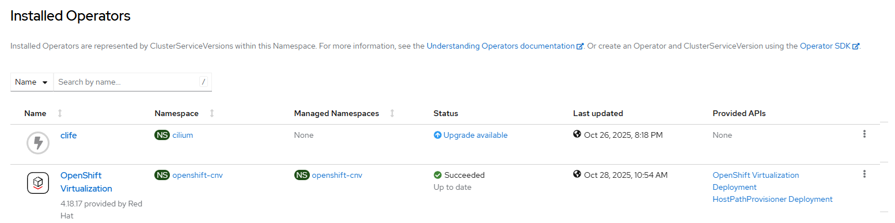
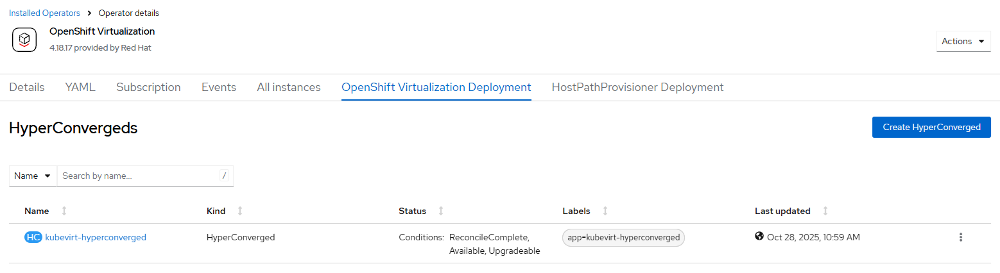

# Container Virtualization Operator - Create Operator and Instance

## Workflow

Execute two workflows in sequence
- [create operator](./create_operator.md)
- [create instance](./create_instance.md)

## Requirements

Operator may be already installed, the workflow will finish early
No hyperconverged instance may exist

## Expected Outcome





## Configurable options

```
# iserver set ocp cnv --mode all
  --cluster TEXT                  Cluster Name
  --channel TEXT                  Operator channel  [default: __default__]
  --filename TEXT                 HyperConverged CRD
  --no-confirm                    Confirmation mode
```

## Example

```
# iserver set ocp cnv --mode all --cluster bm1 --no-confirm


OpenShift Workflow - Container Virtualization Operator - Create Operator
========================================================================

Workflow Parameters
-------------------
{
    "cluster": "bm1",
    "channel": "__default__",
    "confirmation": false,
    "check-verbose": true,
    "namespace": "openshift-cnv",
    "name": "kubevirt-hyperconverged",
    "operator-group-name": "cnv-operator-group",
    "delete-namespace": true
}


OpenShift Cluster
-----------------
- cluster: bm1 [domain:local]
- api [C:\Users\user\.itool\ocp-clusters\bm1\kubeconfig]: ok
- dns resolution: ok


Create Namespace
----------------
- name: openshift-cnv

~~~
apiVersion: v1
kind: Namespace
metadata:
  name: openshift-cnv

~~~

Namespace created

Wait for namespace [timeout:60]...

Create Operator Group
---------------------
Operator group: openshift-cnv/cnv-operator-group

~~~
apiVersion: operators.coreos.com/v1
kind: OperatorGroup
metadata:
  name: cnv-operator-group
  namespace: openshift-cnv
spec:
  targetNamespaces:
  - openshift-cnv
  upgradeStrategy: Default

~~~

Operator group created

Wait for operator group [timeout:60]...

Create Subscription
-------------------
Subscription: openshift-cnv/kubevirt-hyperconverged
Source: openshift-marketplace/redhat-operators/kubevirt-hyperconverged
Install plan approval: Automatic
Getting subscription and packege manifest information...
Resolving channel name...
Channel: stable
- CSV [kubevirt-hyperconverged-operator.v4.18.17]
- CSV Display name [OpenShift Virtualization]
- CVS Version [4.18.17]
- CSV Provider [{'name': 'Red Hat'}]
- CSV Maturity [alpha]

~~~
apiVersion: operators.coreos.com/v1alpha1
kind: Subscription
metadata:
  name: kubevirt-hyperconverged
  namespace: openshift-cnv
spec:
  channel: stable
  installPlanApproval: Automatic
  name: kubevirt-hyperconverged
  source: redhat-operators
  sourceNamespace: openshift-marketplace

~~~

Subscription created

Wait for subscription install plan started [timeout:360]...
Install plan: install-8vd92
Wait for subscription install plan ready [timeout:600]...
Install plan succeeded
Wait for deployments ready (optional: True, allow zero replicas: False)...
- openshift-cnv/aaq-operator
- openshift-cnv/cdi-operator
- openshift-cnv/cluster-network-addons-operator
- openshift-cnv/hco-operator
- openshift-cnv/hco-webhook
- openshift-cnv/hostpath-provisioner-operator
- openshift-cnv/hyperconverged-cluster-cli-download
- openshift-cnv/ssp-operator
- openshift-cnv/virt-operator

Completed tasks
- Namespace created
- Operator Group created
- Cnv Operator installed

OpenShift Workflow - Container Virtualization Operator - Create HyperConverged Instance
=======================================================================================

Workflow Parameters
-------------------
{
    "cluster": "bm1",
    "instance": null,
    "confirmation": false,
    "channel": "stable",
    "check-verbose": true,
    "namespace": "openshift-cnv",
    "name": "kubevirt-hyperconverged",
    "operator-group-name": "cnv-operator-group",
    "delete-namespace": true
}


OpenShift Cluster
-----------------
- cluster: bm1 [domain:local]
- api [C:\Users\user\.itool\ocp-clusters\bm1\kubeconfig]: ok
- dns resolution: ok

Operator
--------
- subscription: openshift-cnv/kubevirt-hyperconverged
- channel: stable
- csv: kubevirt-hyperconverged-operator.v4.18.17

Cnv operator ready

Create HyperConverged Instance
------------------------------

~~~
apiVersion: hco.kubevirt.io/v1beta1
kind: HyperConverged
metadata:
  annotations:
    deployOVS: 'false'
  name: kubevirt-hyperconverged
  namespace: openshift-cnv
spec: {}

~~~

HyperConverged instance created

Wait for hyperconverged instance and resources...
Wait for deployments ready (optional: True, allow zero replicas: False)...
- openshift-cnv/cdi-apiserver
- openshift-cnv/cdi-deployment
- openshift-cnv/cdi-uploadproxy
- openshift-cnv/kubemacpool-cert-manager
- openshift-cnv/kubemacpool-mac-controller-manager
- openshift-cnv/kubevirt-apiserver-proxy
- openshift-cnv/kubevirt-console-plugin
- openshift-cnv/kubevirt-ipam-controller-manager
- openshift-cnv/virt-api
- openshift-cnv/virt-controller
- openshift-cnv/virt-exportproxy
- openshift-cnv/virt-template-validator
Wait for deamon sets ready...
- openshift-cnv/bridge-marker
- openshift-cnv/kube-cni-linux-bridge-plugin
- openshift-cnv/passt-binding-cni
- openshift-cnv/virt-handler

Completed tasks
- HyperConverged instance created and ready
```

[[Back]](./README.md)