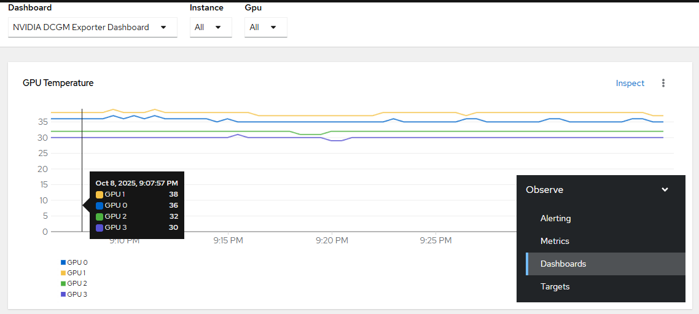

# NVIDIA GPU Operator - Create monitoring dashboard

## Workflow

Create dashboard based on pre-defined and non-configurable source: https://github.com/NVIDIA/dcgm-exporter/raw/main/grafana/dcgm-exporter-dashboard.json

## Requirements

GPU Operator must be [created](./create_operator) and policy [configured](./create_policy.md).

## Configurable options

```
# iserver set ocp gpu --mode dashboard
  --cluster TEXT                  Cluster Name
  --no-confirm                    Confirmation mode
```

## Expected Outcome



## Example

```
# iserver set ocp gpu --mode dashboard

OpenShift Workflow - GPU Operator - Create DCGM Dashboard
=========================================================

Workflow Parameters
-------------------
{
    "cluster": "bm1",
    "confirmation": true,
    "check-verbose": true,
    "namespace": "nvidia-gpu-operator",
    "name": "gpu-operator-certified",
    "operator-group-name": "gpu-operator-group",
    "delete-namespace": true,
    "monitoring": {
        "dashboard_url": "https://github.com/NVIDIA/dcgm-exporter/raw/main/grafana/dcgm-exporter-dashboard.json",
        "dashboard_namespace": "openshift-config-managed",
        "dashboard_name": "nvidia-dcgm-exporter-dashboard",
        "admin": true,
        "developer": false
    }
}


OpenShift Cluster
-----------------
- cluster: bm1 [domain:local]
- api [C:\Users\user\.itool\ocp-clusters\bm1\kubeconfig]: ok
- dns resolution: ok


Monitoring dashboard source: https://github.com/NVIDIA/dcgm-exporter/raw/main/grafana/dcgm-exporter-dashboard.json

Dashboard content downloaded from url: https://github.com/NVIDIA/dcgm-exporter/raw/main/grafana/dcgm-exporter-dashboard.json
ConfigMap admin label: console.openshift.io/dashboard=true
Config map create with dashboard content: openshift-config-managed/nvidia-dcgm-exporter-dashboard

Completed tasks
- GPU Monitoring Dashboard created
```

[[Back]](./README.md)