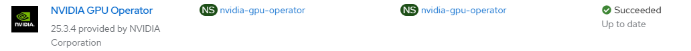

# NVIDIA GPU Operator - Create Operator

## Workflow

- create nvidia-gpu-operator with label openshift.io/cluster-monitoring:true
- create operator group
- create subscription with user controlled channel or defaultChannelName

## Requirements

None

## Configurable options

```
# iserver set ocp gpu --mode operator
  --cluster TEXT                  Cluster Name
  --channel TEXT                  Operator channel  [default: __default__]
  --no-confirm                    Confirmation mode
```

## Expected Outcome



## Example

```
# iserver set ocp gpu --mode operator

OpenShift Workflow - GPU Operator - Create Operator
===================================================

Workflow Parameters
-------------------
{
    "cluster": "bm1",
    "channel": "__default__",
    "confirmation": true,
    "check-verbose": true,
    "namespace": "nvidia-gpu-operator",
    "name": "gpu-operator-certified",
    "operator-group-name": "gpu-operator-group",
    "delete-namespace": true,
    "monitoring": {
        "dashboard_url": "https://github.com/NVIDIA/dcgm-exporter/raw/main/grafana/dcgm-exporter-dashboard.json",
        "dashboard_namespace": "openshift-config-managed",
        "dashboard_name": "nvidia-dcgm-exporter-dashboard",
        "admin": true,
        "developer": false
    }
}


OpenShift Cluster
-----------------
- cluster: bm1 [domain:local]
- api [C:\Users\user\.itool\ocp-clusters\bm1\kubeconfig]: ok
- dns resolution: ok


Create Namespace
----------------
- name: nvidia-gpu-operator
- labels
        openshift.io/cluster-monitoring:true

~~~
apiVersion: v1
kind: Namespace
metadata:
  labels:
    openshift.io/cluster-monitoring: 'true'
  name: nvidia-gpu-operator

~~~
Continue [Y/N]? y

Namespace created

Wait for namespace [timeout:60]...

Check labels
- openshift.io/cluster-monitoring:true

Create Operator Group
---------------------
Operator group: nvidia-gpu-operator/gpu-operator-group

~~~
apiVersion: operators.coreos.com/v1
kind: OperatorGroup
metadata:
  name: gpu-operator-group
  namespace: nvidia-gpu-operator
spec:
  targetNamespaces:
  - nvidia-gpu-operator
  upgradeStrategy: Default

~~~
Continue [Y/N]? y

Operator group created

Wait for operator group [timeout:60]...

Create Subscription
-------------------
Subscription: nvidia-gpu-operator/gpu-operator-certified
Source: openshift-marketplace/certified-operators/gpu-operator-certified
Install plan approval: Automatic
Getting subscription and packege manifest information...
Resolving channel name...
Channel: v25.3
- CSV [gpu-operator-certified.v25.3.4]
- CSV Display name [NVIDIA GPU Operator]
- CVS Version [25.3.4]
- CSV Provider [{'name': 'NVIDIA Corporation'}]
- CSV Maturity [stable]

~~~
apiVersion: operators.coreos.com/v1alpha1
kind: Subscription
metadata:
  name: gpu-operator-certified
  namespace: nvidia-gpu-operator
spec:
  channel: v25.3
  installPlanApproval: Automatic
  name: gpu-operator-certified
  source: certified-operators
  sourceNamespace: openshift-marketplace
  startingCSV: gpu-operator-certified.v25.3.4

~~~
Continue [Y/N]? y

Subscription created

Wait for subscription install plan started [timeout:360]...
Install plan: install-qmd5c
Wait for subscription install plan ready [timeout:600]...
Install plan succeeded
Wait for deployments ready (optional: True, allow zero replicas: False)...
- nvidia-gpu-operator/gpu-operator

Completed tasks
- GPU Operator installed
```

[[Back]](./README.md)