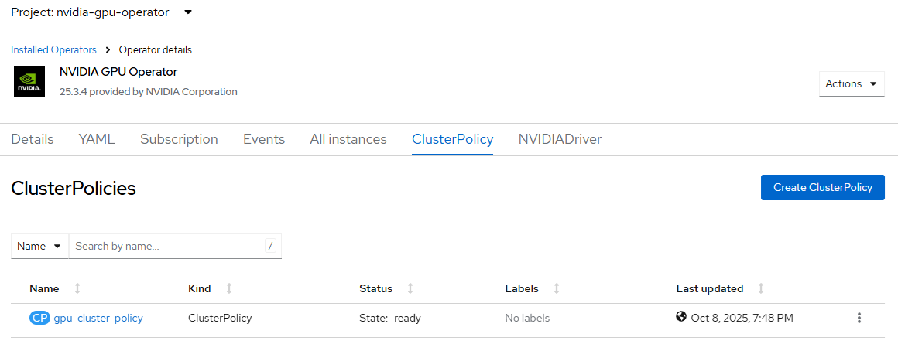

# NVIDIA GPU Operator - Create Policy

## Workflow

Create cluster policy based on 
- filename defined with --filename option with expected ClusterPolicy CRD in yaml format
- default ClusterPolicy of GPU operator subscription channel 

## Requirements

GPU Operator must be [created](./create_operator).

## Configurable options

```
# iserver set ocp gpu --mode policy
  --cluster TEXT                  Cluster Name
  --filename TEXT                 NVIDIA Cluster Policy (optional with filename)
  --no-confirm                    Confirmation mode
```

## Expected Outcome



## Example

```
# iserver set ocp gpu --mode policy

OpenShift Workflow - GPU Operator - Create NVIDIA Cluster Policy
================================================================

Workflow Parameters
-------------------
{
    "cluster": "bm1",
    "policy": null,
    "confirmation": true,
    "check-verbose": true,
    "namespace": "nvidia-gpu-operator",
    "name": "gpu-operator-certified",
    "operator-group-name": "gpu-operator-group",
    "delete-namespace": true,
    "monitoring": {
        "dashboard_url": "https://github.com/NVIDIA/dcgm-exporter/raw/main/grafana/dcgm-exporter-dashboard.json",
        "dashboard_namespace": "openshift-config-managed",
        "dashboard_name": "nvidia-dcgm-exporter-dashboard",
        "admin": true,
        "developer": false
    }
}


OpenShift Cluster
-----------------
- cluster: bm1 [domain:local]
- api [C:\Users\user\.itool\ocp-clusters\bm1\kubeconfig]: ok
- dns resolution: ok


Create NVIDIA Cluster Policy
----------------------------

~~~
apiVersion: nvidia.com/v1
kind: ClusterPolicy
metadata:
  name: gpu-cluster-policy
spec:
  daemonsets:
    rollingUpdate:
      maxUnavailable: '1'
    updateStrategy: RollingUpdate
  dcgm:
    enabled: true
  dcgmExporter:
    config:
      name: ''
    enabled: true
    serviceMonitor:
      enabled: true
  devicePlugin:
    config:
      default: ''
      name: ''
    enabled: true
    mps:
      root: /run/nvidia/mps
  driver:
    certConfig:
      name: ''
    enabled: true
    kernelModuleConfig:
      name: ''
    kernelModuleType: auto
    licensingConfig:
      configMapName: ''
      nlsEnabled: true
    repoConfig:
      configMapName: ''
    upgradePolicy:
      autoUpgrade: true
      drain:
        deleteEmptyDir: false
        enable: false
        force: false
        timeoutSeconds: 300
      maxParallelUpgrades: 1
      maxUnavailable: 25%
      podDeletion:
        deleteEmptyDir: false
        force: false
        timeoutSeconds: 300
      waitForCompletion:
        timeoutSeconds: 0
    useNvidiaDriverCRD: false
    virtualTopology:
      config: ''
  gdrcopy:
    enabled: false
  gds:
    enabled: false
  gfd:
    enabled: true
  mig:
    strategy: single
  migManager:
    enabled: true
  nodeStatusExporter:
    enabled: true
  operator:
    defaultRuntime: crio
    initContainer: {}
    use_ocp_driver_toolkit: true
  sandboxDevicePlugin:
    enabled: true
  sandboxWorkloads:
    defaultWorkload: container
    enabled: false
  toolkit:
    enabled: true
  validator:
    plugin:
      env: []
  vfioManager:
    enabled: true
  vgpuDeviceManager:
    enabled: true
  vgpuManager:
    enabled: false

~~~
Continue [Y/N]? y

Cluster policy created

Wait for cluster policy [timeout:60]...
Wait for cluster policy ready [timeout:180]...


NVIDIA Cluster Policy
---------------------
- Namespace             : nvidia-gpu-operator
- Name                  : gpu-cluster-policy
- State                 : ready
- DCGM                  : ✓
- DCGM Exporter         : ✓
- DCGM Service Monitor  : ✓
- Device Plugin         : ✓
- Driver                : ✓
- GDR Copy              : ✗
- GDS                   : ✗
- GFD                   : ✓
- Mig Strategy          : single
- Mig Manager           : ✓
- Node Status Exporter  : ✓
- Sandbox Device Plugin : ✓
- Toolkit               : ✓
- VFID Manager          : ✓
- vGPU Device Manager   : ✓
- vGPU Manager          : ✗


Completed tasks
- NVIDIA Cluster Policy created
```

[[Back]](./README.md)