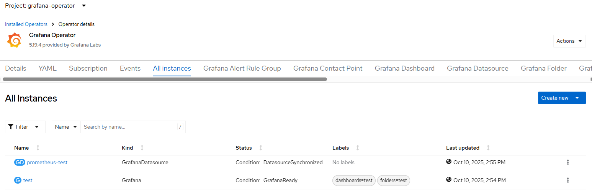
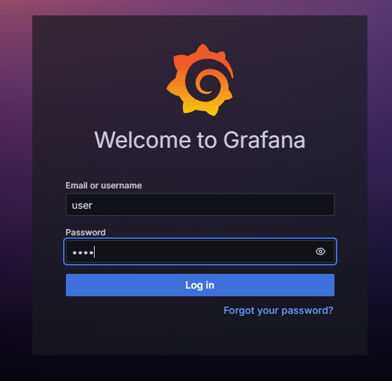
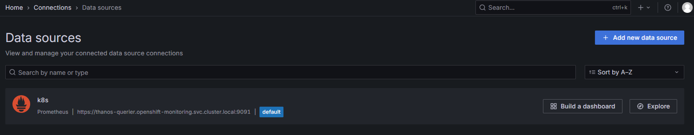

# Grafana Operator - Create Instance

## Workflow

- create grafana instance with authenticated access
- add cluster role binding for role:cluster-monitoring-view to service account of grafana instance
- get service account token for prometheus access
- create prometheus data source associated with the grafana instance if --prometheus flag
- add Grafana CRDs (dashboard support only) if defined with optional fixup

## Dashboard Fixup

In case of --fixup flag, the following properties of GrafanaDashboard CRDs from input files are honored. Other paremeters are defined based on target Grafana instance and environemt settings.

```
kind: GrafanaDashboard
apiVersion: grafana.integreatly.org/v1beta1
metadata:
  name: some-name
spec:
  json: |
  {
    ...
  }
```

If json dashboard source has parametrized reference to prometheus datasource then it will be replaced with Prometheus uid of target Grafana instance. The dashboard my refer to non-existing datasource otherwise.

```
  "datasource": {
    "type": "prometheus",
    "uid": "${PROMETHEUS}"
  },
```

'${INSTANCE}' value in dashboard source will be replaced with target Grafana instance name.

Recreated Grafana dashboard definition is created or updated (if name already exists) via REST API.

## Requirements

Grafana operator installed
If prometheus enabled then user-workload monitoring must be enabled

## Configurable options

```
# iserver set ocp grafana --mode instance
  --cluster TEXT                  Cluster Name
  --instance TEXT                 Grafana instance name
  --username TEXT                 Grafana instance admin username
  --password TEXT                 Grafana instance admin password
  --prometheus                    Enable prometheus data source
  --datasource TEXT               Prometheus data source name  [default: my-prometheus]
  --fixup                         CRD fixup
  --crd TEXT                      Grafana CRDs
  --no-confirm                    Confirmation mode
```

## Expected Outcome










## Example

```
# iserver set ocp grafana --mode instance --cluster bm1 --instance test --username user --password pass --prometheus --datasource k8s 
OpenShift Cluster: bm1


OpenShift Workflow - Grafana Operator - Create Instance
=======================================================

Workflow Parameters
-------------------
{
    "cluster": "bm1",
    "instance": "test",
    "username": "user",
    "password": "pass",
    "prometheus": true,
    "datasource": "k8s",
    "confirmation": true,
    "check-verbose": true,
    "namespace": "grafana-operator",
    "name": "grafana-operator",
    "operator-group-name": "grafana-operator-group",
    "mon-namespace": "openshift-monitoring",
    "mon-name": "cluster-monitoring-config",
    "delete-namespace": true
}


OpenShift Cluster
-----------------
- cluster: bm1 [domain:local]
- api [C:\Users\user\.itool\ocp-clusters\bm1\kubeconfig]: ok
- dns resolution: ok


Check User Workload Monitoring
------------------------------
- config map namespace: openshift-monitoring
- config map name: cluster-monitoring-config
- enableUserWorkload enabled

Create Grafana Instance
-----------------------

~~~
apiVersion: grafana.integreatly.org/v1beta1
kind: Grafana
metadata:
  labels:
    dashboards: test
    folders: test
  name: test
  namespace: grafana-operator
spec:
  config:
    auth:
      disable_login_form: 'false'
    log:
      mode: console
    security:
      admin_password: pass
      admin_user: user
  route:
    spec: {}

~~~
Continue [Y/N]? y
Wait until grafana found [timeout:60s]...
Wait until grafana resources [timeout:60s]...
Wait for deployments ready (optional: False, allow zero replicas: False)...
- grafana-operator/test-deployment
Wait for service account...
Grafana instance route [test-route-grafana-operator.apps.bm1.domain.com]

Cluster Role Binding
--------------------
Service Account [test-sa] is not yet associated with role [cluster-monitoring-view]
Cluster role binding created: test-sa-view

Grafana Data Source
-------------------
Grafana datasource created
- grafana-operator/prometheus-test
- type: prometheus
- name: k8s
- token: service account [grafana-operator/test-sa]
- dashboards: test


Completed tasks
---------------
- Grafana instance created
- Prometheus data source created
```

[[Back]](./README.md)