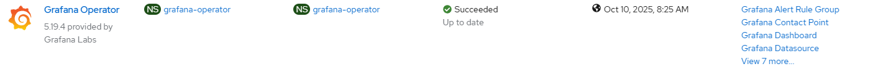

# Grafana Operator - Create Operator

## Workflow

- create grafana-operator namespace 
- create operator group
- create subscription with user controlled channel or defaultChannelName

## Requirements

None

## Configurable options

```
# iserver set ocp grafana --mode operator
  --cluster TEXT                  Cluster Name
  --channel TEXT                  Operator channel  [default: __default__]
  --no-confirm                    Confirmation mode
```

## Expected Outcome



## Example

```
# iserver set ocp grafana --mode operator --cluster bm1
OpenShift Cluster: bm1


OpenShift Workflow - Grafana Operator - Create Operator
=======================================================

Workflow Parameters
-------------------
{
    "cluster": "bm1",
    "channel": "__default__",
    "confirmation": true,
    "check-verbose": true,
    "namespace": "grafana-operator",
    "name": "grafana-operator",
    "operator-group-name": "grafana-operator-group",
    "delete-namespace": true
}


OpenShift Cluster
-----------------
- cluster: bm1 [domain:local]
- api [C:\Users\user\.itool\ocp-clusters\bm1\kubeconfig]: ok
- dns resolution: ok


Create Namespace
----------------
- name: grafana-operator

~~~
apiVersion: v1
kind: Namespace
metadata:
  name: grafana-operator

~~~
Continue [Y/N]? y

Namespace created

Wait for namespace [timeout:60]...

Create Operator Group
---------------------
Operator group: grafana-operator/grafana-operator-group

~~~
apiVersion: operators.coreos.com/v1
kind: OperatorGroup
metadata:
  name: grafana-operator-group
  namespace: grafana-operator
spec:
  targetNamespaces:
  - grafana-operator
  upgradeStrategy: Default

~~~
Continue [Y/N]? y

Operator group created

Wait for operator group [timeout:60]...

Create Subscription
-------------------
Subscription: grafana-operator/grafana-operator
Source: openshift-marketplace/community-operators/grafana-operator
Install plan approval: Automatic
Getting subscription and packege manifest information...
Resolving channel name...
Channel: v5
- CSV [grafana-operator.v5.19.4]
- CSV Display name [Grafana Operator]
- CVS Version [5.19.4]
- CSV Provider [{'name': 'Grafana Labs', 'url': 'https://grafana.com'}]
- CSV Maturity [stable]

~~~
apiVersion: operators.coreos.com/v1alpha1
kind: Subscription
metadata:
  name: grafana-operator
  namespace: grafana-operator
spec:
  channel: v5
  installPlanApproval: Automatic
  name: grafana-operator
  source: community-operators
  sourceNamespace: openshift-marketplace

~~~
Continue [Y/N]? y

Subscription created

Wait for subscription install plan started [timeout:360]...
Install plan: install-k8js7
Wait for subscription install plan ready [timeout:600]...
Install plan succeeded
Wait for deployments ready (optional: True, allow zero replicas: False)...
- grafana-operator/grafana-operator-controller-manager-v5


Completed tasks
---------------
- Namespace created
- Operator Group created
- Grafana Operator installed
```

[[Back]](./README.md)