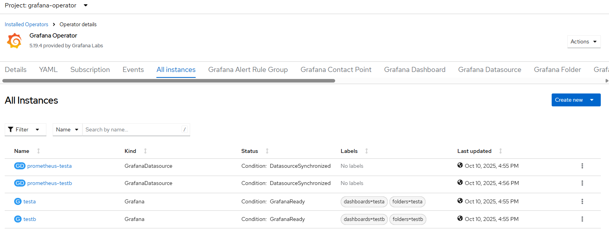

# Grafana Operator - Create via Task

## Input

```
[
    {
        "grafana": {
            "operator": {},
            "mon": {},
            "instance": [
                {
                    "instance": "testa",
                    "username": "usera",
                    "password": "pass",
                    "prometheus": true,
                    "datasource": "k8s",
                    "crd": [
                      "file-or-directory"
                    ],
                    "fixup": true
                },
                {
                    "instance": "testb",
                    "username": "userb",
                    "password": "pass",
                    "prometheus": true,
                    "datasource": "k8s"
                }
            ]
        }
    }
]
```

Notes:
- [operator](./create_operator.md), [mon](./enable_monitoring.md) and [instance](./create_instance.md) trigger workflow execution with optional input parameters
- not all workflows have to be defined however be aware of workflow execution requirements and dependencies

## Requirements

None

## Configurable options

```
# iserver set ocp task 
  --cluster TEXT   Cluster Name
  --filename TEXT  Tasks filename
  --validate       Validate only
  --break          Break on error
  --no-confirm     Confirmation mode
```

## Expected Outcome

- grafana operator installed
- user-workload monitoring enabled (optional)
- grafana instances created with prometheus datasource (optional)



## Example

```
# iserver set ocp task --cluster bm1 --filename C:\tmp\task.json --no-confirm
Cluster: bm1 (type: ocp)

OpenShift Workflow - Create Tasks
=================================

Validate Input
--------------
Completed


OpenShift Workflow - Grafana Operator - Create Operator
=======================================================

Workflow Parameters
-------------------
{
    "cluster": "bm1",
    "confirmation": false,
    "channel": "__default__",
    "check-verbose": true,
    "namespace": "grafana-operator",
    "name": "grafana-operator",
    "operator-group-name": "grafana-operator-group",
    "mon-namespace": "openshift-monitoring",
    "mon-name": "cluster-monitoring-config",
    "delete-namespace": true
}


OpenShift Cluster
-----------------
- cluster: bm1 [domain:local]
- api [C:\Users\user\.itool\ocp-clusters\bm1\kubeconfig]: ok
- dns resolution: ok


Create Namespace
----------------
- name: grafana-operator

~~~
apiVersion: v1
kind: Namespace
metadata:
  name: grafana-operator

~~~

Namespace created

Wait for namespace [timeout:60]...

Create Operator Group
---------------------
Operator group: grafana-operator/grafana-operator-group

~~~
apiVersion: operators.coreos.com/v1
kind: OperatorGroup
metadata:
  name: grafana-operator-group
  namespace: grafana-operator
spec:
  targetNamespaces:
  - grafana-operator
  upgradeStrategy: Default

~~~

Operator group created

Wait for operator group [timeout:60]...

Create Subscription
-------------------
Subscription: grafana-operator/grafana-operator
Source: openshift-marketplace/community-operators/grafana-operator
Install plan approval: Automatic
Getting subscription and packege manifest information...
Resolving channel name...
Channel: v5
- CSV [grafana-operator.v5.19.4]
- CSV Display name [Grafana Operator]
- CVS Version [5.19.4]
- CSV Provider [{'name': 'Grafana Labs', 'url': 'https://grafana.com'}]
- CSV Maturity [stable]

~~~
apiVersion: operators.coreos.com/v1alpha1
kind: Subscription
metadata:
  name: grafana-operator
  namespace: grafana-operator
spec:
  channel: v5
  installPlanApproval: Automatic
  name: grafana-operator
  source: community-operators
  sourceNamespace: openshift-marketplace

~~~

Subscription created

Wait for subscription install plan started [timeout:360]...
Install plan: install-944hk
Wait for subscription install plan ready [timeout:600]...
Install plan succeeded
Wait for deployments ready (optional: True, allow zero replicas: False)...
- grafana-operator/grafana-operator-controller-manager-v5


Completed tasks
---------------
- Namespace created
- Operator Group created
- Grafana Operator installed

OpenShift Workflow - Grafana Operator - Enable user-workload monitoring
=======================================================================

Workflow Parameters
-------------------
{
    "cluster": "bm1",
    "confirmation": false,
    "check-verbose": true,
    "namespace": "grafana-operator",
    "name": "grafana-operator",
    "operator-group-name": "grafana-operator-group",
    "mon-namespace": "openshift-monitoring",
    "mon-name": "cluster-monitoring-config",
    "delete-namespace": true
}


OpenShift Cluster
-----------------
- cluster: bm1 [domain:local]
- api [C:\Users\user\.itool\ocp-clusters\bm1\kubeconfig]: ok
- dns resolution: ok


Config Map
----------
- namespace: openshift-monitoring
- name: cluster-monitoring-config
- found and will be checked
- enableUserWorkload value will be changed in config map
Config map udpated

Check for resources
-------------------
Wait for deployments ready (optional: False, allow zero replicas: False)...
- openshift-user-workload-monitoring/prometheus-operator
Wait for stateful sets ready...
- openshift-user-workload-monitoring/prometheus-user-workload
- openshift-user-workload-monitoring/thanos-ruler-user-workload


Completed tasks
---------------
- User workload monitoring enabled

OpenShift Workflow - Grafana Operator - Create Instance
=======================================================

Workflow Parameters
-------------------
{
    "instance": "testa",
    "username": "usera",
    "password": "pass",
    "prometheus": true,
    "datasource": "k8s",
    "cluster": "bm1",
    "confirmation": false,
    "check-verbose": true,
    "namespace": "grafana-operator",
    "name": "grafana-operator",
    "operator-group-name": "grafana-operator-group",
    "mon-namespace": "openshift-monitoring",
    "mon-name": "cluster-monitoring-config",
    "delete-namespace": true
}


OpenShift Cluster
-----------------
- cluster: bm1 [domain:local]
- api [C:\Users\user\.itool\ocp-clusters\bm1\kubeconfig]: ok
- dns resolution: ok


Check User Workload Monitoring
------------------------------
- config map namespace: openshift-monitoring
- config map name: cluster-monitoring-config
- enableUserWorkload enabled

Create Grafana Instance
-----------------------

~~~
apiVersion: grafana.integreatly.org/v1beta1
kind: Grafana
metadata:
  labels:
    dashboards: testa
    folders: testa
  name: testa
  namespace: grafana-operator
spec:
  config:
    auth:
      disable_login_form: 'false'
    log:
      mode: console
    security:
      admin_password: pass
      admin_user: usera
  route:
    spec: {}

~~~
Wait until grafana found [timeout:60s]...
Wait until grafana resources [timeout:60s]...
Wait for deployments ready (optional: False, allow zero replicas: False)...
- grafana-operator/testa-deployment
Wait for service account...
Grafana instance route [testa-route-grafana-operator.apps.bm1.domain.com]

Cluster Role Binding
--------------------
Service Account [testa-sa] is not yet associated with role [cluster-monitoring-view]
Cluster role binding created: testa-sa-view

Grafana Data Source
-------------------
Grafana datasource created
- grafana-operator/prometheus-testa
- type: prometheus
- name: k8s
- token: service account [grafana-operator/testa-sa]
- dashboards: testa


Completed tasks
---------------
- Grafana instance created
- Prometheus data source created

OpenShift Workflow - Grafana Operator - Create Instance
=======================================================

Workflow Parameters
-------------------
{
    "instance": "testb",
    "username": "userb",
    "password": "pass",
    "prometheus": true,
    "datasource": "k8s",
    "cluster": "bm1",
    "confirmation": false,
    "check-verbose": true,
    "namespace": "grafana-operator",
    "name": "grafana-operator",
    "operator-group-name": "grafana-operator-group",
    "mon-namespace": "openshift-monitoring",
    "mon-name": "cluster-monitoring-config",
    "delete-namespace": true
}


OpenShift Cluster
-----------------
- cluster: bm1 [domain:local]
- api [C:\Users\user\.itool\ocp-clusters\bm1\kubeconfig]: ok
- dns resolution: ok


Check User Workload Monitoring
------------------------------
- config map namespace: openshift-monitoring
- config map name: cluster-monitoring-config
- enableUserWorkload enabled

Create Grafana Instance
-----------------------

~~~
apiVersion: grafana.integreatly.org/v1beta1
kind: Grafana
metadata:
  labels:
    dashboards: testb
    folders: testb
  name: testb
  namespace: grafana-operator
spec:
  config:
    auth:
      disable_login_form: 'false'
    log:
      mode: console
    security:
      admin_password: pass
      admin_user: userb
  route:
    spec: {}

~~~
Wait until grafana found [timeout:60s]...
Wait until grafana resources [timeout:60s]...
Wait for deployments ready (optional: False, allow zero replicas: False)...
- grafana-operator/testb-deployment
Wait for service account...
Grafana instance route [testb-route-grafana-operator.apps.bm1.domain.com]

Cluster Role Binding
--------------------
Service Account [testb-sa] is not yet associated with role [cluster-monitoring-view]
Cluster role binding created: testb-sa-view

Grafana Data Source
-------------------
Grafana datasource created
- grafana-operator/prometheus-testb
- type: prometheus
- name: k8s
- token: service account [grafana-operator/testb-sa]
- dashboards: testb


Completed tasks
---------------
- Grafana instance created
- Prometheus data source created
```

[[Back]](./README.md)