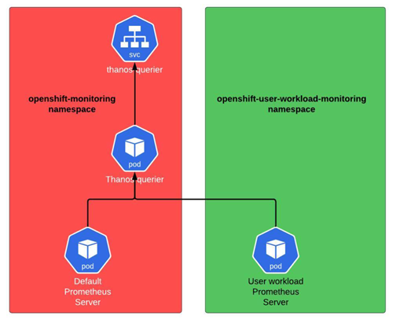

# Grafana Operator

[Grafana Operator](https://github.com/grafana/grafana-operator) adds CRDs that abstract Grafana instance, data sources and dashboards
- Grafana
- GrafanaDatasource
- GrafanaDashboard

Other CRDs:
- GrafanaAlertRuleGroup
- GrafanaContactPoint
- GrafanaFolder
- GrafanaLibraryPanel
- GrafanaMuteTiming
- GrafanaNotificationPolicy
- GrafanaNotificationPolicyRoute
- GrafanaNotificationTemplate

While OpenShift has built-in Grafana with dashboards exposed via the OpenShift Console UI, it may be useful to run dedicated Grafana instance via Grafana Operator to gain feature velocity and flexibility.

## Monitoring Architecture

Grafana integrates with wide range of data sources to visualize data on the dashboard. In the context of Kubernetes, Prometheus data source is used.

OpenShift offers out-of-the-box Prometheus as the default platform monitoring solution as well as Thanos and Alert Manager stacks. However, these components to large extent are immutable.

In order to integrate extra applications that expose Prometheus metrics such as [Tetragon Agents](../tetragon/README.md), user-workload monitoring must be enabled. That will trigger the creation of new Prometheus instance used for non-platform related metrics collection.

Both Prometheus instances i.e. platform and user-workload, are being queried by the same central Thanos Querier.



User workload monitoring can be enabled by the following ConfigMap CR:

```
apiVersion: v1
kind: ConfigMap
metadata:
  name: cluster-monitoring-config
  namespace: openshift-monitoring
data:
  config.yaml: |
    enableUserWorkload: true
```

Once enabled, the following resources are created (example)

```
$ oc get all -n openshift-user-workload-monitoring
NAME                                       READY   STATUS    RESTARTS   AGE
pod/prometheus-operator-744ff78877-g56mk   2/2     Running   0          3m57s
pod/prometheus-user-workload-0             6/6     Running   0          2m55s
pod/prometheus-user-workload-1             6/6     Running   0          2m55s
pod/thanos-ruler-user-workload-0           4/4     Running   0          2m56s
pod/thanos-ruler-user-workload-1           4/4     Running   0          2m56s

NAME                                              TYPE        CLUSTER-IP       EXTERNAL-IP   PORT(S)                       AGE
service/prometheus-operated                       ClusterIP   None             <none>        9090/TCP,10901/TCP            2m56s
service/prometheus-operator                       ClusterIP   None             <none>        8443/TCP                      3m57s
service/prometheus-user-workload                  ClusterIP   172.30.227.133   <none>        9091/TCP,9092/TCP,10902/TCP   3m56s
service/prometheus-user-workload-thanos-sidecar   ClusterIP   None             <none>        10902/TCP                     3m56s
service/thanos-ruler                              ClusterIP   172.30.41.202    <none>        9091/TCP,9092/TCP,10901/TCP   3m58s
service/thanos-ruler-operated                     ClusterIP   None             <none>        10902/TCP,10901/TCP           2m56s

NAME                                  READY   UP-TO-DATE   AVAILABLE   AGE
deployment.apps/prometheus-operator   1/1     1            1           3m57s

NAME                                             DESIRED   CURRENT   READY   AGE
replicaset.apps/prometheus-operator-744ff78877   1         1         1       3m57s

NAME                                          READY   AGE
statefulset.apps/prometheus-user-workload     2/2     2m56s
statefulset.apps/thanos-ruler-user-workload   2/2     2m56s

NAME                                    HOST/PORT                                                                        PATH        SERVICES                   PORT       TERMINATION          WILDCARD
route.route.openshift.io/federate       federate-openshift-user-workload-monitoring.apps.my-cluster.ocp.domain.com       /federate   prometheus-user-workload   federate   reencrypt/Redirect   None
route.route.openshift.io/thanos-ruler   thanos-ruler-openshift-user-workload-monitoring.apps.my-cluster.ocp.domain.com   /api        thanos-ruler               web        reencrypt/Redirect   None
```
## Grafana Data Source

Grafana datasource of Prometheus type can be configured to query Thanos in order to get the monitoring data, both platform and user-workload related.

Communication with Thanos Querier from Grafana instance requires Kubernetes token that will be used as authorization bearer in every HTTP REST API.

Example:

```
$ TOKEN=`oc create token grafana-tetragon-sa -n openshift-operators`
```

```
apiVersion: grafana.integreatly.org/v1beta1
kind: GrafanaDatasource
metadata:
  name: my-prometheus
  namespace: openshift-operators
spec:
  datasource:
    access: proxy
    editable: true
    isDefault: true
    jsonData:
      httpHeaderName1: 'Authorization'
      timeInterval: 5s
      tlsSkipVerify: true
    name: Prometheus
    secureJsonData:
      httpHeaderValue1: 'Bearer $TOKEN'
    type: prometheus
    url: 'https://thanos-querier.openshift-monitoring.svc.cluster.local:9091'
  instanceSelector:
    matchLabels:
      dashboards: my-grafana
```

Even if authorization bearer is configured, OpenShift prevents such communication unless it is enabled via ClusterRoleBinding CRD that binds the cluster-monitoring-view role to service account that Grafana instances is running with.

```
$ oc adm policy add-cluster-role-to-user cluster-monitoring-view -z grafana-tetragon-sa -n openshift-operators
clusterrole.rbac.authorization.k8s.io/cluster-monitoring-view added: "grafana-tetragon-sa"

$ oc get clusterrolebinding cluster-monitoring-view
apiVersion: rbac.authorization.k8s.io/v1
kind: ClusterRoleBinding
metadata:
  name: grafana-tetragon-sa-view
roleRef:
  apiGroup: rbac.authorization.k8s.io
  kind: ClusterRole
  name: cluster-monitoring-view
subjects:
- kind: ServiceAccount
  name: grafana-tetragon-sa
  namespace: openshift-operators
```

## Grafana

Grafana is primarly data visualization solution and as such web UI access is expected. Every Grafana instance has associated ClusterIP service with TCP/3000 used for web access. Kubernete Ingress or OpenShift Route can be used for external access.

Example:

```
$ oc get service -n openshift-operators tetragon-service -o yaml
apiVersion: v1
kind: Service
metadata:
  labels:
    app.kubernetes.io/managed-by: grafana-operator
    dashboards: tetragon
    folders: tetragon
  name: tetragon-service
  namespace: openshift-operators
spec:
  clusterIP: 172.30.145.223
  clusterIPs:
  - 172.30.145.223
  internalTrafficPolicy: Cluster
  ipFamilies:
  - IPv4
  ipFamilyPolicy: SingleStack
  ports:
  - name: grafana
    port: 3000
    protocol: TCP
    targetPort: grafana-http
  selector:
    app: tetragon
  sessionAffinity: None
  type: ClusterIP
status:
  loadBalancer: {}
```

```
$ oc get route -n openshift-operators tetragon-route
apiVersion: route.openshift.io/v1
kind: Route
metadata:
  annotations:
    openshift.io/host.generated: "true"
  creationTimestamp: "2025-08-06T09:15:54Z"
  labels:
    app.kubernetes.io/managed-by: grafana-operator
    dashboards: tetragon
    folders: tetragon
  name: tetragon-route
  namespace: openshift-operators
spec:
  host: tetragon-route-openshift-operators.apps.my-cluster.ocp.domain.com
  port:
    targetPort: 3000
  tls:
    termination: edge
  to:
    kind: Service
    name: tetragon-service
    weight: 100
  wildcardPolicy: None
```

[[Back]](../Operations.md)