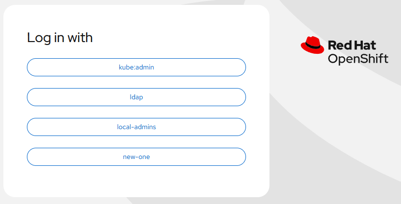

# HTPasswd Identity Provider - Create via Task

[[Back]](./README.md) [[Prev]](./set.md) [[Next]](./delete.md)

## Input

```
[
    {
        "identity": {
            "type": "htpasswd",
            "provider": "new-one",
            "userpass": [
                "aaa:aaa"
            ],
            "filename": [
                "/tmp/htpasswd.txt"
            ],
            "admins": [
                "__ALL__"
            ]
        }
    }
] 
```

Notes:
- htpasswd users to be added are defined with identity.filename
- filename can be file or directory
- all files in the directory must be valid htpasswd files
- file or directory path must be absolute or relative to the location of task file

## Requirements

None

## Expected outcome



```
# iserver get ocp htpasswd --cluster bm1

+----+---------+--------------+--------------+-----------+------------------+
| ID | OAuth   | Provider     | Secret       | Is Secret | User             |
+----+---------+--------------+--------------+-----------+------------------+
| 1  | cluster | local-admins | local-admins | True      | akaliwod (admin) |
|    |         |              |              |           | xxx (admin)      |
|    |         |              |              |           | yyy (admin)      |
+----+---------+--------------+--------------+-----------+------------------+
| 2  | cluster | new-one      | new-one      | True      | aaa (admin)      |
|    |         |              |              |           | bbb (admin)      |
+----+---------+--------------+--------------+-----------+------------------+
```

## Configurable options

```
# iserver set ocp task 
  --cluster TEXT   Cluster Name
  --filename TEXT  Tasks filename
  --validate       Validate only
  --break          Break on error
  --no-confirm     Confirmation mode
```

## Example

```
# iserver set ocp task --cluster bm1 --filename C:\tmp\task.json 

Cluster: bm1 (type: ocp)

OpenShift Workflow - Create Tasks
=================================

Validate Input
--------------
Completed


OpenShift Workflow - Add HTPasswd Identity Provider
===================================================

OpenShift Cluster: bm1

htpasswd identity provider [new-one]
- not found
- post mode
- secret openshift-config/new-one
- check user bbb
- check user aaa
- check admin bbb
- check admin aaa

Add htpasswd identity provider to oauth
---------------------------------------
- oauth: cluster
- provider: new-one
- secret: new-one

Replace OAuth
-------------
- name: cluster

~~~
apiVersion: config.openshift.io/v1
kind: OAuth
metadata:
  annotations:
    include.release.openshift.io/ibm-cloud-managed: 'true'
    include.release.openshift.io/self-managed-high-availability: 'true'
    release.openshift.io/create-only: 'true'
  name: cluster
spec:
  identityProviders:
  - ldap:
    mappingMethod: claim
    name: ldap
    type: LDAP
    ...
  - htpasswd:
      fileData:
        name: local-admins
    mappingMethod: claim
    name: local-admins
    type: HTPasswd
  - htpasswd:
      fileData:
        name: new-one
    mappingMethod: claim
    name: new-one
    type: HTPasswd

~~~
OAuth [cluster] replaced
OAuth updated with htpasswd [new-one]

Generated htpasswd
~~~
bbb:...
aaa:...
~~~

Create Secret
-------------
- namespace: openshift-config
- name: new-one

~~~
apiVersion: v1
data:
  htpasswd: ...
kind: Secret
metadata:
  name: new-one
  namespace: openshift-config
type: Opaque

~~~
Secret [openshift-config/new-one] created
- wait for Secret openshift-config/new-one [timeout:60s]

Add user subject to cluster role binding
----------------------------------------
- cluster role binding: cluster-admin
- user: bbb

Replace ClusterRoleBinding
--------------------------
- name: cluster-admin

~~~
apiVersion: rbac.authorization.k8s.io/v1
kind: ClusterRoleBinding
metadata:
  annotations:
    rbac.authorization.kubernetes.io/autoupdate: 'true'
  labels:
    kubernetes.io/bootstrapping: rbac-defaults
  name: cluster-admin
roleRef:
  apiGroup: rbac.authorization.k8s.io
  kind: ClusterRole
  name: cluster-admin
subjects:
- apiGroup: rbac.authorization.k8s.io
  description: Group:system:masters
  kind: Group
  name: system:masters
- apiGroup: rbac.authorization.k8s.io
  description: User:akaliwod
  kind: User
  name: akaliwod
- apiGroup: rbac.authorization.k8s.io
  description: User:xxx
  kind: User
  name: xxx
- apiGroup: rbac.authorization.k8s.io
  description: User:yyy
  kind: User
  name: yyy
- apiGroup: rbac.authorization.k8s.io
  kind: User
  name: bbb

~~~
ClusterRoleBinding [cluster-admin] replaced

Add user subject to cluster role binding
----------------------------------------
- cluster role binding: cluster-admin
- user: aaa

Replace ClusterRoleBinding
--------------------------
- name: cluster-admin

~~~
apiVersion: rbac.authorization.k8s.io/v1
kind: ClusterRoleBinding
metadata:
  annotations:
    rbac.authorization.kubernetes.io/autoupdate: 'true'
  labels:
    kubernetes.io/bootstrapping: rbac-defaults
  name: cluster-admin
roleRef:
  apiGroup: rbac.authorization.k8s.io
  kind: ClusterRole
  name: cluster-admin
subjects:
- apiGroup: rbac.authorization.k8s.io
  description: Group:system:masters
  kind: Group
  name: system:masters
- apiGroup: rbac.authorization.k8s.io
  description: User:akaliwod
  kind: User
  name: akaliwod
- apiGroup: rbac.authorization.k8s.io
  description: User:xxx
  kind: User
  name: xxx
- apiGroup: rbac.authorization.k8s.io
  description: User:yyy
  kind: User
  name: yyy
- apiGroup: rbac.authorization.k8s.io
  description: User:bbb
  kind: User
  name: bbb
- apiGroup: rbac.authorization.k8s.io
  kind: User
  name: aaa

~~~
ClusterRoleBinding [cluster-admin] replaced

Completed tasks
- HTPasswd Identity Provider configured
```

[[Back]](./README.md) [[Prev]](./set.md) [[Next]](./delete.md)