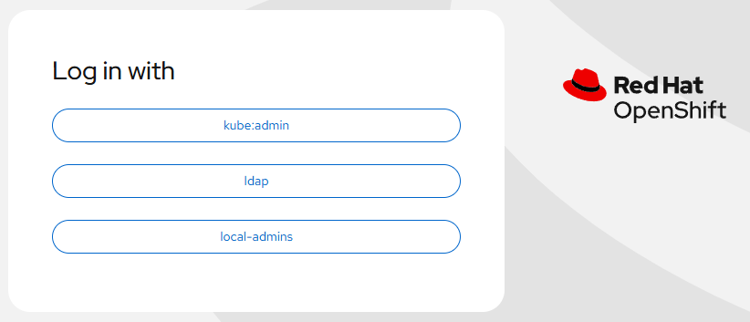

# HTPasswd Identity Provider - Delete provider

[[Back]](./delete.md) [[Prev]](./delete_user.md) [[Next]](./delete_admin.md)

## Workflow

- Extract the htpasswd file content from `Secret`
- Get the list of users
- Remove existing resources for each deleted user i.e. `User` and `Identity`
- Delete `Secret`
- Update `OAuth` configuration to remove the identity provider

## Before

```
# iserver get ocp htpasswd --cluster bm1

OpenShift Workflow - Get HTPasswd Identity Provider
===================================================

OpenShift Cluster: bm1

+----+---------+--------------+--------------+-----------+------------------+
| ID | OAuth   | Provider     | Secret       | Is Secret | User             |
+----+---------+--------------+--------------+-----------+------------------+
| 1  | cluster | local-admins | local-admins | True      | akaliwod (admin) |
|    |         |              |              |           | xxx (admin)      |
|    |         |              |              |           | yyy (admin)      |
+----+---------+--------------+--------------+-----------+------------------+
| 2  | cluster | new-one      | new-one      | True      | aaa              |
|    |         |              |              |           | bbb              |
+----+---------+--------------+--------------+-----------+------------------+
```

## Action

```
# iserver delete ocp htpasswd --cluster bm1 --provider new-one 

OpenShift Workflow - Delete HTPasswd Identity Provider
======================================================

OpenShift Cluster: bm1

htpasswd identity provider [new-one]
- found

Delete user
-----------
- user: aaa
- with identities
- incl identity: new-one:aaa
- already deleted

Delete Identity
---------------
- name: new-one:aaa
- already deleted

Remove user subject from cluster role binding
---------------------------------------------
- cluster role binding: cluster-admin
- user: aaa
- already deleted

Delete user
-----------
- user: bbb
- with identities
- incl identity: new-one:bbb
- already deleted

Delete Identity
---------------
- name: new-one:bbb
- already deleted

Remove user subject from cluster role binding
---------------------------------------------
- cluster role binding: cluster-admin
- user: bbb
- already deleted

Delete Secret
-------------
- namespace: openshift-config
- name: new-one
- wait for no secret

Delete identity provider from oauth
-----------------------------------
- oauth: cluster
- provider: new-one

Replace OAuth
-------------
- name: cluster

~~~
apiVersion: config.openshift.io/v1
kind: OAuth
metadata:
  annotations:
    include.release.openshift.io/ibm-cloud-managed: 'true'
    include.release.openshift.io/self-managed-high-availability: 'true'
    release.openshift.io/create-only: 'true'
  name: cluster
spec:
  identityProviders:
  - ldap:
    mappingMethod: claim
    name: ldap
    type: LDAP
    ...
  - htpasswd:
      fileData:
        name: local-admins
    mappingMethod: claim
    name: local-admins
    type: HTPasswd

~~~
OAuth [cluster] replaced

Completed tasks
- HTPasswd Identity Provider configured
```

## After



```
# iserver get ocp htpasswd --cluster bm1

OpenShift Workflow - Get HTPasswd Identity Provider
===================================================

OpenShift Cluster: bm1

+----+---------+--------------+--------------+-----------+------------------+
| ID | OAuth   | Provider     | Secret       | Is Secret | User             |
+----+---------+--------------+--------------+-----------+------------------+
| 1  | cluster | local-admins | local-admins | True      | akaliwod (admin) |
|    |         |              |              |           | xxx (admin)      |
|    |         |              |              |           | yyy (admin)      |
+----+---------+--------------+--------------+-----------+------------------+
```

[[Back]](./delete.md) [[Prev]](./delete_user.md) [[Next]](./delete_admin.md)