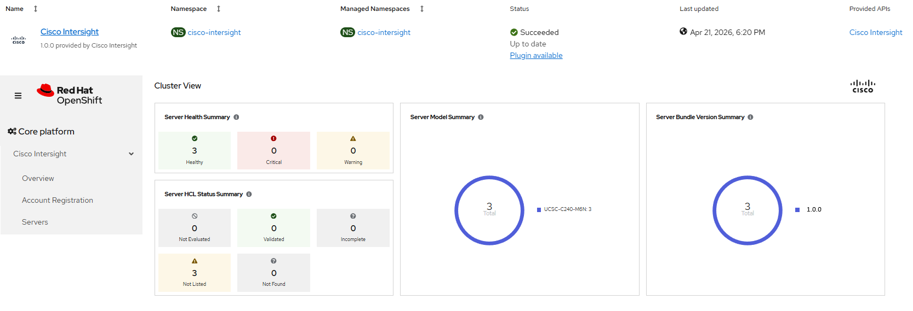

# Cisco Intersight Plugin - From zero-to-hero

[[Back]](./README.md) [[Next]](./delete_operator.md)

## Workflow sequence

- [create operator](./create_operator.md)
- [create instance](./create_instance.md)
- [enable plugin](./enable_plugin.md)
- [register account](./register.md)

## Expected outcome



## Configurable options

> [!NOTE]
> Logical sum of all input parameters for all executed workflows

```
# iserver set ocp intersight --mode all
  --cluster TEXT                  Cluster Name
  --channel TEXT                  Operator channel  [default: __default__]
  --ucs-tool                      Enable OsDiscoveryToolInstall
  --client-id TEXT                Intersight client id
  --client-secret TEXT            Intersight client secret
  --location [us|eu|va]           Intersight server location  [default: us]
  --no-confirm                    Confirmation mode
  --help                          Show this message and exit.
```

# Example

```
# iserver set ocp intersight --cluster bm1 --mode all \
    --ucs-tool \ 
    --client-id AAAA \
    --client-secret BBBB \
    --no-confirm

OpenShift Workflow - Cisco Intersight Operator - Create Operator
================================================================

OpenShift Cluster: bm1
Subscription not found: cisco-intersight

Create Namespace
----------------
- name: cisco-intersight

~~~
apiVersion: v1
kind: Namespace
metadata:
  name: cisco-intersight
~~~
Namespace [cisco-intersight] created
Wait for namespace [timeout:60]...

Create OperatorGroup
--------------------
- namespace: cisco-intersight
- name: cisco-intersight

~~~
apiVersion: operators.coreos.com/v1
kind: OperatorGroup
metadata:
  name: cisco-intersight
  namespace: cisco-intersight
spec:
  targetNamespaces:
  - cisco-intersight
  upgradeStrategy: Default
~~~
OperatorGroup [cisco-intersight/cisco-intersight] created
- wait for OperatorGroup cisco-intersight/cisco-intersight [timeout:60s]

Create Subscription
-------------------
Subscription: cisco-intersight/cisco-intersight
Source: openshift-marketplace/certified-operators/cisco-intersight
Install plan approval: Automatic
Getting subscription and packege manifest information...
Resolving channel name...
Channel: stable
- CSV [cisco-intersight.v1.0.0]
- CSV Display name [Cisco Intersight]
- CVS Version [1.0.0]
- CSV Provider [{'name': 'Cisco Intersight', 'url': 'https://intersight.com/help/saas'}]
- CSV Maturity [stable]

~~~
apiVersion: operators.coreos.com/v1alpha1
kind: Subscription
metadata:
  name: cisco-intersight
  namespace: cisco-intersight
spec:
  channel: stable
  installPlanApproval: Automatic
  name: cisco-intersight
  source: certified-operators
  sourceNamespace: openshift-marketplace
~~~

Subscription created

Wait for subscription install plan started [timeout:360]...
Install plan: install-b8x4c
Wait for subscription install plan ready [timeout:600]...
Install plan succeeded
Wait for deployment cisco-intersight/cisco-intersight-operator ready (optional: False, allow zero replicas: False, timeout: 600s)...
Subscription intersight ready

Operator
- subscription          : cisco-intersight/cisco-intersight
- package               : openshift-marketplace/certified-operators/cisco-intersight
- channel               : stable
- install plan          : cisco-intersight/install-b8x4c
- install plan approved : ✓
- installed csv         : cisco-intersight.v1.0.0
- latest_csv            : ✓


Completed tasks
- Namespace created
- Operator Group created
- Cisco intersight operator installed

OpenShift Workflow - Cisco Intersight Operator - Define Instance
================================================================

OpenShift Cluster: bm1
Subscription cisco-intersight found

Create CiscoIntersight
----------------------
- namespace: cisco-intersight
- name: cisco-intersight

~~~
apiVersion: intersight.cisco.com/v1
kind: CiscoIntersight
metadata:
  name: cisco-intersight
  namespace: cisco-intersight
spec:
  OsDiscoveryToolInstall: true
~~~
CiscoIntersight [cisco-intersight/cisco-intersight] created
- wait for CiscoIntersight cisco-intersight/cisco-intersight [timeout:60s]
Wait for deployment cisco-intersight/cisco-intersight-operator ready (optional: False, allow zero replicas: False, timeout: 600s)...
Wait for deployment cisco-intersight/cisco-intersight-api ready (optional: False, allow zero replicas: False, timeout: 600s)...
Wait for deployment cisco-intersight/intersight-plugin-console-plugin ready (optional: False, allow zero replicas: False, timeout: 600s)...
Wait for daemonset cisco-intersight/ucs-serial-discover ready (optional: False, timeout: 600s)...
Wait for daemonset cisco-intersight/ucs-tool ready (optional: False, timeout: 600s)...
Subscription intersight ready

Completed tasks
- Cisco intersight ready

OpenShift Workflow - Cisco Intersight Operator - Enable UI plugin
=================================================================

OpenShift Cluster: bm1
Subscription cisco-intersight found

Patch Console
-------------
- name: cluster

~~~
apiVersion: operator.openshift.io/v1
kind: Console
metadata:
  name: cluster
spec:
  plugins:
  - networking-console-plugin
  - monitoring-plugin
  - intersight-plugin
~~~
Console [cluster] patched

Completed tasks
- Cisco intersight ui plugin enabled

OpenShift Workflow - Cisco Intersight Operator - Register Account
=================================================================

OpenShift Cluster: bm1
Subscription cisco-intersight found

Create Secret
-------------
- namespace: cisco-intersight
- name: intersight-configurations

~~~
apiVersion: v1
data:
  ...
kind: Secret
metadata:
  name: intersight-configurations
  namespace: cisco-intersight
type: Opaque
~~~
Secret [cisco-intersight/intersight-configurations] created
- wait for Secret cisco-intersight/intersight-configurations [timeout:60s]

Completed tasks
- Cisco intersight account registered
```

[[Next]](./delete_operator.md)