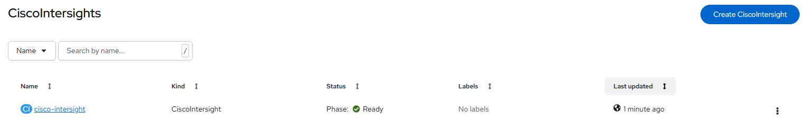

# Cisco Intersight Plugin - Create instance

[[Back]](../README.md) [[Next]](./ui_plugin.md) [[iserver-way]](../create_instance.md)

Cisco Intersight Operator requires single CiscoIntersight object aka `instance`
- must be created in the same namespace as operator e.g. cisco-intersight
- `spec:OsDiscoveryToolInstall` controls Cisco UCS RedHat OsDiscovery tool instantiation and by default is set to `false`

Once instance is ready, you need to enable [Console UI plugin](./ui_plugin.md)

## CiscoIntersight

~~~
apiVersion: intersight.cisco.com/v1
kind: CiscoIntersight
metadata:
  name: cisco-intersight
  namespace: cisco-intersight
spec:
  OsDiscoveryToolInstall: true
~~~

## Expected outcome



Resources with spec:OsDiscoveryToolInstall = true

```
$ oc get all -n cisco-intersight
NAME                                                    READY   STATUS    RESTARTS   AGE
pod/cisco-intersight-api-6cb8f8588-zmpwj                1/1     Running   0          13s
pod/cisco-intersight-operator-5d7b6b8d55-8tvl5          1/1     Running   0          3h44m
pod/intersight-plugin-console-plugin-7cfb8884bf-74gzn   1/1     Running   0          13s
pod/ucs-serial-discover-gks95                           1/1     Running   0          13s
pod/ucs-serial-discover-hsdk2                           1/1     Running   0          13s
pod/ucs-serial-discover-wv5cg                           1/1     Running   0          13s
pod/ucs-tool-6ml55                                      1/1     Running   0          13s
pod/ucs-tool-79xsk                                      1/1     Running   0          13s
pod/ucs-tool-xbm2h                                      1/1     Running   0          13s

NAME                                                          TYPE        CLUSTER-IP        EXTERNAL-IP   PORT(S)    AGE
service/cisco-intersight-api                                  ClusterIP   172.244.98.161    <none>        9443/TCP   13s
service/cisco-intersight-controller-manager-metrics-service   ClusterIP   172.244.168.126   <none>        8443/TCP   3h44m
service/intersight-plugin-console-plugin                      ClusterIP   172.244.213.148   <none>        9443/TCP   13s

NAME                                 DESIRED   CURRENT   READY   UP-TO-DATE   AVAILABLE   NODE SELECTOR   AGE
daemonset.apps/ucs-serial-discover   3         3         3       3            3           <none>          13s
daemonset.apps/ucs-tool              3         3         3       3            3           <none>          13s

NAME                                               READY   UP-TO-DATE   AVAILABLE   AGE
deployment.apps/cisco-intersight-api               1/1     1            1           13s
deployment.apps/cisco-intersight-operator          1/1     1            1           3h44m
deployment.apps/intersight-plugin-console-plugin   1/1     1            1           13s

NAME                                                          DESIRED   CURRENT   READY   AGE
replicaset.apps/cisco-intersight-api-6cb8f8588                1         1         1       13s
replicaset.apps/cisco-intersight-operator-5d7b6b8d55          1         1         1       3h44m
replicaset.apps/intersight-plugin-console-plugin-7cfb8884bf   1         1         1       13s
```

[[Back]](../README.md) [[Next]](./ui_plugin.md) [[iserver-way]](../create_instance.md)