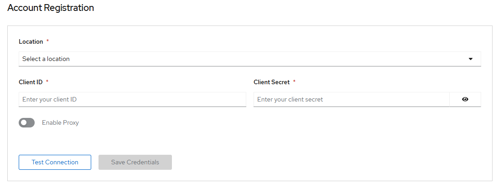
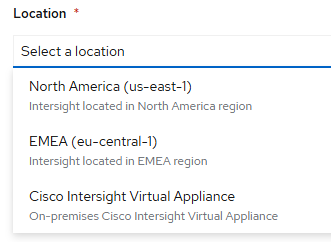

# Cisco Intersight Plugin - Account registration

[[Back]](../README.md) [[Next]](../get.md) [[iserver-way]](../register.md)

Once Cisco Intersight UI plugin is [enabled](./ui_plugin.md), you can register the Intersight account using Console UI. Upon successful registration you should see OpenShift server details.

## Intersight UI

- access Intersight UI where OpenShift cluster servers are registered with 
- goto Settings => OAuth2 Tokens and create new token
- note down client id and secret

## OpenShift Console UI

- access OpenShift Console UI
- goto Cisco Intersight => Account Registration

- select location

- edit Client ID and Secret
- optionally enable proxy
- test connection
- save credentials

[[Back]](../README.md) [[Next]](../get.md) [[iserver-way]](../register.md)