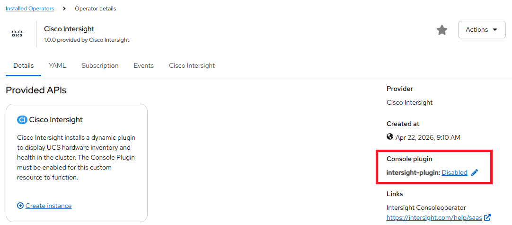
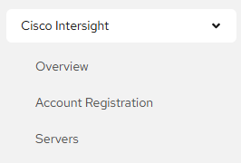
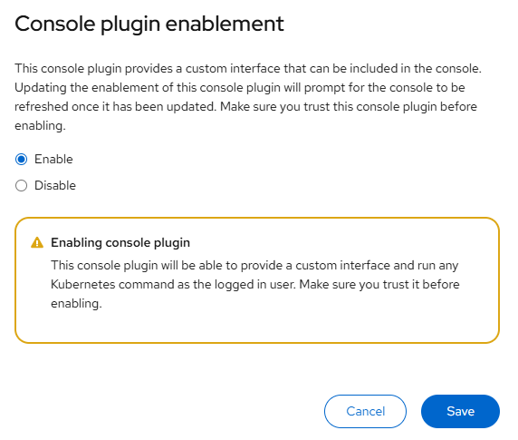

# Cisco Intersight Plugin - UI Plugin

[[Back]](../README.md) [[Next]](./registration.md) [[iserver-way]](../enable_plugin.md)

Cisco Intersight Operator intergrates with OpenShift Console UI via plugin that **must be enabled** and by default is disabled.



Once plugin is enabled, you will find Cisco Intersight menu item



> [!CAUTION]
> Console restarts and you may have to re-login

Proceed to [account registration](./registration.md) as the next step.

## via Console UI



## via cli

Plugin can be enabled by modifying `console.operator` object e.g.,

```
$ oc edit console.operator
spec:
  plugins:
  - intersight-plugin
```

[[Back]](../README.md) [[Next]](./registration.md) [[iserver-way]](../enable_plugin.md)