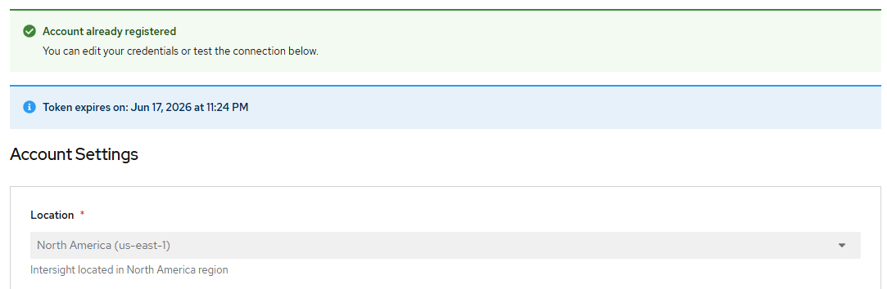

# Cisco Intersight Plugin - Register account

[[Back]](./README.md) [[Next]](./create_all.md) [[kb]](./kb/registration.md)

## Workflow

Checks
- operator should be [installed](./create_operator.md)
- instance should be [created](./create_instance.md)

Action
- create `Secret` resource based on user parameters
- proxy settings inherited from cluster
- refer [kb](./kb/registration.md) for Intersight credentials

## Expected outcome



## Configurable options

```
# iserver set ocp intersight --mode register
  --cluster TEXT                  Cluster Name
  --client-id TEXT                Intersight client id
  --client-secret TEXT            Intersight client secret
  --location [us|eu|va]           Intersight server location  [default: us]
  --no-confirm                    Confirmation mode
```

## Example

```
# iserver set ocp intersight --cluster bm1 --mode register --client-id AAAA --client-secret BBBB

OpenShift Workflow - Cisco Intersight Operator - Register Account
=================================================================

OpenShift Cluster: bm1
Subscription cisco-intersight found

Create Secret
-------------
- namespace: cisco-intersight
- name: intersight-configurations

~~~
apiVersion: v1
data:
   ...
kind: Secret
metadata:
  name: intersight-configurations
  namespace: cisco-intersight
type: Opaque
~~~
Secret [cisco-intersight/intersight-configurations] created
- wait for Secret cisco-intersight/intersight-configurations [timeout:60s]

Completed tasks
- Cisco intersight account registered
```

[[Back]](./README.md) [[Next]](./create_all.md) [[kb]](./kb/registration.md)