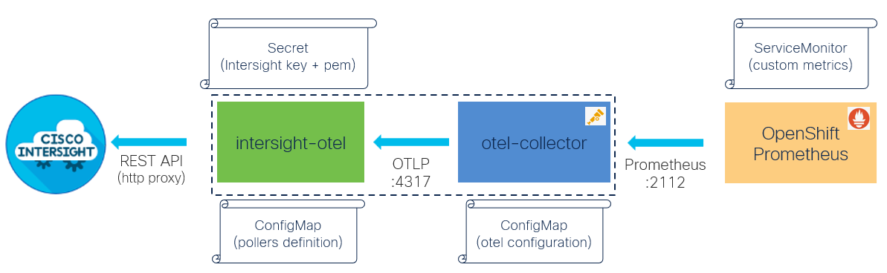

# Intersight Open Telemetry

[intersight-otel tool](https://github.com/cgascoig/intersight-otel) makes Cisco Intersight API requests and generate OpenTelemetry metrics from the responses.

iserver features
- intersight-otel deployment in OpenShift
- [OpenShift Prometheus](../prometheus/README.md) integration
- [Intersight Server Discovery](../imm/README.md) integration for pollers [generation](./templates.md)

Note: intersight-otel deployments per intersight iaccount is required

## Life Cycle Management Commands

Command | Intent | Details
--- | --- | ---
iserver get ocp iotel | check instance state | [Link](./get.md)
iserver set ocp iotel --mode instance | deploy intersight-otel instance | [Link](./create_instance.md)
iserver set ocp iotel --mode poller | set instance pollers | [Link](./set_poller.md)
iserver set ocp iotel | in task way | [Link](./create_task.md)
iserver delete ocp iotel --mode instance | delete intersight-otel instance | [Link](./delete_instance.md)
iserver delete ocp iotel --mode poller | delete intersight-otel instance pollers | [Link](./delete_poller.md)
iserver delete ocp task | in task way | [Link](./delete_task.md)

## Extras

- [all-in-one example](./all_in_one.md) for deployment in OpenShift
- [integration with Grafana](https://github.com/akaliwod/imonitor/blob/master/README.md)

[[Back]](../Operations.md)
