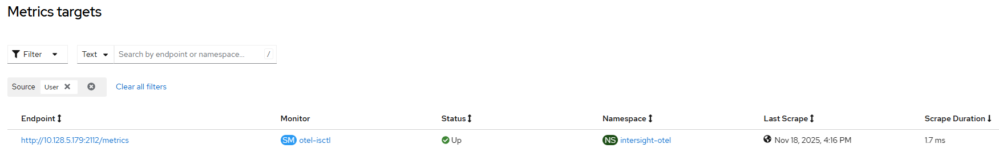
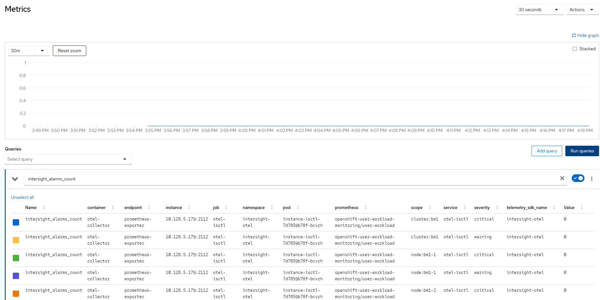

# Intersight Open Telemetry - Create Instance via Task

## Input

```
[
    {
        "iotel": {
            "instance": {
                "iaccount": "iac",
                "pollers": "C:\\tmp\\pollers.txt"
            }
        }
    }
]
```

Notes:
- [instance](./create_instance.md) triggers workflow execution with input parameter

## Requirements

- [Prometheus user-workload monitoring enabled](../prometheus/enable_monitoring.md)

## Configurable options

```
# iserver set ocp task 
  --cluster TEXT   Cluster Name
  --filename TEXT  Tasks filename
  --validate       Validate only
  --break          Break on error
  --no-confirm     Confirmation mode
```

## Expected outcome





## Example

```
# iserver set ocp task --cluster bm1 --filename C:\tmp\task.json --no-confirm

Cluster: bm1 (type: ocp)

OpenShift Workflow - Create Tasks
=================================

Validate Input
--------------
Completed


OpenShift Workflow - Intersight Open Telemetry (iotel) - Create Instance
========================================================================

OpenShift Cluster: bm1

Check User Workload Monitoring
------------------------------
- config map namespace: openshift-monitoring
- config map name: cluster-monitoring-config
- enableUserWorkload enabled

Resources
---------
namespace: intersight-otel
intersight-otel secret: intersight-otel/intersight-iac
intersight-otel config map: intersight-otel/intersight-iac
otel-collector config map: intersight-otel/otel-iac
deployment: intersight-otel/instance-iac
service: intersight-otel/otel-iac
service monitor: intersight-otel/otel-iac

Create Namespace
----------------
- name: intersight-otel

~~~
apiVersion: v1
kind: Namespace
metadata:
  name: intersight-otel

~~~

Namespace created

Wait for namespace [timeout:60]...

Create Secret
-------------
- namespace: intersight-otel
- name: intersight-iac

Secret created

Wait for secret [timeout:60]...

Create Config Map
-----------------
- namespace: intersight-otel
- name: otel-iac
- labels
	app:opentelemetry
	component:otel-collector-config
- destination: otel-collector-config

~~~
exporters:
  prometheus:
    enable_open_metrics: true
    endpoint: :2112
    metric_expiration: 180m
    resource_to_telemetry_conversion:
      enabled: true
    send_timestamps: true
extensions:
  zpages:
processors:
  batch:
  memory_limiter:
    check_interval: 5s
    limit_mib: 1500
    spike_limit_mib: 512
receivers:
  otlp:
    protocols:
      grpc:
      http:
service:
  extensions:
  - zpages
  pipelines:
    metrics:
      exporters:
      - prometheus
      processors:
      - memory_limiter
      - batch
      receivers:
      - otlp

~~~

Config map created

Wait for config map [timeout:60]...

Create Config Map
-----------------
- namespace: intersight-otel
- name: intersight-iac
- destination: intersight-otel.toml

~~~
otel_collector_endpoint = "http://127.0.0.1:4317"

[[pollers]]
name = "intersight.tam.advisory.count"
otel_attributes = { scope = "node:bm1-1" }
api_query = "api/v1/tam/AdvisoryInstances?$filter=AffectedObjectMoid eq '111111'"
aggregator = "count_results"
interval = 60

[[pollers]]
name = "intersight.tam.advisory.count"
otel_attributes = { scope = "node:bm1-2" }
api_query = "api/v1/tam/AdvisoryInstances?$filter=AffectedObjectMoid eq '222222'"
aggregator = "count_results"
interval = 60

[[pollers]]
name = "intersight.tam.advisory.count"
otel_attributes = { scope = "node:bm1-3" }
api_query = "api/v1/tam/AdvisoryInstances?$filter=AffectedObjectMoid eq '333333'"
aggregator = "count_results"
interval = 60

[[pollers]]
name = "intersight.tam.advisory.count"
otel_attributes = { scope = "cluster:bm1" }
api_query = "api/v1/tam/AdvisoryInstances?$filter=AffectedObjectMoid in ('111111', '222222', '333333')"
aggregator = "count_results"
interval = 60

[[pollers]]
name = "intersight.alarms.count"
otel_attributes = { scope = "node:bm1-1", severity = "critical" }
api_query = "api/v1/cond/Alarms?$filter=Acknowledge eq 'None' and Severity eq 'Critical' and RegisteredDevice/Moid eq '444444'&$count=true"
aggregator = "result_count"
interval = 300

[[pollers]]
name = "intersight.alarms.count"
otel_attributes = { scope = "node:bm1-2", severity = "critical" }
api_query = "api/v1/cond/Alarms?$filter=Acknowledge eq 'None' and Severity eq 'Critical' and RegisteredDevice/Moid eq '555555'&$count=true"
aggregator = "result_count"
interval = 300

[[pollers]]
name = "intersight.alarms.count"
otel_attributes = { scope = "node:bm1-3", severity = "critical" }
api_query = "api/v1/cond/Alarms?$filter=Acknowledge eq 'None' and Severity eq 'Critical' and RegisteredDevice/Moid eq '666666'&$count=true"
aggregator = "result_count"
interval = 300

[[pollers]]
name = "intersight.alarms.count"
otel_attributes = { scope = "cluster:bm1", severity = "critical" }
api_query = "api/v1/cond/Alarms?$filter=Acknowledge eq 'None' and Severity eq 'Critical' and RegisteredDevice/Moid in ('444444', '555555', '666666')&$count=true"
aggregator = "result_count"
interval = 300

[[pollers]]
name = "intersight.alarms.count"
otel_attributes = { scope = "node:bm1-1", severity = "warning" }
api_query = "api/v1/cond/Alarms?$filter=Acknowledge eq 'None' and Severity eq 'Warning' and RegisteredDevice/Moid eq '444444'&$count=true"
aggregator = "result_count"
interval = 300

[[pollers]]
name = "intersight.alarms.count"
otel_attributes = { scope = "node:bm1-2", severity = "warning" }
api_query = "api/v1/cond/Alarms?$filter=Acknowledge eq 'None' and Severity eq 'Warning' and RegisteredDevice/Moid eq '555555'&$count=true"
aggregator = "result_count"
interval = 300

[[pollers]]
name = "intersight.alarms.count"
otel_attributes = { scope = "node:bm1-3", severity = "warning" }
api_query = "api/v1/cond/Alarms?$filter=Acknowledge eq 'None' and Severity eq 'Warning' and RegisteredDevice/Moid eq '666666'&$count=true"
aggregator = "result_count"
interval = 300

[[pollers]]
name = "intersight.alarms.count"
otel_attributes = { scope = "cluster:bm1", severity = "warning" }
api_query = "api/v1/cond/Alarms?$filter=Acknowledge eq 'None' and Severity eq 'Warning' and RegisteredDevice/Moid in ('444444', '555555', '666666')&$count=true"
aggregator = "result_count"
interval = 300
~~~

Config map created

Wait for config map [timeout:60]...

Create Deployment
-----------------
- namespace: intersight-otel
- name: instance-iac

~~~
apiVersion: apps/v1
kind: Deployment
metadata:
  name: instance-iac
  namespace: intersight-otel
spec:
  selector:
    matchLabels:
      app: instance-iac
  template:
    metadata:
      labels:
        app: instance-iac
        component: otel-collector
    spec:
      containers:
      - command:
        - /target/release/intersight_otel
        - -c
        - /etc/intersight-otel/intersight-otel.toml
        env:
        - name: HTTPS_PROXY
          value: http://proxy.domain.com
        - name: RUST_LOG
          value: info
        - name: intersight_otel_key_file
          value: /etc/intersight-otel-key/intersight.pem
        - name: intersight_otel_key_id
          valueFrom:
            secretKeyRef:
              key: intersight-key-id
              name: intersight-iac
        image: ghcr.io/cgascoig/intersight-otel:v0.1.2
        name: intersight-otel
        resources:
          limits:
            cpu: 200m
            memory: 128Mi
          requests:
            cpu: 100m
            memory: 64Mi
        securityContext:
          securityContext:
            allowPrivilegeEscalation: false
            capabilities:
              drop:
              - all
            privileged: false
            readOnlyRootFilesystem: true
        volumeMounts:
        - mountPath: /etc/intersight-otel
          name: intersight-otel-config
          readyOnly: true
        - mountPath: /etc/intersight-otel-key
          name: intersight-otel-key
          readyOnly: true
      - command:
        - /otelcol
        - --config=/conf/otel-collector-config.yaml
        image: otel/opentelemetry-collector:0.59.0
        name: otel-collector
        ports:
        - containerPort: 4317
        - containerPort: 2112
        resources:
          limits:
            cpu: '1'
            memory: 2Gi
          requests:
            cpu: 200m
            memory: 400Mi
        volumeMounts:
        - mountPath: /conf
          name: otel-collector-config-vol
      volumes:
      - configMap:
          name: intersight-iac
        name: intersight-otel-config
      - name: intersight-otel-key
        secret:
          items:
          - key: intersight-key
            path: intersight.pem
          secretName: intersight-iac
      - configMap:
          items:
          - key: otel-collector-config
            path: otel-collector-config.yaml
          name: otel-iac
        name: otel-collector-config-vol

~~~
Wait until deployment found [timeout:60s]...
Wait until deployment resources [timeout:60s]...

Create Service
--------------
- namespace: intersight-otel
- name: otel-iac

~~~
apiVersion: v1
kind: Service
metadata:
  labels:
    app: instance-iac
    component: otel-collector
  name: otel-iac
  namespace: intersight-otel
spec:
  ports:
  - name: prometheus-exporter
    port: 2112
  selector:
    app: instance-iac
    component: otel-collector

~~~
Wait until service found [timeout:60s]...

Create Service Monitor
----------------------
- namespace: intersight-otel
- name: otel-iac

~~~
apiVersion: monitoring.coreos.com/v1
kind: ServiceMonitor
metadata:
  name: otel-iac
  namespace: intersight-otel
spec:
  endpoints:
  - interval: 30s
    path: /metrics
    port: prometheus-exporter
    scheme: http
  selector:
    matchLabels:
      app: instance-iac
      component: otel-collector

~~~
Wait until service monitor found [timeout:60s]...
Wait until service monitor target ready [timeout:360s]...

Completed tasks
- Namespace created
- Secret with intersight authentication ready
- ConfigMap for otel-collector ready
- ConfigMap for intersight poller ready
- Deployment ready
- Service created
- Service monitor ready with prometheus target
```

[[Back]](./README.md)