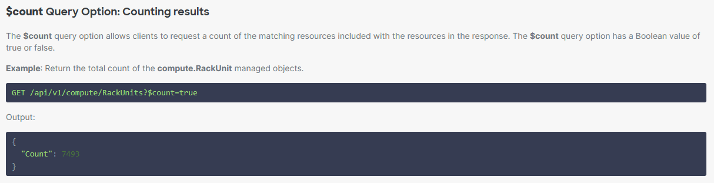

# Intersight Open Telemetry - Pollers

## Overview 

Pollers are defined in configmap mounted as volume by intersight-otel container
- Prometheus metric name based on 'name' property with '.' replaced with '_'
- Intersight REST API query incl. filtering following the [query syntax](https://intersight.com/apidocs/introduction/overview/resources/)
- if API query contains '$count=true' then aggregator should be set to 'result_count' and Prometheus metric will be populated as per Count property of the response
- else aggregator should be set to 'count_results' and the return objects will be counted by intersight-otel collector



```
[[pollers]]
name = "intersight.policy.ntp.count"
api_query = "api/v1/ntp/Policies?$count=true"
aggregator = "result_count"
interval = 60
```

```
[[pollers]]
name = "intersight.policy.ntp.count"
api_query = "api/v1/ntp/Policies"
aggregator = "count_results"
interval = 60
```

## Filtering for cluster specific pollers

Cluster specific pollers <=> pollers with filtering rules selecting the Intersight metrics in the context or scope of the server (cluster node) and cluster (all cluster nodes)

```
[[pollers]]
name = "intersight.tam.advisory.count"
otel_attributes = { scope = "node:bm1-1" }
api_query = "api/v1/tam/AdvisoryInstances?$filter=AffectedObjectMoid eq '11111111'"
aggregator = "count_results"
interval = 60

[[pollers]]
name = "intersight.tam.advisory.count"
otel_attributes = { scope = "cluster:bm1" }
api_query = "api/v1/tam/AdvisoryInstances?$filter=AffectedObjectMoid in ('11111111', '22222222', '33333333')"
aggregator = "count_results"
interval = 60
```

[[Back]](./README.md)