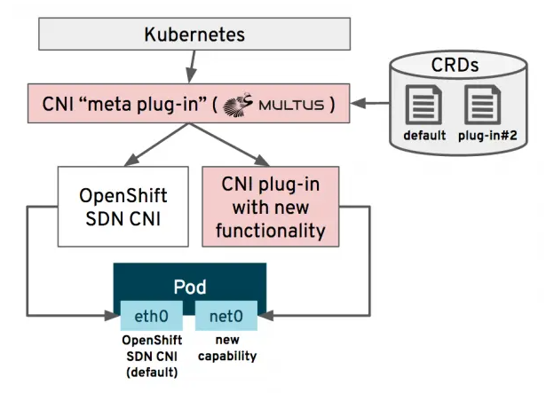

# Network Attachment Definition

## Overview

A NAD is a Kubernetes CustomResourceDefinition (CRD) used to define additional network interfaces for pods or virtual machines. Requires Multus CNI plug-in, integrated with Kubernetes.

Key features of NADs:
- Multi-networking: Ability to attach multiple networks to VMs.
- Custom networking: Define virtual local area networks (VLANs), single root input/output virtualization (SR-IOV), or MacVLAN configurations.
- Flexible IPAM: Use DHCP, static IPs, or other methods for IP allocation.

NAD Type | Overview | CRD Example | Functional Test (POD) 
--- | --- | --- | --- 
Bridge | [Link](./overview-bridge.md) | [Link](./crd-bridge.md) | [Link](./pod-bridge.md) 
IPVLAN | [Link](./overview-ipvlan.md) | [Link](./crd-ipvlan.md) | [Link](./pod-ipvlan.md) 
MacVLAN | [Link](./overview-macvlan.md) | [Link](./crd-ipvlan.md) | [Link](./pod-ipvlan.md) 
VLAN | [Link](./overview-vlan.md) | [Link](./crd-vlan.md) | [Link](./pod-vlan.md) 

## Life Cycle Management Commands

Command | Intent | Details 
--- | --- | --- 
iserver get k8s nad | Get network-attachment-definitions | [Link](./get.md) 
iserver create k8s nad bridge | Create Linux bridge NAD | [Link](./create-bridge.md) 
iserver create k8s nad ipvlan | Create IPVLAN NAD | [Link](./create-ipvlan.md) 
iserver create k8s nad macvlan | Create MacVLAN NAD | [Link](./create-macvlan.md) 
iserver create k8s nad vlan | Create VLAN NAD | [Link](./create-vlan.md) 
iserver delete k8s nad | Delete network-attachment-definition | [Link](./delete.md) 

[[Back]](../Operations.md)