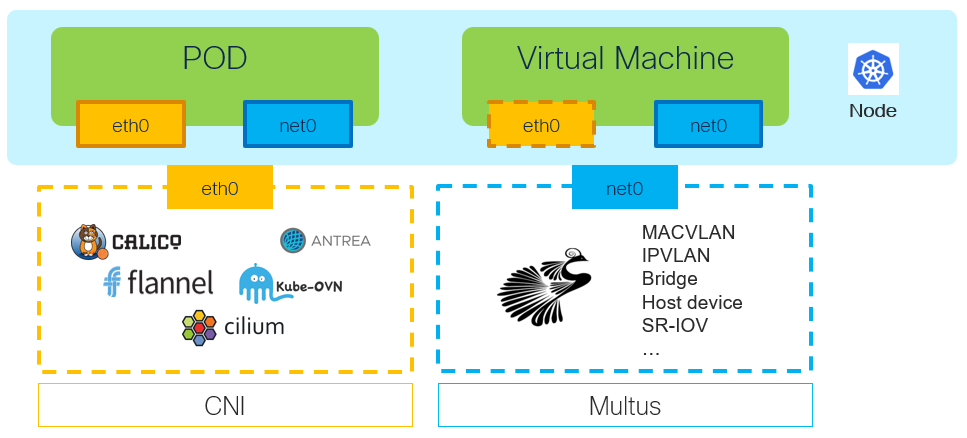

# Network Attachment Definition (NAD)

[[Back]](../Operations.md)

A `NetworkAttachmentDefinition` is a Kubernetes CustomResourceDefinition (CRD) used to define **additional network interfaces** for pods or virtual machines. Requires Multus CNI plug-in.

## Features

- Multi-networking: Ability to attach multiple networks to VMs
- Custom networking: Define virtual local area networks (VLANs), single root input/output virtualization (SR-IOV), or MacVLAN configurations
- Flexible IPAM: Use DHCP, static IPs, or other methods for IP allocation

> [!CAUTION]
> Multus and NAD is ships-in-the-night for Kubernetes i.e. no Kubernetes features via NAD interface

## Types

Type | Overview | CRD Schema | Example | Plugin
--- | --- | --- | --- | --- 
Bridge | [Link](./overview-bridge.md) | [Link](./crd-schema-bridge.md) | [Link](./example-bridge.md) | [Link](https://www.cni.dev/plugins/current/main/bridge/)
IPVLAN | [Link](./overview-ipvlan.md) | [Link](./crd-schema-ipvlan.md) | [Link](./example-ipvlan.md) | [Link](https://www.cni.dev/plugins/current/main/ipvlan/)
MacVLAN | [Link](./overview-macvlan.md) | [Link](./crd-schema-macvlan.md) | [Link](./example-macvlan.md) | [Link](https://www.cni.dev/plugins/current/main/macvlan/)
VLAN | [Link](./overview-vlan.md) | [Link](./crd-schema-vlan.md) | [Link](./example-vlan.md) | [Link](https://www.cni.dev/plugins/current/main/vlan/)

## Life Cycle Management Commands

Command | Intent | Details 
--- | --- | --- 
iserver get k8s nad | Get network-attachment-definitions | [Link](./get.md) 
iserver create k8s nad bridge | Create Linux bridge NAD | [Link](./create-bridge.md) 
iserver create k8s nad ipvlan | Create IPVLAN NAD | [Link](./create-ipvlan.md) 
iserver create k8s nad macvlan | Create MacVLAN NAD | [Link](./create-macvlan.md) 
iserver create k8s nad vlan | Create VLAN NAD | [Link](./create-vlan.md) 
iserver delete k8s nad | Delete network-attachment-definition | [Link](./delete.md) 

[[Back]](../Operations.md)