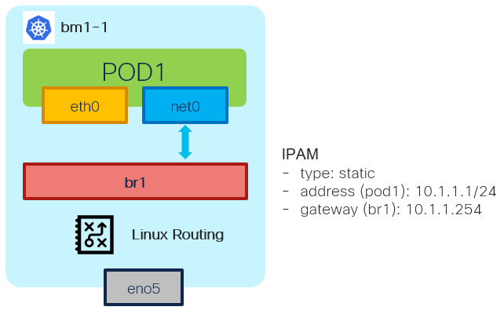

# Bridge NAD - Example - 1x POD w/IPAM static

[[Back]](./example-bridge.md) [[Prev]](./example-bridge-2pod-network.md) [[Next]](./example-bridge-2pod-ipam-host-local.md)



## IPAM static

Static IPAM is very simple IPAM plugin that assigns IPv4 and IPv6 addresses statically to container. Refer for [details](https://www.cni.dev/plugins/current/ipam/static/)

## Provision

> [!NOTE]
> Bridge is created on the node where pod is scheduled on

```
apiVersion: k8s.cni.cncf.io/v1
kind: NetworkAttachmentDefinition
metadata:
  name: test
  namespace: default
spec:
  config: |-
    {
      "cniVersion": "0.3.1",
      "type": "bridge",
      "name": "br1",
      "bridge": "br1",
      "isDefaultGateway": true,
      "isMasq": true,
      "ipam": {
        "type": "static",
        "addresses": [
          {
            "address": "10.1.1.1/24",
            "gateway": "10.1.1.254"
          }
        ]
      }
    }
---
apiVersion: v1
kind: Pod
metadata:
  annotations:
    k8s.v1.cni.cncf.io/networks: test
  name: pod1
spec:
  containers:
  - command:
    - sleep
    - infinite
    image: nicolaka/netshoot:latest
    securityContext:
      runAsUser: 0
      capabilities:
        add: ["IPC_LOCK","SYS_RESOURCE","NET_RAW"]
    name: netshoot
  nodeName: bm1-1
```

> [!CAUTION]
> Bridge may not be deleted when NAD is deleted 

```
# sudo ip link delete br1 type bridge
```

## Outcome

```
# iserver get k8s nns -v lb
Cluster: bm1 (type: ocp)

Node Network State - Linux Bridge [#1]
--------------------------------------

+-------+--------+-------+------+-------------------+--------------+------+---------------+------------------------------+
| Node  | Bridge | State | MTU  | MAC               | Interface    | LLDP | IPv4          | IPv6                         |
+-------+--------+-------+------+-------------------+--------------+------+---------------+------------------------------+
| bm1-1 | br1    | V     | 1500 | 86:7A:F5:41:6E:82 | veth4b3a654e | X    | Enabled       | Enabled                      |
|       |        |       |      |                   |              |      | DHCPv4: no    | DHCPv6: no                   |
|       |        |       |      |                   |              |      | 10.1.1.254/24 | fe80::847a:f5ff:fe41:6e82/64 |
+-------+--------+-------+------+-------------------+--------------+------+---------------+------------------------------+

+-------+--------+--------------+-------------+----------+----------+-------+--------+------+-------+
| Node  | Bridge | Interface    | STP Hairpin | STP Cost | STP Prio | VLAN  | Native | Mode | Range |
+-------+--------+--------------+-------------+----------+----------+-------+--------+------+-------+
| bm1-1 | br1    | veth4b3a654e | False       | 2        | 32       | False |        |      | --    |
+-------+--------+--------------+-------------+----------+----------+-------+--------+------+-------+
```

## IPAM

Pod1:net1 10.1.1.1

```
$ oc get pod pod1 -o yaml
apiVersion: v1
kind: Pod
metadata:
  annotations:
    k8s.v1.cni.cncf.io/network-status: |-
      [{
          ...
          ]
      },{
          "name": "default/test",
          "interface": "net1",
          "ips": [
              "10.1.1.1"
          ],
          "mac": "b2:d0:9b:1c:05:0b",
          "dns": {},
          "gateway": [
              "10.1.1.254"
          ]
      }]
    k8s.v1.cni.cncf.io/networks: test
```

## Linux bridge

```
$ ip -details link show br1
69836: br1: <BROADCAST,MULTICAST,UP,LOWER_UP> mtu 1500 qdisc noqueue state UP mode DEFAULT group default qlen 1000
    link/ether 86:7a:f5:41:6e:82 brd ff:ff:ff:ff:ff:ff promiscuity 0  allmulti 0 minmtu 68 maxmtu 65535
    bridge forward_delay 1500 hello_time 200 max_age 2000 ageing_time 30000 stp_state 0 priority 32768 
    vlan_filtering 0 vlan_protocol 802.1Q 
    bridge_id 8000.86:7a:f5:41:6e:82 designated_root 8000.86:7a:f5:41:6e:82 root_port 0 root_path_cost 0 
    ...
  
$ ip a l br1
69836: br1: <BROADCAST,MULTICAST,UP,LOWER_UP> mtu 1500 qdisc noqueue state UP group default qlen 1000
    link/ether 86:7a:f5:41:6e:82 brd ff:ff:ff:ff:ff:ff
    inet 10.1.1.254/24 brd 10.1.1.255 scope global br1
       valid_lft forever preferred_lft forever
    inet6 fe80::847a:f5ff:fe41:6e82/64 scope link
       valid_lft forever preferred_lft forever
```

## Virtual Ethernet

Host network namespace

```
$ ip -details link show veth4b3a654e
69837: veth4b3a654e@if2: <BROADCAST,MULTICAST,UP,LOWER_UP> mtu 1500 qdisc noqueue master br1 state UP mode DEFAULT group default
    link/ether 02:48:77:36:05:8c brd ff:ff:ff:ff:ff:ff link-netns 1d05404e-1719-41eb-9d08-e899b3283ec5 
    veth bridge_slave 
    designated_port 32769 designated_cost 0 designated_bridge 8000.86:7a:f5:41:6e:82 designated_root 8000.86:7a:f5:41:6e:82 
    ...

$ ip a l veth4b3a654e
69837: veth4b3a654e@if2: <BROADCAST,MULTICAST,UP,LOWER_UP> mtu 1500 qdisc noqueue master br1 state UP group default
    link/ether 02:48:77:36:05:8c brd ff:ff:ff:ff:ff:ff link-netns 1d05404e-1719-41eb-9d08-e899b3283ec5
    inet6 fe80::48:77ff:fe36:58c/64 scope link
       valid_lft forever preferred_lft forever
```

Container network namespace

```
$ oc exec pod1 -- ip -details link show net1
2: net1@if69837: <BROADCAST,MULTICAST,UP,LOWER_UP> mtu 1500 qdisc noqueue state UP mode DEFAULT group default
    link/ether b2:d0:9b:1c:05:0b brd ff:ff:ff:ff:ff:ff link-netnsid 0 promiscuity 0 allmulti 0 minmtu 68 maxmtu 65535
    veth 
    ...

$ oc exec pod1 -- ip a l net1
2: net1@if69837: <BROADCAST,MULTICAST,UP,LOWER_UP> mtu 1500 qdisc noqueue state UP group default
    link/ether b2:d0:9b:1c:05:0b brd ff:ff:ff:ff:ff:ff link-netnsid 0
    inet 10.1.1.1/24 brd 10.1.1.255 scope global net1
       valid_lft forever preferred_lft forever
    inet6 fe80::b0d0:9bff:fe1c:50b/64 scope link
       valid_lft forever preferred_lft forever
```

## L3

> [!NOTE]
> Pod L3 to host network namespace via Virtual Ethernet ending on the bridge interface then host IP route based forwarding

```
$ oc exec pod1 -- ping -c 1 10.1.1.254
PING 10.1.1.254 (10.1.1.254) 56(84) bytes of data.
64 bytes from 10.1.1.254: icmp_seq=1 ttl=64 time=0.086 ms

$ oc exec pod1 -- arp -a
? (10.1.1.254) at 86:7a:f5:41:6e:82 [ether]  on net1
```

[[Back]](./example-bridge.md) [[Prev]](./example-bridge-2pod-network.md) [[Next]](./example-bridge-2pod-ipam-host-local.md)