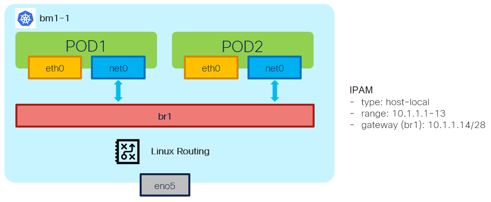

# Bridge NAD - Example - 2x POD w/IPAM host-local

[[Back]](./example-bridge.md) [[Prev]](./example-bridge-1pod-ipam-static.md) [[Next]](./example-bridge-2pod-network.md)



## IPAM host-local

host-local IPAM allocates IPv4 and IPv6 addresses out of a specified address range. Refer for [details](https://www.cni.dev/plugins/current/ipam/host-local/)

## Provision

> [!NOTE]
> Bridge is created on the node where pod is scheduled on

```
apiVersion: k8s.cni.cncf.io/v1
kind: NetworkAttachmentDefinition
metadata:
  name: test
  namespace: default
spec:
  config: |-
    {
      "cniVersion": "0.3.1",
      "type": "bridge",
      "name": "br1",
      "bridge": "br1",
      "isDefaultGateway": true,
      "isMasq": true,
      "ipam": {
        "type": "host-local",
        "subnet": "10.1.1.0/28",
        "rangeStart": "10.1.1.1",
        "rangeEnd": "10.1.1.13",
        "gateway": "10.1.1.14"
      }
    }
---
apiVersion: v1
kind: Pod
metadata:
  annotations:
    k8s.v1.cni.cncf.io/networks: test
  name: pod1
spec:
  containers:
  - command:
    - sleep
    - infinite
    image: nicolaka/netshoot:latest
    securityContext:
      runAsUser: 0
      capabilities:
        add: ["IPC_LOCK","SYS_RESOURCE","NET_RAW"]
    name: netshoot
  nodeName: bm1-1
---
apiVersion: v1
kind: Pod
metadata:
  annotations:
    k8s.v1.cni.cncf.io/networks: test
  name: pod2
spec:
  containers:
  - command:
    - sleep
    - infinite
    image: nicolaka/netshoot:latest
    securityContext:
      runAsUser: 0
      capabilities:
        add: ["IPC_LOCK","SYS_RESOURCE","NET_RAW"]
    name: netshoot
  nodeName: bm1-1
```

> [!CAUTION]
> Bridge may not be deleted when NAD is deleted 

```
# sudo ip link delete br1 type bridge
```

## Outcome

```
# iserver get k8s nns -v lb
Cluster: bm1 (type: ocp)

Node Network State - Linux Bridge [#1]
--------------------------------------

+-------+--------+-------+------+-------------------+--------------+------+--------------+------------------------------+
| Node  | Bridge | State | MTU  | MAC               | Interface    | LLDP | IPv4         | IPv6                         |
+-------+--------+-------+------+-------------------+--------------+------+--------------+------------------------------+
| bm1-1 | br1    | V     | 1500 | DE:11:DC:6D:2B:C1 | veth0f1b2acf | X    | Enabled      | Enabled                      |
|       |        |       |      |                   | veth8335fb12 |      | DHCPv4: no   | DHCPv6: no                   |
|       |        |       |      |                   |              |      | 10.1.1.14/28 | fe80::dc11:dcff:fe6d:2bc1/64 |
+-------+--------+-------+------+-------------------+--------------+------+--------------+------------------------------+

+-------+--------+--------------+-------------+----------+----------+-------+--------+------+-------+
| Node  | Bridge | Interface    | STP Hairpin | STP Cost | STP Prio | VLAN  | Native | Mode | Range |
+-------+--------+--------------+-------------+----------+----------+-------+--------+------+-------+
| bm1-1 | br1    | veth0f1b2acf | False       | 2        | 32       | False |        |      | --    |
+-------+--------+--------------+-------------+----------+----------+-------+--------+------+-------+
| bm1-1 | br1    | veth8335fb12 | False       | 2        | 32       | False |        |      | --    |
+-------+--------+--------------+-------------+----------+----------+-------+--------+------+-------+
```

## IPAM

Pod1:net1 10.1.1.7

```
$ oc get pod pod1 -o yaml
apiVersion: v1
kind: Pod
metadata:
  annotations:
    k8s.v1.cni.cncf.io/network-status: |-
      [{
        ...
      },{
          "name": "default/test",
          "interface": "net1",
          "ips": [
              "10.1.1.7"
          ],
          "mac": "1e:cd:0a:c5:bc:1e",
          "dns": {},
          "gateway": [
              "10.1.1.14"
          ]
      }]
    k8s.v1.cni.cncf.io/networks: test
```

Pod2 10.1.1.8

```
$ oc get pod pod2 -o yaml
apiVersion: v1
kind: Pod
metadata:
  annotations:
    k8s.v1.cni.cncf.io/network-status: |-
      [{
        ...
      },{
          "name": "default/test",
          "interface": "net1",
          "ips": [
              "10.1.1.8"
          ],
          "mac": "2a:bd:12:13:09:c2",
          "dns": {},
          "gateway": [
              "10.1.1.14"
          ]
      }]
    k8s.v1.cni.cncf.io/networks: test
```

## Linux bridge

```
$ ip -details link show br1
69825: br1: <BROADCAST,MULTICAST,UP,LOWER_UP> mtu 1500 qdisc noqueue state UP mode DEFAULT group default qlen 1000
    link/ether de:11:dc:6d:2b:c1 
    bridge forward_delay 1500 hello_time 200 max_age 2000 ageing_time 30000 stp_state 0 priority 32768 
    vlan_filtering 0 vlan_protocol 802.1Q 
    bridge_id 8000.de:11:dc:6d:2b:c1 designated_root 8000.de:11:dc:6d:2b:c1 root_port 0 root_path_cost 0 
    ...
  
$ ip a l br1
69825: br1: <BROADCAST,MULTICAST,UP,LOWER_UP> mtu 1500 qdisc noqueue state UP group default qlen 1000
    link/ether de:11:dc:6d:2b:c1 brd ff:ff:ff:ff:ff:ff
    inet 10.1.1.14/28 brd 10.1.1.15 scope global br1
       valid_lft forever preferred_lft forever
    inet6 fe80::dc11:dcff:fe6d:2bc1/64 scope link
       valid_lft forever preferred_lft forever
```

## Virtual Ethernet

Host network namespace

```
$ bridge link
69826: veth0f1b2acf@eno5: <BROADCAST,MULTICAST,UP,LOWER_UP> mtu 1500 master br1 state forwarding priority 32 cost 2
69827: veth8335fb12@eno5: <BROADCAST,MULTICAST,UP,LOWER_UP> mtu 1500 master br1 state forwarding priority 32 cost 2
```

Virtual ethernet host <=> pod1

```
$ ip -details link show veth0f1b2acf
69826: veth0f1b2acf@if2: <BROADCAST,MULTICAST,UP,LOWER_UP> mtu 1500 qdisc noqueue master br1 state UP mode DEFAULT group default
    link/ether 1a:91:12:6f:3e:c8 brd ff:ff:ff:ff:ff:ff link-netns 372a6e82-9b94-41d9-a29b-01354100f77e 
    veth
    bridge_slave state forwarding priority 32 cost 2 hairpin off guard off root_block off fastleave off learning on flood on 
    port_id 0x8001 port_no 0x1 designated_port 32769 designated_cost 0 
    designated_bridge 8000.de:11:dc:6d:2b:c1 designated_root 8000.de:11:dc:6d:2b:c1 
    ...

$ ip a l veth0f1b2acf
69826: veth0f1b2acf@if2: <BROADCAST,MULTICAST,UP,LOWER_UP> mtu 1500 qdisc noqueue master br1 state UP group default
    link/ether 1a:91:12:6f:3e:c8 brd ff:ff:ff:ff:ff:ff link-netns 372a6e82-9b94-41d9-a29b-01354100f77e
    inet6 fe80::1891:12ff:fe6f:3ec8/64 scope link
       valid_lft forever preferred_lft forever
```

Virtual ethernet pod1 <=> host

```
$ oc exec pod1 -- ip -details link show net1
2: net1@if69826: <BROADCAST,MULTICAST,UP,LOWER_UP> mtu 1500 qdisc noqueue state UP mode DEFAULT group default
    link/ether 1e:cd:0a:c5:bc:1e brd ff:ff:ff:ff:ff:ff link-netnsid 0 promiscuity 0 allmulti 0 minmtu 68 maxmtu 65535
    veth 
    ...
    
$ oc exec pod1 -- ip a l net1
2: net1@if69826: <BROADCAST,MULTICAST,UP,LOWER_UP> mtu 1500 qdisc noqueue state UP group default
    link/ether 1e:cd:0a:c5:bc:1e brd ff:ff:ff:ff:ff:ff link-netnsid 0
    inet 10.1.1.7/28 brd 10.1.1.15 scope global net1
       valid_lft forever preferred_lft forever
    inet6 fe80::1ccd:aff:fec5:bc1e/64 scope link
       valid_lft forever preferred_lft forever
```

Virtual ethernet host <=> pod2

```
$ ip -details link show veth8335fb12
69827: veth8335fb12@if2: <BROADCAST,MULTICAST,UP,LOWER_UP> mtu 1500 qdisc noqueue master br1 state UP mode DEFAULT group default
    link/ether fa:e5:78:5c:57:5d brd ff:ff:ff:ff:ff:ff link-netns 74279b4d-fdf1-4e45-9265-183cffe61cd2 
    veth
    bridge_slave state forwarding priority 32 cost 2 hairpin off guard off root_block off fastleave off learning on flood on 
    port_id 0x8002 port_no 0x2 designated_port 32770 designated_cost 0 
    designated_bridge 8000.de:11:dc:6d:2b:c1 designated_root 8000.de:11:dc:6d:2b:c1 
    ...

$ ip a l veth8335fb12
69827: veth8335fb12@if2: <BROADCAST,MULTICAST,UP,LOWER_UP> mtu 1500 qdisc noqueue master br1 state UP group default
    link/ether fa:e5:78:5c:57:5d brd ff:ff:ff:ff:ff:ff link-netns 74279b4d-fdf1-4e45-9265-183cffe61cd2
    inet6 fe80::f8e5:78ff:fe5c:575d/64 scope link
       valid_lft forever preferred_lft forever
```

Virtual ethernet pod2 <=> host

```
$ oc exec pod2 -- ip -details link show net1
2: net1@if69827: <BROADCAST,MULTICAST,UP,LOWER_UP> mtu 1500 qdisc noqueue state UP mode DEFAULT group default
    link/ether 2a:bd:12:13:09:c2 brd ff:ff:ff:ff:ff:ff link-netnsid 0 promiscuity 0 allmulti 0 minmtu 68 maxmtu 65535
    veth 
    ...

$ oc exec pod2 -- ip a l net1
2: net1@if69827: <BROADCAST,MULTICAST,UP,LOWER_UP> mtu 1500 qdisc noqueue state UP group default
    link/ether 2a:bd:12:13:09:c2 brd ff:ff:ff:ff:ff:ff link-netnsid 0
    inet 10.1.1.8/28 brd 10.1.1.15 scope global net1
       valid_lft forever preferred_lft forever
    inet6 fe80::28bd:12ff:fe13:9c2/64 scope link
       valid_lft forever preferred_lft forever
```

## L3

> [!NOTE]
> Pod L3 to host network namespace via Virtual Ethernet ending on the bridge interface then either local bridge or host IP route based forwarding

```
$ oc exec pod1 -- ping -c 1 10.1.1.14
PING 10.1.1.14 (10.1.1.14) 56(84) bytes of data.
64 bytes from 10.1.1.14: icmp_seq=1 ttl=64 time=0.058 ms

$ oc exec pod1 -- ping -c 1 10.1.1.8
PING 10.1.1.8 (10.1.1.8) 56(84) bytes of data.
64 bytes from 10.1.1.8: icmp_seq=1 ttl=64 time=0.076 ms

$ oc exec pod1 -- arp -a
? (10.1.1.14) at de:11:dc:6d:2b:c1 [ether]  on net1
? (10.1.1.8) at 2a:bd:12:13:09:c2 [ether]  on net1
```

[[Back]](./example-bridge.md) [[Prev]](./example-bridge-1pod-ipam-static.md) [[Next]](./example-bridge-2pod-network.md)