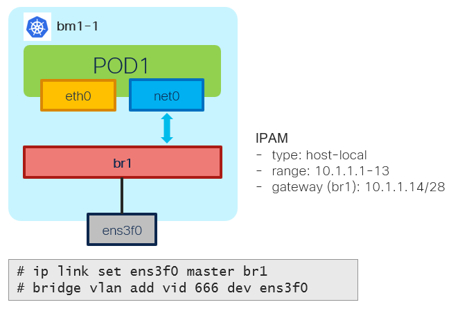

# Bridge NAD - Example - L2 Mode with VLAN

[[Back]](./example-bridge.md) [[Prev]](./example-bridge-2pod-network.md) [[Next]](./example-bridge-1pod-ipam-static.md)



This change on top of [bridge l2 scenario](./example-bridge-l2.md) with vlan tag being defined on the NAD level and corresponding bridge settings changes to allow VLAN forwarding out.

## Provision

```
apiVersion: k8s.cni.cncf.io/v1
kind: NetworkAttachmentDefinition
metadata:
  name: test
  namespace: default
spec:
  config: |-
    {
      "cniVersion": "0.3.1",
      "type": "bridge",
      "name": "br1",
      "bridge": "br1",
      "vlan": 666
      "ipam": {
        "type": "host-local",
        "subnet": "10.1.1.0/28",
        "rangeStart": "10.1.1.1",
        "rangeEnd": "10.1.1.13",
        "routes": [
          {
            "dst": "10.1.2.0/28",
            "gw": "10.1.1.14"
          }
        ]
      }
    }
```

> [!CAUTION]
> Bridge may not be deleted when NAD is deleted 

```
# bridge vlan del vid 666 dev ens3f0
# ip link set ens3f0 nomaster
# ip link delete br1 type bridge
```

## L2

> [!NOTE]
> Ping not working since there is nobody to respond, what we care is checking L2 forwarding out

```
$ oc exec pod1 -- ping -c 1 10.1.1.14
PING 10.1.1.14 (10.1.1.14) 56(84) bytes of data.
...
```

```
# tcpdump -i ens3f0 -e -n -nn -s 1500 -v -vv arp
fa:f3:2f:74:1e:eb > ff:ff:ff:ff:ff:ff, ethertype 802.1Q (0x8100), length 46: vlan 666, p 0, ethertype ARP (0x0806), Ethernet (len 6), IPv4 (len 4), 
  Request who-has 10.1.1.14 tell 10.1.1.8, length 28
```

[[Back]](./example-bridge.md) [[Prev]](./example-bridge-2pod-network.md) [[Next]](./example-bridge-1pod-ipam-static.md)