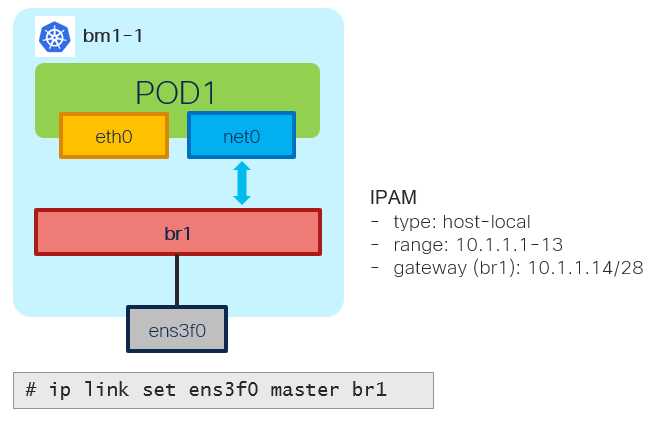

# Bridge NAD - Example - L2 Mode

[[Back]](./example-bridge.md) [[Prev]](./example-bridge-2pod-network.md) [[Next]](./example-bridge-l2-vlan.md)



## L2 Mode

Bridge in L2 mode
- IP address not assigned to bridge itself
- when packet is received via Virtual Ethernet from container, it must be bridged
- unlike bridge in L3 mode acting as default gateway, host route IP table is *not* in-play
- add any physical/vlan/bonded interface to allow upstream communication

## Provision

> [!NOTE]
> Bridge is created on the node where pod is scheduled on

```
apiVersion: k8s.cni.cncf.io/v1
kind: NetworkAttachmentDefinition
metadata:
  name: test
  namespace: default
spec:
  config: |-
    {
      "cniVersion": "0.3.1",
      "type": "bridge",
      "name": "br1",
      "bridge": "br1",
      "ipam": {
        "type": "host-local",
        "subnet": "10.1.1.0/28",
        "rangeStart": "10.1.1.1",
        "rangeEnd": "10.1.1.13",
        "routes": [
          {
            "dst": "10.1.2.0/28",
            "gw": "10.1.1.14"
          }
        ]
      }
    }
---
apiVersion: v1
kind: Pod
metadata:
  annotations:
    k8s.v1.cni.cncf.io/networks: test
  name: pod1
spec:
  containers:
  - command:
    - sleep
    - infinite
    image: nicolaka/netshoot:latest
    securityContext:
      runAsUser: 0
      capabilities:
        add: ["IPC_LOCK","SYS_RESOURCE","NET_RAW"]
    name: netshoot
  nodeName: bm1-1
```

> [!CAUTION]
> Bridge may not be deleted when NAD is deleted 

```
# ip link set ens3f0 nomaster
# ip link delete br1 type bridge
```

## Outcome

```
# iserver get k8s nns -v lb
Cluster: bm1 (type: ocp)

Node Network State - Linux Bridge [#1]
--------------------------------------

+-------+--------+-------+------+-------------------+--------------+------+------+------+
| Node  | Bridge | State | MTU  | MAC               | Interface    | LLDP | IPv4 | IPv6 |
+-------+--------+-------+------+-------------------+--------------+------+------+------+
| bm1-1 | br1    | V     | 1500 | 02:01:04:D1:D0:86 | ens3f0       | X    | --   | --   |
|       |        |       |      |                   | veth38aed718 |      |      |      |
+-------+--------+-------+------+-------------------+--------------+------+------+------+

+-------+--------+--------------+-------------+----------+----------+-------+--------+------+-------+
| Node  | Bridge | Interface    | STP Hairpin | STP Cost | STP Prio | VLAN  | Native | Mode | Range |
+-------+--------+--------------+-------------+----------+----------+-------+--------+------+-------+
| bm1-1 | br1    | ens3f0       | False       | 2        | 32       | False |        |      | --    |
+-------+--------+--------------+-------------+----------+----------+-------+--------+------+-------+
| bm1-1 | br1    | veth38aed718 | False       | 2        | 32       | False |        |      | --    |
+-------+--------+--------------+-------------+----------+----------+-------+--------+------+-------+
```

## IPAM

Pod1:net1 10.1.1.7

```
$ oc get pod pod1 -o yaml
apiVersion: v1
kind: Pod
metadata:
  annotations:
    k8s.v1.cni.cncf.io/network-status: |-
      [{
        ...
      },{
          "name": "default/test",
          "interface": "net1",
          "ips": [
              "10.1.1.7"
          ],
          "mac": "26:6e:e6:66:e3:08",
          "dns": {}
      }]
```

## Linux bridge

```
$ ip -details link show br1
69885: br1: <BROADCAST,MULTICAST,UP,LOWER_UP> mtu 1500 qdisc noqueue state UP mode DEFAULT group default qlen 1000
    link/ether 02:01:04:d1:d0:86 brd ff:ff:ff:ff:ff:ff 
    bridge forward_delay 1500 hello_time 200 max_age 2000 ageing_time 30000 stp_state 0 priority 32768 
    vlan_filtering 0 vlan_protocol 802.1Q 
    bridge_id 8000.2:1:4:d1:d0:86 designated_root 8000.2:1:4:d1:d0:86 root_port 0 root_path_cost 0 
    ...
  
$ ip a l br1
69885: br1: <BROADCAST,MULTICAST,UP,LOWER_UP> mtu 1500 qdisc noqueue state UP group default qlen 1000
    link/ether 02:01:04:d1:d0:86 brd ff:ff:ff:ff:ff:ff
    inet6 fe80::e8fb:4eff:fe9e:25dc/64 scope link
       valid_lft forever preferred_lft forever
```

## Virtual Ethernet

Host network namespace

```
$ bridge link
69898: veth38aed718@eno5: <BROADCAST,MULTICAST,UP,LOWER_UP> mtu 1500 master br1 state forwarding priority 32 cost 2
```

Virtual ethernet host <=> pod1

```
$ ip -details link show veth38aed718
69898: veth38aed718@if2: <BROADCAST,MULTICAST,UP,LOWER_UP> mtu 1500 qdisc noqueue master br1 state UP mode DEFAULT group default
    link/ether 02:01:04:d1:d0:86 brd ff:ff:ff:ff:ff:ff link-netns e8a7027f-005b-4e35-bded-2d49e9f85e17 
    veth
    bridge_slave state forwarding 
    port_id 0x8001 port_no 0x1 designated_port 32769 designated_cost 0 
    designated_bridge 8000.2:1:4:d1:d0:86 designated_root 8000.2:1:4:d1:d0:86 
    ...

$ ip a l veth38aed718
69898: veth38aed718@if2: <BROADCAST,MULTICAST,UP,LOWER_UP> mtu 1500 qdisc noqueue master br1 state UP group default
    link/ether 02:01:04:d1:d0:86 brd ff:ff:ff:ff:ff:ff link-netns e8a7027f-005b-4e35-bded-2d49e9f85e17
    inet6 fe80::1:4ff:fed1:d086/64 scope link
       valid_lft forever preferred_lft forever
```

Virtual ethernet pod1 <=> host

```
$ oc exec pod1 -- ip -details link show net1
2: net1@if69898: <BROADCAST,MULTICAST,UP,LOWER_UP> mtu 1500 qdisc noqueue state UP mode DEFAULT group default
    link/ether 26:6e:e6:66:e3:08 brd ff:ff:ff:ff:ff:ff link-netnsid 0 promiscuity 0 allmulti 0 minmtu 68 maxmtu 65535
    veth 
    ...
    
$ oc exec pod1 -- ip a l net1
2: net1@if69898: <BROADCAST,MULTICAST,UP,LOWER_UP> mtu 1500 qdisc noqueue state UP group default
    link/ether 26:6e:e6:66:e3:08 brd ff:ff:ff:ff:ff:ff link-netnsid 0
    inet 10.1.1.7/28 brd 10.1.1.15 scope global net1
       valid_lft forever preferred_lft forever
    inet6 fe80::246e:e6ff:fe66:e308/64 scope link
       valid_lft forever preferred_lft forever
```

## L2

> [!NOTE]
> Ping not working since there is nobody to respond, what we care is checking L2 forwarding out

```
$ oc exec pod1 -- ping -c 1 10.1.1.14
PING 10.1.1.14 (10.1.1.14) 56(84) bytes of data.
...
```

```
# tcpdump -i ens3f0 -e -n -nn -s 1500 -v -vv arp
26:6e:e6:66:e3:08 > ff:ff:ff:ff:ff:ff, ethertype ARP (0x0806), length 42: Ethernet (len 6), IPv4 (len 4), 
    Request who-has 10.1.1.14 tell 10.1.1.7, length 28
```

[[Back]](./example-bridge.md) [[Prev]](./example-bridge-2pod-network.md) [[Next]](./example-bridge-1pod-ipam-static.md)