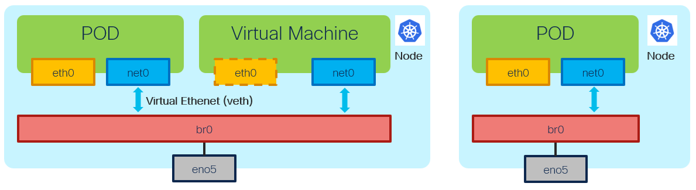

# Bridge NAD - Overview

[[Back]](./README.md) [[Prev]](./pod-bridge.md) [[Next]](./crd-schema-bridge.md)

Bridge
- `br0` bridge (virtual switch) resides in the host network namespace
- network configuration specifies the name of the bridge to be used

Container-to-Bridge
- containers running in own network namespace receive one end of the veth pair with the other end connected to the bridge
- IP address is assigned to one end of the veth pair - one residing in the container

Bridge mode
- (l2 default) bridge works as L2 device, does not have IP address assigned, add phy/bonded/vlan interface to bridge for upstream forwarding
- (l3) bridge itself is assigned with IP address, turning it into a gateway for the containers, packets received by bridge are then L3 forwarded out based on the host route table

[[Back]](./README.md) [[Prev]](./pod-bridge.md) [[Next]](./crd-schema-bridge.md)