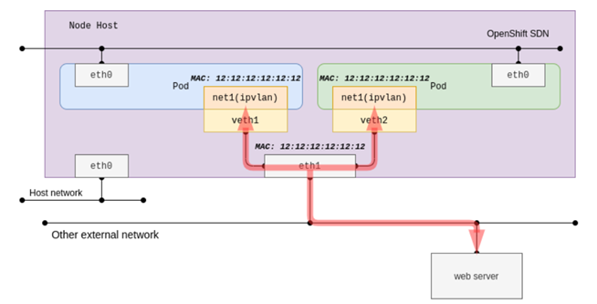

# Network Attachment Definition - IPVLAN

[[Back]](./README.md) [[Prev]](./pod-ipvlan.md) [[Next]](./crd-schema-ipvlan.md)

IPVLAN CNI plugin allows connecting container interface directly to host interface, without Linux ipvlan, OVS or port mapping. The parent interface on the host can be interface, sub-interface or bonded interface. 

POD’s virtual interface mac-address is the same as parent interface. This rules out DHCP IP address assignment option.

## Operating Mode

L2 (default) - In this mode TX processing happens on the stack instance attached to the slave device and packets are switched and queued to the master device to send out. In this mode the slaves will RX/TX multicast and broadcast (if applicable) as well.

L3 - In this mode TX processing up to L3 happens on the stack instance attached to the slave device and packets are switched to the stack instance of the master device for the L2 processing and routing from that instance will be used before packets are queued on the outbound device. In this mode the slaves will not receive nor can send multicast / broadcast traffic.

L3S - This is very similar to the L3 mode except that iptables (conn-tracking) works in this mode and hence it is L3-symmetric (L3s). 

[[Back]](./README.md) [[Prev]](./pod-ipvlan.md) [[Next]](./crd-schema-ipvlan.md)